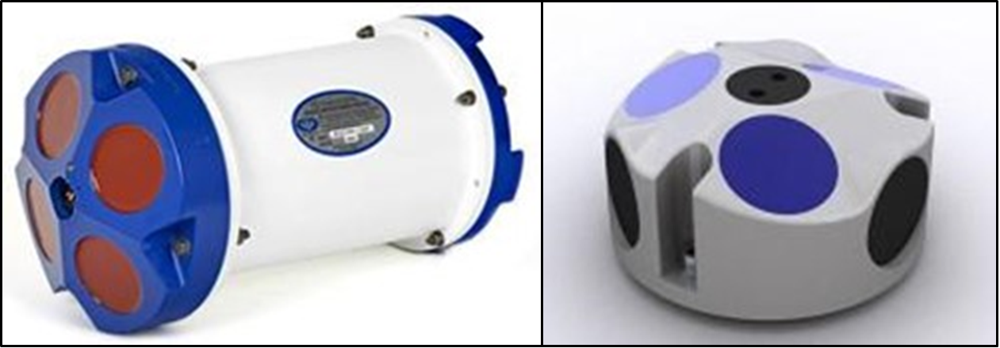
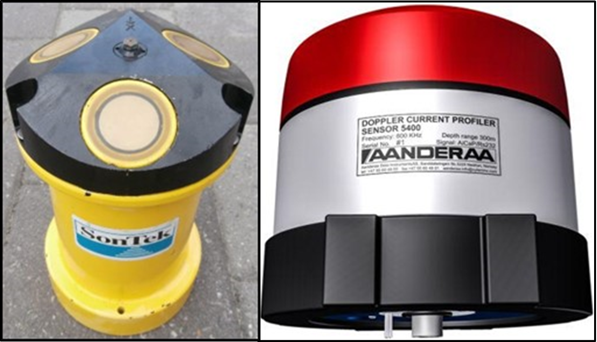
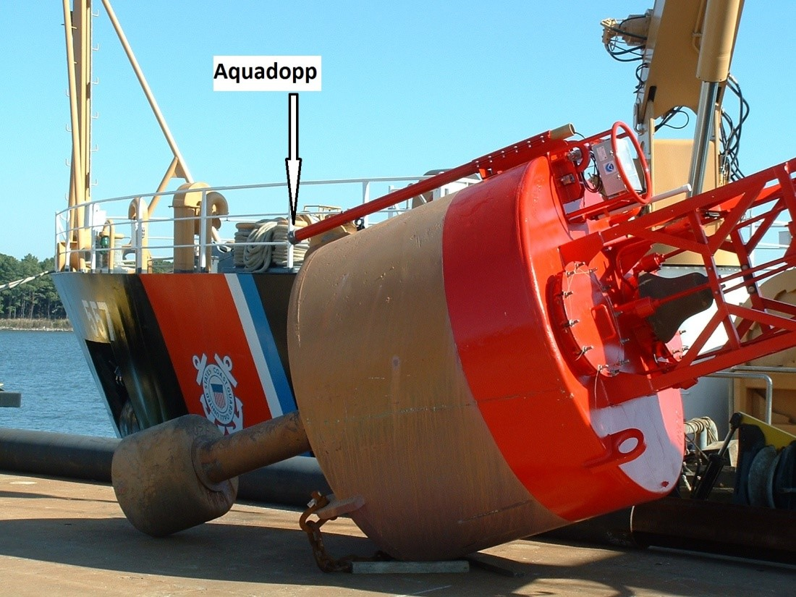
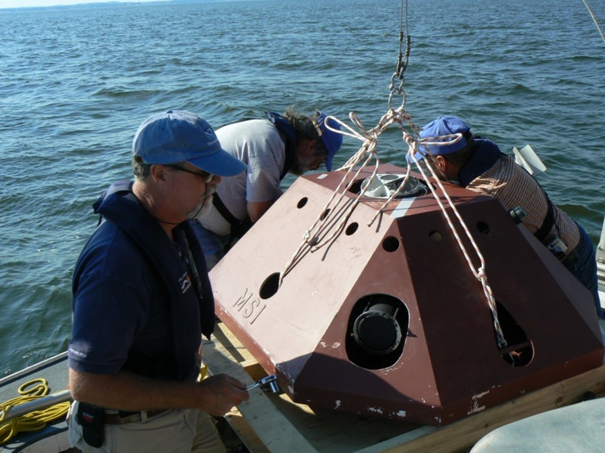
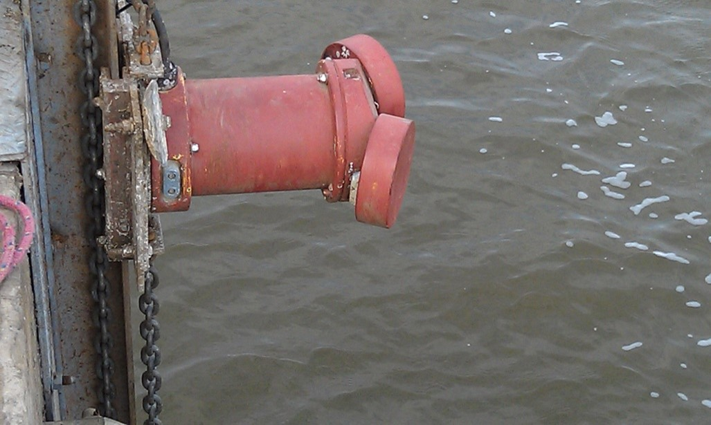

# Manual for Real-Time Quality Control of In-Situ Current Observations

A Guide to Quality Control and Quality Assurance of Acoustic Doppler Current Profiler Observations

Version 2.
July 2019
[https://doi.org/10.25923/sqe9-e310](https://doi.org/10.25923/sqe9-e310)

## Revision History

| Date    | Revision Description                                                                                                          | Notes                                                   |
| ------- | ----------------------------------------------------------------------------------------------------------------------------- | ------------------------------------------------------- |
| 06/2013 | Original Document Published                                                                                                   | Manual updated with revisions listed sequentially       |
| 10/2015 | Revise dates on Document Validation page (page ii)                                                                            |                                                         |
|         | Add statement requesting feedback from Manual Users (page vii)                                                                |                                                         |
|         | Update Acknowledgements to include manual update team members (page viii)                                                     |                                                         |
|         | Update Acronyms and Abbreviations (pages ix-x)                                                                                |                                                         |
|         | Add Definitions of Selected Terms (after Acronyms and Abbreviations)                                                          |                                                         |
|         | Revise Background and Introduction to reflect updated currents manual, as                                                     |                                                         |
|         | well as additional manuals that have been developed (page 1)                                                                  |                                                         |
|         | Revise section 2.0 content in various places to reflect feedback from reviewers.                                              |                                                         |
|         | Move Sensor Deployment Considerations from section 3.2 to section 2.4.                                                        |                                                         |
|         | Add content addressing data uncertainty (page 8)                                                                              |                                                         |
|         | Update content in sections 3.1 and 3.2 (pages 10 - 13)                                                                        |                                                         |
|         | Correct the spelling of "codable" in test tables (various)                                                                    |                                                         |
|         | Add Rate of Change Test (page 22) and Spike Test (page 23)                                                                    |                                                         |
|         | Update language in section 4.0, summary, to reflect feedback from reviewers. (page 27)                                        |                                                         |
|         | Update References and Supporting Documents (pages 28- 31)                                                                     |                                                         |
|         | Add bullet to deployment checklist (page A-5)                                                                                 |                                                         |
|         | Update In-Situ Surface Currents Manual Team members (page B-1)                                                                |                                                         |
| 07/2019 | Revise cover page to reflect updated logos.                                                                                   | Second manual update with revisions listed sequentially |
|         | Revise Document Validation page to reflect new logo, signatures, and dates.                                                   |                                                         |
|         | Update email address to Request to Manual Users                                                                               |                                                         |
|         | Update acknowledgements to include version 2.1 reviewers and link to                                                          |                                                         |
|         | QARTOD workshop reports.                                                                                                      |                                                         |
|         | Add three terms with definitions (interoperable, sensor, and variable) to Definitions of Selected Terms.                      |                                                         |
|         | Update section 1 (manuals published to date, addition of DOIs, etc.).                                                         |                                                         |
|         | Update section 2 (minor editorial revisions, figure numbers, etc.).                                                           |                                                         |
|         | Update section 3 (minor revisions to tests 4, 5, 6, 7, 14, 17, and 20 and substantial revisions to tests 18 and 19).          |                                                         |
|         | Update appendix A - add names of manual team for version 2.1 and update names of QARTOD Board of Advisors, U.S. IOOS Regional |                                                         |
|         | Associations/Executive Directors, and DMAC Community.                                                                         |                                                         |
|         | Update appendix B – added B-3 and other minor edits.                                                                          |                                                         |
|         | Update links throughout the manual.                                                                                           |                                                         |
|         | Update formatting to comply with 508 accessibility requirements.                                                              |                                                         |

## Endorsement Disclaimer

Mention of a commercial company or product does not constitute an endorsement by NOAA.
Use of information from this publication for publicity or advertising purposes concerning proprietary products or the tests of such products is not authorized.

## Request to Manual Users

To gauge the success of the QARTOD project,
it helps to be aware of groups working to utilize these QC tests.
Please notify us of your efforts or intentions to implement QARTOD processes by sending a brief email to
qartod.board@noaa.gov or posting a notice at
[http://www.linkedin.com/groups?gid=2521409](http://www.linkedin.com/groups?gid=2521409).

## Acknowledgements

We wish to acknowledge those who have contributed to this Version 2.1 update.
We greatly appreciate the thorough review,
thoughtful comments,
and contributions of Matthias Lankhorst / University of California San Diego.
Once again,
Darryl Symonds / Teledyne RDI has provided valuable input,
this time addressing compass sensitivity issues at high latitudes;
while not a real-time issue,
these contributions have been added to appendix B. We thank Chris Paternostro,
Lorraine Heilman,
and Paul Fanelli,
all at NOAA / Center for Operational Oceanographic Products and Services (CO-OPS),
for their contribution, which improves tests 18 and 19.

Our thanks go to co-editors Jennifer Patterson,
Central and Northern California Ocean Observing System (CeNCOOS) Information Manager at the Monterey Bay Aquarium Research Institute,
and to Chris Paternostro,
Lead Oceanographer at NOAA CO-OPS for their contributions to Version 2.0 (2015) update of this manual.
We are also grateful to all reviewers of the original manual as well as the updated versions (listed in appendix A).

For the initial Version 1.0 of this manual,
special thanks go to Zdenka Willis,
Director of the U.S. Integrated Ocean Observing System (IOOS),
for her continuing support of U.S. IOOS QARTOD.
Also,
we are grateful to the manufacturers,
who participated at their own expense.
Special thanks also to Dr. Richard Crout,
former QARTOD Project Manager and now with the Navy Research Laboratory / Stennis Space Center,
who led the development of the tests in section 3 of this document.

Through the process of five workshops of the Quality Assurance/Quality Control of Real-Time Oceanographic Data (QARTOD),
these quality control steps were adapted from existing guidelines of NOAA's National Data Buoy Center (NDBC) and CO-OPS,
the U.S. Army Corps of Engineers Field Research Facility (USACE FRF),
and participating manufacturers of current measuring systems—Nortek,
SonTek,
and Teledyne RDI.
Additionally,
the individual tests have been mapped to existing tests of UNESCO (1993).

**QARTOD Meetings** (QARTOD 2003-2009)

- **QARTOD I**: National Data Buoy Center, Stennis Space Center, Mississippi. 3-5 December 2003
- **QARTOD II**: Norfolk, Virginia. 28 Feb-2 Mar 2005
- **QARTOD III**: Scripps Institution of Oceanography, La Jolla, California, 2-4 November 2005
- **QARTOD IV**: Woods Hole Oceanographic Institution, Woods Hole, Massachusetts. 21-23 June 2006
- **QARTOD V**: Omni Hotel, Atlanta, Georgia, 17-19 November 2009.

Agendas,
attendees,
and reports from QARTOD meetings are located at
[https://ioos.noaa.gov/ioos-in-action/qartod-meetings](https://ioos.noaa.gov/ioos-in-action/qartod-meetings).

## Acronyms and Abbreviations

|          |                                                                       |
| -------- | --------------------------------------------------------------------- |
| ACT      | Alliance for Coastal Technologies                                     |
| ADCP     | Acoustic Doppler Current Profiler                                     |
| ADP      | Acoustic Doppler Profiler                                             |
| AOOS     | Alaska Ocean Observing System                                         |
| AST      | Acoustic Surface Tracking                                             |
| AWAC     | Acoustic Waves and Currents                                           |
| CariCOOS | Caribbean Coastal Observing System                                    |
| CeNCOOS  | Central and Northern California Ocean Observing System                |
| CO-OPS   | Center for Operational Oceanographic Products and Services            |
| DMAC     | Data Management and Communications                                    |
| GCOOS    | Gulf of Mexico Coastal Ocean Observing System                         |
| GLOS     | Great Lakes Observing System                                          |
| GOOS     | Global Ocean Observing System                                         |
| IOC      | Intergovernmental Oceanographic Commission                            |
| IODE     | International Oceanographic Date Exchange                             |
| IOOS     | Integrated Ocean Observing System                                     |
| MARACOOS | Mid-Atlantic Regional Association Coastal Ocean Observing System      |
| NANOOS   | Northwest Association of Networked Ocean Observing Systems            |
| NDBC     | National Data Buoy Center                                             |
| NERACOOS | Northeastern Regional Association of Coastal Ocean Observing Systems  |
| NIST     | National Institute of Standards and Technology                        |
| NOAA     | National Oceanic and Atmospheric Administration                       |
| PacIOOS  | Pacific Islands Ocean Observing System                                |
| QARTOD   | Quality Assurance/Quality Control of Real-Time Oceanographic Data     |
| QA       | Quality Assurance                                                     |
| QC       | Quality Control                                                       |
| SCCOOS   | Southern California Coastal Ocean Observing System                    |
| SECOORA  | Southeast Coastal Ocean Observing Regional Association                |
| UNESCO   | United Nations Educational, Scientific, and Cultural Organization     |
| USACE    | FRF U.S. Army Corps of Engineers, Field Research Facility, [Duck, NC] |

## Definitions of Selected Terms

This manual contains several terms whose meanings are critical to those using the manual.
These terms are included in the following table to ensure that the meanings are clearly defined.

|                        |                                                                                                                                                                                                                                                                                               |
| ---------------------- | --------------------------------------------------------------------------------------------------------------------------------------------------------------------------------------------------------------------------------------------------------------------------------------------- |
| Codable Instructions   | Specific guidance that can be used by a software programmer to design, construct, and implement a test. These instructions also include examples with sample thresholds.                                                                                                                      |
| Data Record            | One or more messages that form a coherent, logical, and complete observation.                                                                                                                                                                                                                 |
| Interoperable          | Interoperable means the ability of two or more systems to exchange and mutually use data, metadata, information, or system parameters using established protocols or standards.                                                                                                               |
| Message                | A standalone data transmission. A data record can be composed of multiple messages.                                                                                                                                                                                                           |
| Operator               | Individuals or entities responsible for collecting and providing data.                                                                                                                                                                                                                        |
| Quality Assurance (QA) | Processes that are employed with hardware to support the generation of high-quality data. (section 2.0 and appendix B)                                                                                                                                                                        |
| Quality Control (QC)   | Follow-on steps that support the delivery of high-quality data and requires both automation and human intervention. (section 3.0)                                                                                                                                                             |
| Real-Time              | Data are delivered as soon as possible after acquisition for immediate use; time series extends only backwards in time, where the next data point is not available; and sample intervals may range from a few seconds to a few hours or even days, depending upon the variable. (section 1.0) |
| Sensor                 | A sensor is a device that detects or measures a physical property and provides the result without delay. A sensor is an element of a measuring system that is directly affected by a phenomenon, body, or substance carrying a quantity to be measured. (JCGM 2012)                           |
| Thresholds             | Limits that are defined by the operator.                                                                                                                                                                                                                                                      |
| Variable               | A variable is an observation (or measurement) of biogeochemical properties within oceanographic and/or meteorological environments.                                                                                                                                                           |

## 1.0 Background and Introduction

The U.S. Integrated Ocean Observing System (IOOS) has a vested interest in collecting high quality data for the 34 core variables
([https://ioos.noaa.gov/about/ioos-by-the-numbers(https://ioos.noaa.gov/about/ioos-by-the-numbers)]) measured on a national scale.
In response to this interest,
U.S. IOOS continues to establish written,
authoritative procedures for the quality control (QC) of real-time data through the Quality Assurance/Quality Control of Real-Time Oceanographic Data (QARTOD) Project,
addressing each variable as funding permits.
This manual on the real-time QC of in-situ current observations was first published in June 2013 as the third core variable to be addressed,
was updated in October 2015,
and is now the third core variable to receive a second update.

Please refer to [https://ioos.noaa.gov/project/qartod](https://ioos.noaa.gov/project/qartod/) for the following documents:

1. U.S. Integrated Ocean Observing System, 2017. U.S IOOS QARTOD Project Plan - Accomplishments for 2012–2016 and Update for 2017–2021. 47 pp. [https://doi.org/10.7289/V5JQ0Z](https://doi.org/10.7289/V5JQ0Z)
1. U.S. Integrated Ocean Observing System, 2018. Manual for Real-Time Quality Control of Dissolved Oxygen Observations Version 2.1: A Guide to Quality Control and Quality Assurance for Dissolved Oxygen Observations in Coastal Oceans. 48 pp. [https://doi.org/10.25923/q0m1-d](https://doi.org/10.25923/q0m1-d)
1. U.S. Integrated Ocean Observing System, 2019. Manual for Real-Time Quality Control of In-Situ Surface Wave Data Version 2.1: A Guide to Quality Control and Quality Assurance of In- Situ Surface Wave Observations. 70 pp. [https://doi.org/10.25923/7yc5-vs](https://doi.org/10.25923/7yc5-vs)
1. U.S. Integrated Ocean Observing System, 2016. Manual for Real-Time Quality Control of In-Situ Temperature and Salinity Data Version 2.0: A Guide to Quality Control and Quality Assurance of In- Situ Temperature and Salinity Observations. 56 pp. [https://doi.org/10.7289/V5V40SD](https://doi.org/10.7289/V5V40SD)
1. U.S. Integrated Ocean Observing System, 2016. Manual for Real-Time Quality Control of Water Level Data Version 2.0: A Guide to Quality Control and Quality Assurance of Water Level Observations. 4 6 pp. [https://doi.org/10.7289/V5QC01Q](https://doi.org/10.7289/V5QC01Q)
1. U.S. Integrated Ocean Observing System, 2017. Manual for Real-Time Quality Control of Wind Data Version 1.1: A Guide to Quality Control and Quality Assurance of Coastal and Oceanic Wind Observations. 47 pp. [https://doi.org/10.7289/V5FX77NH](https://doi.org/10.7289/V5FX77NH)
1. U.S. Integrated Ocean Observing System, 2017. Manual for Real-Time Quality Control of Ocean Optics Data Version 1.1: A Guide to Quality Control and Quality Assurance of Coastal and Oceanic Optics Observations. 49 pp. [https://doi.org/10.25923/v9p8-ft](https://doi.org/10.25923/v9p8-ft)
1. U.S. Integrated Ocean Observing System, 2018. Manual for Real-Time Quality Control of Dissolved Nutrients Data Version 1.1: A Guide to Quality Control and Quality Assurance of Coastal and Dissolved Nutrients Observations. 56 pp. [https://doi.org/10.7289/V5TT4P7R](https://doi.org/10.7289/V5TT4P7R)
1. U.S. Integrated Ocean Observing System, 2016. Manual for Real-Time Quality Control of High Frequency Radar Surface Currents Data Version 1.0: A Guide to Quality Control and Quality Assurance of High Frequency Radar Surface Currents Data Observations. 58 pp. [https://doi.org/10.7289/V5T43R](https://doi.org/10.7289/V5T43R)
1. U.S. Integrated Ocean Observing System, 2017. Manual for Real-Time Quality Control of Phytoplankton Data Version 1.0: A Guide to Quality Control and Quality Assurance of Phytoplankton Data Observations. 67 pp. [https://doi.org/10.7289/V56D5R6S](https://doi.org/10.7289/V56D5R6S)
1. U.S. Integrated Ocean Observing System, 2017. Manual for Real-Time Quality Control of Passive Acoustics Data Version 1.0: A Guide to Quality Control and Quality Assurance of Passive Acoustics Observations. 45 pp. [https://doi.org/10.7289/V5PC30M](https://doi.org/10.7289/V5PC30M)
1. U.S. Integrated Ocean Observing System, 2018. Manual for Real-Time Quality Control of Stream Flow Data Version 1.0: A Guide to Quality Control and Quality Assurance of Stream Flow Observations in Rivers and Streams. 45 pp. [https://doi.org/10.25923/gszc-ha](https://doi.org/10.25923/gszc-ha)

Please refer to this document as:

    U.S. Integrated Ocean Observing System, 2019. Manual for Real-Time Quality
    Control of In-Situ Current Observations Version 2.1 A Guide to Quality Control
    and Quality Assurance of Acoustic Doppler Current Profiler Observations. 52 pp.
    https://doi.org/10.25923/sqe9-e

This document follows and expands on the National Surface Currents Plan (U.S. IOOS 2015 ).
The U.S. Army Corps of Engineers (USACE) and the National Oceanic and Atmospheric Administration's (NOAA) National Data Buoy Center (NDBC) and Center for Operational Oceanographic Products and Services (CO-OPS),
well-recognized as established providers of current data,
have long led the Nation with current observation programs.
NDBC and CO-OPS have decades of experience applying QC checks for hundreds of deployments (NDBC 2009).
However,
the observation locations were based on local project or user requirements,
resulting in a useful but ad hoc network with limited integration.
The National Surface Currents Plan addresses this situation by defining a comprehensive current-observing network for the United States.

The National Surface Currents Plan documents the extensive effort that QARTOD workshops devoted to QC of currents data.
The process for the development,
distribution,
review,
refinement,
and revision of this manual continues the QARTOD effort through collaboration by the QARTOD Board of Advisors,
all the U.S. IOOS Regional Associations,
manufacturers,
and operators.
Operators,
individuals or entities who are responsible for collecting and providing currents data,
are a key part of this endeavor.

This manual is a living document that reflects the state-of-the-art QC testing procedures for in-situ current observations using acoustic Doppler current profilers (ADCPs) and single-point current meters.
It is written for the experienced operator but also provides examples for those who are just entering the field.

## 2.0 Purpose/Constraints/Applications

The following sections describe the purpose of this manual,
as well as the constraints that operators may encounter when performing QC of in-situ current data and specific applications of those data.

### 2.1 Purpose

The purpose of this manual is to provide guidance to the U.S. IOOS and the in-situ currents community at large for the real-time QC of in-situ current measurements using an agreed-upon,
documented,
and implemented standard process.
This manual is also a deliverable to the U.S. IOOS Regional Associations and the ocean-observing community and represents a contribution to a collection of core variable QC documents.

This manual documents a series of test procedures for ocean currents data QC.
Current observations covered by these procedures are collected in oceans,
coastal waters,
and lakes in real time or near-real time.
The scope of real time has expanded to accommodate the span of the 34 variables covered by U.S. IOOS. The characteristics of real time (in no particular order) are:

- data delivered as soon as possible after acquisition for immediate use
- a time series extending only backwards in time, where the next data point is not available
- sample intervals from a few seconds to a few hours or even days, depending upon the variable

High quality marine observations require sustained quality assurance (QA) and QC practices to ensure credibility and value to operators and data users.
QA practices involve processes that are employed with hardware to support the generation of high-quality data,
such as the use and application of a sufficiently accurate, precise,
and reliable sensor with adequate resolution.
Other QA practices include sensor calibration;
calibration checks,
and/or in-situ verification,
including post-deployment calibration;
proper deployment considerations,
such as measures for corrosion control and anti-fouling;
solid data communications;
adequate maintenance intervals;
and creation of a robust quality-control process.
Post-deployment calibration (instrument verification after recovery) issues are not part of the scope of this manual.
Although QC and QA are interrelated and important to the process,
QA considerations are addressed separately in appendix B.

QC involves follow-on steps that support the delivery of high-quality data and requires both automation and human intervention.
QC practices include such things as data integrity checks (format, checksum, timely arrival of data),
data value checks (threshold checks, minimum/maximum rate of change),
neighbor checks,
climatology checks,
model comparisons,
signal/noise ratios,
the mark-up of the data,
the verification of user satisfaction,
and generation of data flags (Bushnell 2005).

These procedures are written as a high-level narrative from which computer code can be developed to generate specific data flags (data quality indicators) within an automated software program.
A code repository exists at [https://github.com/ioos/qartod](https://github.com/ioos/qartod),
where operators may find or post examples of code in use.
Although certain tests are recommended,
thresholds can vary among operators.
The tests described here are designed to support a range of current sensors and operator capabilities.
Some well-established programs with the highest standards have implemented very rigorous QC processes.
Others,
with different requirements,
may utilize sensors with data streams that cannot support as many QC checks—all have value when used prudently.
Users must understand and appropriately utilize data of varying quality,
and operators must provide support by documenting and publishing their QC processes.
A balance must be struck between the time-sensitive needs of real-time observing systems and the degree of rigor that has been applied to non-real-time systems by operators with decades of QC experience.

These tests apply only to the in-situ,
real-time measurement of current points and current profiles as observed by sensors deployed on fixed or moored platforms and not to sensors deployed on moving platforms (e.g., drifting buoys, autonomous marine vehicles, ships) or remotely sensed current measurements (e.g., high frequency radar).

Through the process of the first four QARTOD workshops,
a set of guidelines were collected and submitted to the Ocean.US Data Management and Communications (DMAC) Steering Committee (Bouchard et al. 2007).
Those guidelines were adapted from existing guidelines developed and implemented by established providers of currents data,
as well as participating manufacturers of current-measuring systems—Nortek,
SonTek,
and Teledyne RDI.
Additionally,
the individual tests have been mapped to existing tests of UNESCO (1993).

The following list includes currents data providers (operators) and manufacturers who contributed to developing this manual.
Also included is the specific sensor manufacturer and where possible the individual sensors associated with the data provider.
This list is not intended to be comprehensive but as a means to acknowledge the efforts of these operators and manufacturers.

- Woods Hole Oceanographic Institution, NDBC, University of South Florida (Teledyne RDI 1200, 600, 300, 75, and 38 kHz Acoustic Doppler Current Profilers)
- CO-OPS (Teledyne RDI 1200, 600, 300 , and 75 kHz ADCPs; Nortek Aquadopp; SonTek 1000, 500, and 250 kHz ADP Acoustic Doppler Profilers)
- USACE FRF (Teledyne RDI, Nortek Aquadopp)
- Shell Oil Company (Teledyne RDI)

The process of ensuring data quality is not always straightforward.
QA and QC procedures may be specific to a sensor technology or even to a particular manufacturer's model,
so the establishment of a methodology that is applicable to every sensor is challenging.

### 2.2 Data Processing Methodology

The type of sensor system used to collect the data and the system used to process and transmit the information impact the QC algorithms that can be used on the data.
In-situ systems with sufficient onboard processing power within the sensor and limited data transmission capability may process the original (raw) measurement and produce product summaries,
such as mean currents.
If ample transmission capability is available,
the entire raw data stream may be transmitted ashore and subsequently quality controlled in real-time from there.
Therefore,
because operators have different data processing methodologies,
several levels of QC are proposed.

### 2.3 Traceability to an Accepted Standard

To ensure that ADCPs are producing accurate data,
rigorous calibrations and calibration checks must be performed.
Most operators rely upon manufacturer-recommended calibrations and conduct calibration checks,
which are also usually described in their user manuals.
These activities are considered QA and are further addressed in appendix B.

Calibrations and calibration checks must be traceable to accepted standards.
The National Institute of Standards and Technology (NIST) ([http://www.nist.gov/index.html](http://www.nist.gov/index.html)),
a provider of internationally accepted standards,
is often the source for accepted standards,
but there is no standard for measurement of currents.
These activities must rely upon the fundamental standards for length,
time,
and the earth's magnetic field.
Fortunately,
traceability to NIST is relatively easy because the standards for length,
time,
and compass-bearing are readily available at the resolutions required.

### 2.4 Sensor Deployment Considerations

Acoustic Doppler current meters and profilers can be mounted in a variety of configurations, such as:

- in a platform sitting on the bottom, looking upward
- on a buoy, looking downward
- attached to a structure, looking horizontally (side-looking)
- on an oil rig, looking in any direction
- aboard a surface vessel underway
- upward or downward on an autonomous underwater vehicle or glider
- upward or downward on an in-line mooring

Acoustic Doppler current meters and profilers may have two (the minimum required for horizontal profiling),
three,
four,
or more transducers.
In some cases,
redundant transducers over-resolve the current measurements,
and the results are used to provide an estimate of the quality of the observations.
In other cases,
multiple transducer pairings utilize different transmit frequencies and provide the benefits of longer range from a lower frequency and higher spatial resolution from the higher frequency (e.g., SonTek RiverSurveyor M9).
Some can also be configured to measure other variables as well,
such as waves,
turbulence,
ice tracking (e.g., Nortek Signature500) and biomass (e.g., Nortek Signature100).
Some examples of the variety of transducer configurations are shown in figs. 2-1 through 2-5.
This manual does not cover the QC of all possible configurations,
but it does include the most widely used tests provided by participating operators.
Notes within each specific test provide application guidance.

<figcaption>Figure 2-1. Teledyne RDI ADCP (left); Nortek Aquadopp transducer head (right). (Photos courtesy of Teledyne RDI and Nortek)</figcaption>

<figcaption>Figure 2-2. SonTek ADP (left); Aanderaa Doppler current sensors (right). (Photos courtesy of Mark Bushnell/NOAA and Aanderaa website)</figcaption>

<figcaption>Figure 2-3. A Nortek Aquadopp is fastened to a standard U.S. Coast Guard aid to navigation positioned for downward-looking observations. (Photo courtesy of Mark Bushnell/NOAA)</figcaption>

<figcaption>Figure 2-4. A bottom-mounted upward-looking Nortek AWAC is prepared for deployment. (Photo courtesy of Doug Wilson/NOAA)</figcaption>

<figcaption>Figure 2-5. A SonTek side-looking ADP is raised for cleaning. (Photo courtesy of Warren Krug/NOAA)</figcaption>

### 2.5 Hardware Limitations

Advances in ADCP sensor technology have eliminated many of the problems encountered in older devices.
Sensors are now smaller,
more reliable,
and draw less power.
Ancillary sensors can be employed to make corrections,
and most notably,
signal processing hardware and software capabilities have grown enormously.

ADCP current sensors can withstand moderate bio-fouling,
but observational accuracy gradually degrades as marine growth becomes excessive.
As the bio-mass increases on the ADCP transducers,
effective acoustic power output and transducer reception sensitivity also degrade,
leading to reduced signal-to-noise ratios and less accurate observations.
ADCPs using pressure sensors may find dampened output as the orifice becomes obstructed.
The degree of bio-fouling will vary depending on a number of factors,
but in some instances,
effective anti-fouling materials and coatings may permit system deployments in excess of two years.

As with all instruments,
ADCPs are depth/range limited by the pressure housing.
ADCP measurements are further depth/range limited in two fundamental ways:

1. the acoustic signal strength loss over distance (higher frequency systems have shorter ranges) and
1. the acoustic beams spread with increasing range,
   both within an individual beam and among the multiple beams,
   which leads to reduced resolution and less certainty that the sampled field has uniform flow.
   Many of the QC tests address these limitations through the use of carefully selected thresholds and other test criteria.

ADCP transducer side-lobe reflections must also be considered.
These reflections can come from the bottom,
the surface,
or adjacent structures and degrade ADCP performance.
These errors are mitigated by proper deployment procedures.
Manufacturer user manuals should be consulted to ensure that proper procedures are followed.

### 2.6 Other Important Considerations

Corrections for magnetic declination and deviation are important and must be given careful consideration.

Although these corrections are beyond the scope of this manual, manufacturers provide processes for making

corrections, which are specific to the sensor make/model, within their user manuals. Appendix B-3 provides

further information.

While outside the scope of the real-time tests described in this manual,
QA is critical to data quality.
Sensors require attention to proper QA measures both before and after the deployment (appendix B).
Operators must follow the manufacturer's recommendations for factory calibration schedules and proper sensor maintenance.

Also important,
but beyond the scope of this document at present,
is the determination and reporting of data uncertainty.
Knowledge of the accuracy of each observation is required to ensure that data are used appropriately and aids in the computation of error bounds for subsequent products derived by users.
All sensors and measurements contain errors that are determined by hardware quality,
methods of operation,
and data processing techniques.
Operators should routinely provide a quantitative measure of data uncertainty in the associated metadata.
Such calculations can be challenging,
so operators should also document the methods used to compute the uncertainty.
The limits and thresholds implemented by operators for the data QC tests described here are a key component in establishing the observational error bounds.
Operators are strongly encouraged to consider the impact of the QC tests on data uncertainty,
as these two efforts greatly enhance the utility of their data.

Sensor redundancy is key to obtaining measurements and ensuring that uncertainties can be assigned to those measurements.
Hence,
comparing two adjacent instruments can assist in evaluation of data quality,
as well as provide two (or more) independent estimates of a parameter of interest.
Variation in the estimated values can be useful in uncertainty calculations.

## 3.0 Quality Control

To conduct real-time QC on current observations,
the first pre-requisite is to understand the science and context within which the measurements are being conducted.
Currents are dependent upon many things such as tidal forces,
density gradients,
winds,
and riverine flow.
The real-time QC of these observations can be extremely challenging.
Human involvement is therefore important to ensure that solid scientific principles are applied to the process to ensure that good data are not discarded,
and bad data are not distributed.
Examples include selection of appropriate thresholds and examination of data flagged as questionable.

This manual focuses specifically on real-time data,
so the operator is likely to encounter aspects of data QC where the flags and tests described in the following sections do not apply because the data are not considered to be real time.
For example,
for real-time QC,
drift (slow changes in sensor calibration) cannot be detected or corrected.
Fortunately,
sensor drift and drift correction are not typically issues for ADCPs (except for clock drift).
Another example might be the ability of some data providers to backfill data gaps.
In both of these examples,
the observations are not considered to be real time for purposes of QC checks.
(However, in some sophisticated 24/7 QC operations, real-time dissemination may be switched from one sensor to another based on real-time QC flags.)

### 3.1 QC Flags

Data are evaluated using QC tests,
and the results of those tests are recorded by inserting flags in the data files.
Table 3-1 provides a simple set of flags and associated descriptions.
Operators may incorporate additional flags for inclusion in metadata records.
For example,
an observation may fail the current speed test (test 10) and be flagged as having failed the test.
Additional flags may be incorporated to provide more detailed information to assist with troubleshooting.
If the data failed the current speed test by exceeding the upper limit,
a "failed high" flag may indicate that the values were higher than the expected range,
but such detailed flags primarily support maintenance efforts and are presently beyond U.S. IOOS requirements for QC of real-time data.
For additional information regarding flags,
see the _Manual for the Use of Real-Time Oceanographic Data Quality Control Flags_ (U.S. IOOS 2017) posted on the U.S. IOOS QARTOD website.

Further post-processing of the data may yield different conclusions from those reached during initial assessments.
Flags set in real-time should not be changed to ensure that historical documentation is preserved.
Results from post-processing should generate another set of flags.

Observations are time ordered,
and the most recent observation is _n0_,
preceded by a value at _n-1_,
and so on backwards in time.
The focus of this manual is primarily on the real-time QC of observations _n_,
_n-1_,
and _n-2_.

| **Flag**                      | **Description**                                                                                                                                                                       |
| ----------------------------- | ------------------------------------------------------------------------------------------------------------------------------------------------------------------------------------- |
| Pass=1                        | Data have passed critical real-time QC tests and are deemed adequate for use as preliminary data.                                                                                     |
| Not Evaluated=2               | Data have not been QC-tested, or the information on quality is not available.                                                                                                         |
| Suspect or of High Interest=3 | Data are considered to be either suspect or of high interest to operators and users. They are flagged suspect to draw further attention to them by operators.                         |
| Fail=4                        | Data are considered to have failed one (or more) critical real-time QC check. If they are disseminated at all, it should be readily apparent that they are not of acceptable quality. |
| Missing Data=9                | Data are missing; used as a placeholder.                                                                                                                                              |

: Table 3-1. Flags for real-time data from ADCPs. (UNESCO 2013)

### 3.2 QC Test Types and Hierarchy

This section outlines the 20 real-time QC tests that are required and recommended for in-situ currents.
Tests are listed in table 3-2 and are divided into four groups according to test type.
The tests in group 1 (table 3-3) are required (where possible) for all current measurements collected for U.S. IOOS.
However,
the output of some instruments is not sufficient for some tests.
Operators must consider each test in group 2 to determine if it can be applied in their particular instance—not all tests can be implemented in all situations.
Operators should also consider that some of these tests can be carried out within the instrument,
where thresholds can be defined in configuration files.
Although more tests imply a more robust QC effort,
there are many reasons operators could use to justify not conducting some tests.
In those cases,
operators need only to document reasons these tests do not apply to their observations.
Such flexibility is needed to support the U.S. IOOS Regional Information Coordination Entities certification effort (IOOC 2012),
since the number of tests conducted and the justification for not applying some tests are useful for evaluating an operator's skill level.
Even though currently there are no suggested tests,
group 3 is retained as a placeholder for possible future additions.

| Test Type        | Test Name                         | Status               |
| ---------------- | --------------------------------- | -------------------- |
| Sensor Health    | Battery Voltage (Test 1)          | Strongly Recommended |
|                  | Check Sum (Test 2)                | Required             |
|                  | Sensor Tilt (Test 3)              | Required             |
|                  | Speed of Sound (Test 4)           | Required             |
| Signal Quality   | Noise Floor (Test 5)              | Strongly Recommended |
|                  | Signal Strength (Test 6)          | Required             |
|                  | Signal-to-Noise (Test 7)          | Strongly Recommended |
|                  | Correlation Magnitude (Test 8)    | Strongly Recommended |
|                  | Percent Good (Test 9)             | Strongly Recommended |
| Current Velocity | Current Speed (Test 10)           | Required             |
|                  | Current Direction (Test 11)       | Required             |
|                  | Horizontal Velocity (Test 12)     | Required             |
|                  | Vertical Velocity (Test 13)       | Strongly Recommended |
|                  | Error Velocity (Test 14)          | Strongly Recommended |
|                  | u, v Rate of Change (Test 15)     | Strongly Recommended |
|                  | u, v Spike (Test 16)              | Strongly Recommended |
|                  | Flat Line (Test 17)               | Required             |
| Overall Profile  | Echo Intensity (Test 18)          | Required             |
|                  | Echo Intensity Drop-off (Test 19) | Strongly Recommended |
|                  | Current Gradient (Test 20)        | Strongly Recommended |

: Table 3-2. QC tests for real-time current data from fixed or buoy-mounted current sensors

|                              |                                   |
| ---------------------------- | --------------------------------- |
| Group 1 Required             | Check Sum (Test 2)                |
|                              | Sensor Tilt (Test 3)              |
|                              | Speed of Sound (Test 4)           |
|                              | Signal Strength (Test 6)          |
|                              | Current Speed (Test 10)           |
|                              | Current Direction (Test 11)       |
|                              | Horizontal Velocity (Test 12)     |
|                              | Flat Line (Test 17)               |
|                              | Echo Intensity (Test 18)          |
| Group 2 Strongly Recommended | Battery Voltage (Test 1)          |
|                              | Noise Floor (Test 5)              |
|                              | Signal-to-Noise (Test 7)          |
|                              | Correlation Magnitude (Test 8)    |
|                              | Percent Good (Test 9)             |
|                              | Vertical Velocity Test (13)       |
|                              | Error Velocity Test (14)          |
|                              | u, v Rate of Change Test (15)     |
|                              | u, v Spike Test (16)              |
|                              | Echo Intensity Drop-off Test (19) |
|                              | Current Gradient Test (20)        |
| Group 3 Suggested            | None.                             |

: Table 3-3. QC tests in order of requirement hierarchy

Some effort will be needed to select the best thresholds,
which are determined at the operator level and may require trial and error/iteration before final selections are made.
A successful QC effort is highly dependent upon selection of the proper thresholds,
which should not be determined arbitrarily but can be based on a number of criteria,
such as historical knowledge,
statistics derived from more recently acquired data,
and manufacturer recommendations.
Although this manual provides some guidance for selecting thresholds based on input from various operators,
it is assumed that operators have the subject matter expertise as well as a sincere interest in selecting the proper thresholds to maximize the value of their QC effort.
Operators are required to openly provide thresholds as metadata for user support.
This shared information will help U.S. IOOS to document standardized thresholds to be included in future releases of this manual.

### 3.3 QC Test Descriptions

A variety of tests can be performed on the sensor measurements to evaluate data quality.
Testing the integrity of the data transmission is a first step.
If the data are corrupted during transmission,
further testing may be irrelevant.
The checks defined in these 20 tests evaluate data through various comparisons to other data and to the expected conditions in the given environment.
The tests listed in this section presume a time-ordered series of observations (..., _n-2_, _n-1_, _n_) and denote the most recent observation as previously described.

For each test described,
_i_ represents the bin number (range cell within a beam),
with bin one being closest to the instrument,
and _j_ represents the beam number.

The test descriptions provided are examples of tests that may be employed.
They are not intended to be the only acceptable tests,
rather they serve to clearly identify the intent of the test.
The examples are the best available at present and will be improved in updated manuals as tests are implemented.
Specifically,
the rate-of-change and spike tests are surprisingly challenging and have deficiencies as presently described.
Both tests may suffer from false failure of subsequent valid observations when recovering from the initial detection of a flawed observation.
Operators are strongly encouraged to share improved versions of all tests as they are developed.

#### 3.3.1 Sensor Health Tests

Each test checks to ensure that the sensor is working properly.

**Battery Voltage (Test 1) – Strongly Recommended**

Check for sufficient battery voltage
Test determines that there is sufficient battery voltage (`BATTVOLT`) to provide a "good" measurement.

| Flags       | Condition                                                     | Codable Instructions          |
| ----------- | ------------------------------------------------------------- | ----------------------------- |
| Fail = 4    | Battery voltage is less than an accepted minimum value (MIN). | `If BATTVOLT < MIN, flag = 4` |
| Suspect = 3 | N/A                                                           |                               |
| Pass = 1    | Battery voltage is sufficient.                                | `If BATTVOLT ≥ MIN, flag = 1` |

Test Exception: Test cannot be applied when no battery measurement is provided.
Test specifications to be established by operator.
Example 1 : MIN = 11.6 Vdc Example 2: Teledyne RDI, MIN = 150 battery counts

**Check Sum (Test 2) - Required**

Check for data message integrity.

Test to ensure that the message transmitted from the sensor is valid.
A checksum value (`CKSUMXMT`) is prepared from the message before it is transmitted and appended to the data stream. Once the message is received,
a checksum is calculated from the message and that value is compared to the transmitted value.

| Flags       | Condition                                                                                                                                                | Codable Instructions               |
| ----------- | -------------------------------------------------------------------------------------------------------------------------------------------------------- | ---------------------------------- |
| Fail = 4    | The data message fails if the calculated checksum (`CKSUMCAL`) from the data stream does not match the transmitted checksum (`CKSUMXMT`) in the message. | `IF CKSUMCAL ≠ CKSUMXMT, flag = 4` |
| Suspect = 3 | N/A                                                                                                                                                      | None                               |
| Pass = 1    | The data message is valid if the calculated checksum (`CKSUMCAL`) is identical to the transmitted checksum (`CKSUMXMT`).                                 | `IF CKSUMCAL = CKSUMXMT, flag = 1` |

Test Exception : Test cannot be applied when no checksum or other message integrity verification is provided.
Example: `CKSUMXMT = FF4A`, `CKSUMCAL = FF4A`, flag = 1

**Sensor Tilt (Test 3) - Required**

Check for unexpected tilt or change in tilt.
Current sensors must be aligned within an expected range of tilt angles to properly measure horizontal and vertical currents.
Sensors with the capability to measure tilt along two axes should undergo this sensor tilt test to ensure that the measurements are collected within the correct range of values for the type of current meter used.
Manufacturers' specifications indicate the maximum allowable tilt.

| Flags       | Condition                                                                    | Codable Instructions                              |
| ----------- | ---------------------------------------------------------------------------- | ------------------------------------------------- |
| Fail = 4    | Tilt (`TILTX`, `TILTY`) angle is greater than the allowed value (`TILTMAX`). | `If TILTX > TILTMAX OR TILTY > TILTMAX, flag = 4` |
| Suspect = 3 | N/A                                                                          |                                                   |
| Pass = 1    | Tilt angle is less than or equal to the allowed value.                       | `If TILTX ≤ TILTMAX OR TILTY ≤ TILTMAX, flag = 1` |

Test Exception: Test cannot be applied when no tilt value is provided in real-time data stream.
`TILTMAX` values provided by manufacturer.
Example: `TILTMAX = 15°`, `TILTX = 3`, `TILY = 1`, flag = 1

**Speed of Sound (Test 4) - Required**

Check for a valid speed of sound value.
The speed of sound value is used in the calculation of acoustic pulse travel times and must be within a reasonable range given a known salinity and temperature of the water column and allowing for variations in density throughout.

| Flags       | Condition                                                                                                              | Codable Instructions                           |
| ----------- | ---------------------------------------------------------------------------------------------------------------------- | ---------------------------------------------- |
| Fail = 4    | If the speed of sound value (`SSVAL`) is outside of acceptable sound speed range (`SSMIN` to `SSMAX`) it is not valid. | `IF SSVAL < SSMIN OR SSVAL > SSMAX, flag = 4`  |
| Suspect = 3 | N/A                                                                                                                    | None                                           |
| Pass = 1    | If the speed of sound value (`SSVAL`) is within the acceptable sound speed range (`SSMIN` to `SSMAX`) it is valid.     | `IF SSVAL ≥ SSMIN AND SSVAL ≤ SSMAX, flag = 1` |

Test Exception: Test cannot be applied if no sound speed is being reported.
Test specifications to be established locally by operator: `SSMIN` and `SSMAX`
Example: `SSMIN = 1,475 m/s`, `SSMAX = 1,560 m/s`, `SSVAL = 1,528 m/s`, flag = 1

#### 3.3.2 Signal Quality Tests

Signal quality tests are applied to each beam of the sensor and to each depth level that is transmitted by the sensor.

**Noise Floor (Test 5) – Strongly Recommended**

Ensure that measured values of signal are above the noise value.
System noise within each of the beams should be within a specified range of values.
If any of the beams fail the test,
the sensor fails the test and should not be used.

| Flags       | Condition                                                     | Codable Instructions                                                                                                                     |
| ----------- | ------------------------------------------------------------- | ---------------------------------------------------------------------------------------------------------------------------------------- |
| Fail = 4    | System noise values `[SCMNOIS(j)]` are outside a count range. | `If SCMNOIS(j) < COUNTMIN OR SCMNOIS(j) > COUNTMAX, flag (j) = 4`                                                                        |
| Suspect = 3 | N/A                                                           | None                                                                                                                                     |
| Pass = 1    | System noise values `[SCMNOIS(j)]` are within a count range.  | `If SCMNOIS(j) ≥ COUNTMIN AND SCMNOIS(j) ≤ COUNTMAX, flag (j) = 1` All flags must equal 1, `FLAG(1) = FLAG(2) = FLAG(3) = 1` to continue |

Test Exception: For instruments with extra beams,
a solution can be achieved with a bad beam.
A four-beam system can provide 3-D currents if just one beam is bad.
At least three beams must pass this test for vertical profiling,
and at least two beams are required for horizontal profiling.

Test does not apply unless the particular property is actually included in the data stream.
Test specifications to be established locally by operator.

Example: `COUNTMIN = 25` counts; `COUNTMAX = 30` counts (Nortek Aquadopp)

**Signal Strength (Test 6) - Required**

Ensure that the signal strength is sufficient to produce good data.
Signal strength within each of the beams should be above a specified threshold (`SCMDBMIN`).
At least three beams must pass this test for vertical profiling,
and at least two beams are required for horizontal profiling.

| Flags       | Condition                                                                                  | Codable Instructions                 |
| ----------- | ------------------------------------------------------------------------------------------ | ------------------------------------ |
| Fail = 4    | Signal strength values `[SCMDB(j)]` for each beam, `j` , are greater than a minimum value. | `IF SCMDB(j) < SCMDBMIN, flag = 4`   |
| Suspect = 3 | N/A                                                                                        | None                                 |
| Pass = 1    | Signal strength values exceed the minimum value for good data.                             | `IF SCMDB( j ) ≥ SCMDBMIN, flag = 1` |

Test Exception: Test does not apply unless the particular property is actually included in the data stream.
Test specifications to be established by the manufacturer.
Example: `SCMDBMIN = 25` counts (Nortek Aquadopp)

**Signal-to-Noise (Test 7) – Strongly Recommended**

Test that the signal-to-noise ratio is sufficient.
The signal-to-noise ratio value should exceed an operator-prescribed value for each bin for the measurements to be valid.

| Flags       | Condition                                                                                                                             | Codable Instructions           |
| ----------- | ------------------------------------------------------------------------------------------------------------------------------------- | ------------------------------ |
| Fail = 4    | If the signal-to-noise ratio value `[SNRVAL(i)]` is less than the operator-prescribed value (`SNRMIN`), the measurement is not valid. | `If SNRVAL < SNRMIN, flag = 4` |
| Suspect = 3 | N/A                                                                                                                                   | None                           |
| Pass = 1    | Applies for test pass condition.                                                                                                      | `If SNRVAL ≥ SNRMIN`, flag = 1 |

Test Exception: Test does not apply unless the particular property is actually included in the data stream.
Test specifications to be established locally by operator.
Example: Operators to provide examples as procedures are implemented.

**Correlation Magnitude (Test 8) – Strongly Recommended**

Test that correlation magnitude is above an acceptable threshold.

A key quality control parameter for broadband ADCPs is the correlation magnitude.
This is essentially a measurement of how much the particle distribution has changed between phase measurements.
The less the distribution has changed,
the higher the correlation,
and the more precise the velocity measurement.
Correlation magnitude is provided for each bin (`i`) and each beam (`j`).

| Flags       | Condition                                                                                                                                                                                     | Codable Instructions                                         |
| ----------- | --------------------------------------------------------------------------------------------------------------------------------------------------------------------------------------------- | ------------------------------------------------------------ |
| Fail = 4    | If the correlation magnitude `[CMAG(i, j)]` falls below a certain count level (`CMAGMIN`), the measurement for that bin and beam fails.                                                       | `If CMAG(i, j) < CMAGMIN`, flag = 4                          |
| Suspect = 3 | If the correlation magnitude `[CMAG(i, j)]` is between the minimum (`CMAGMIN`) and maximum (`CMAGMAX`) count levels, the measurement for that bin and beam passes, but is considered suspect. | `IF CMAG(i, j) ≥ CMAGMIN AND CMAG(i, j) ≤ CMAGMAX`, flag = 3 |
| Pass = 1    | If the correlation magnitude `[CMAG(i, j)]` is above a maximum count level (`CMAGMAX`), the measurement for that bin and beam passes.                                                         | `IF CMAG( i , j ) > CMAGMAX`, flag = 1                       |

Test Exception: This test is primarily for the Teledyne RDI ADCP sensors.
Test specifications to be established by the manufacturer.
Example: Correlation Magnitude (in counts) ≥3 beams need to pass test `CMAGMIN = 65`, `CMAGMAX = 140`.

**Percent Good (Test 9) – Strongly Recommended**

Percentage of high data quality measurements to produce good velocities.
A key quality control parameter,
percent good,
indicates what fraction of the pings passed the various error thresholds.
The percent good test determines whether the data that are being returned are sufficient to provide the required data quality.
Different methods are used by different manufacturers.
For Teledyne RDI,
there are percent good three-beam `[PG1(j)]` solutions (one beam rejected) and percent good four-beam `[PG4(j)]` solutions.
This test is applied to each depth bin, `i`.

| Flags       | Condition                                                                                                                                             | Codable Instructions                                                   |
| ----------- | ----------------------------------------------------------------------------------------------------------------------------------------------------- | ---------------------------------------------------------------------- |
| Fail = 4    | If `PG1(i)` and `PG4(i)` combined do not exceed a minimum value (`PGMINLO`), the measurement at that depth bin (`i`) fails.                           | `IF PG1(i) + PG4(i) < PGMINLO`, flag = 4                               |
| Suspect = 3 | If `PG1(i)` and `PG4(i)` combined fall in the range between `PGMINLO` and `PGMINHI`, the measurement at that depth passes, but is flagged as suspect. | `IF PG1(i) + PG4(i) ≥ PGMINLO AND PG3(i) + PG4(i) ≤ PGMINHI`, flag = 3 |
| Pass = 1    | If `PG1(i)` and `PG4(i)` combined exceed a minimum value (`PGMINHI`), the measurement at that depth bin (`i`) passes.                                 | `IF PG1(i) + PG4(i  > PGMINHI`, flag = 1                               |

Test Exception: This applies only to Teledyne RDI sensors, excluding beam coordinate configuration.
Test specifications to be established by the manufacturer.
In this case,
the `PGMINLO` and `PGMINHI` values differ depending on the frequency of Teledyne RDI system used and the sampling strategy (pings per second and sampling interval).
Example: Percent good for Teledyne RDI ADCPs, `fail = PG1 + PG4 < 25` and `suspect = PG1 + PG4 < 75`

#### 3.3.3 Current Velocity Tests

These tests check the validity of the current velocity (speed and direction) measurements.

**Current Speed (Test 10) - Required**

Ensure that the current speed is reasonable.

Current speed is typically provided as a positive value.
This test checks for unrealistically high current speed values and is applied to each depth bin (`i`).
The maximum current speed should be set based on the environment in which the instrument will be deployed,
as well as for all reasonable high-speed anomalies.

| Flags       | Condition                                                                                                                | Codable Instructions            |
| ----------- | ------------------------------------------------------------------------------------------------------------------------ | ------------------------------- |
| Fail = 4    | N/A                                                                                                                      | N/A                             |
| Suspect = 3 | If the current speed `[CSPD(i)]` exceeds a reasonable maximum value (`SPDMAX`), the measurement is suspect.              | `IF CSPD(i) > SPDMAX`, flag = 3 |
| Pass = 1    | If the current speed `[CSPD(i)]` is less than or equal to a reasonable maximum value (`SPDMAX`), the measurement passes. | `IF CSPD(i) ≤ SPDMAX`, flag = 1 |

Test Exception: None.
Applies to: All current measurements.
Test specifications to be established locally by operator.
Example: `SPDMAX = 250 cm/s`

**Current Direction (Test 11) - Required**

Ensure that the current direction is reasonable.

This test ensures that the current direction values fall between 0 and 360 degrees,
inclusive.
In most systems,
0 is reported as the absence of any current and 360 degrees indicates a current to the north.
This test is applied to each depth bin (`i`).

| Flags       | Condition                                                                                                                      | Codable Instructions                               |
| ----------- | ------------------------------------------------------------------------------------------------------------------------------ | -------------------------------------------------- |
| Fail = 4    | If current direction `[CDIR(i)]` is less than 0.00 degrees or greater than 360 degrees, the measurement is invalid.            | `IF CDIR(i) < 0.00 OR CDIR(i) > 360.00`, flag = 4  |
| Suspect = 3 | N/A                                                                                                                            |                                                    |
| Pass = 1    | If current direction `[CDIR(i)]` is greater than 0.00 degrees and less than or equal to 360 degrees, the measurement is valid. | `IF CDIR(i) ≥ 0.00 AND CDIR(i) ≤ 360.00`, flag = 1 |

Test Exception: None. Applies to all current measurements.
Test specifications may be adjusted locally depending on their application of 0.00 and 360.00 values.
Examples: None needed.

**Horizontal Velocity (Test 12) - Required**

Ensure that horizontal velocities are valid measurements.

Horizontal velocities u(`i`) and v(`i`) may be represented as components
(East-West and North-South, Alongshore and Cross-Shore, Along-shelf and Cross-Shelf, Along-Isobath and Cross-Isobath, etc.)
of the current speed and direction.
This test ensures that speeds in the respective horizontal directions (`HVELMAXX` and `HVELMAXY`) are valid.
Maximum allowed values may differ in the orthogonal directions.
This test is applied to each depth bin (`i`).

| Flags       | Condition                                                                              | Codable Instructions                                           |
| ----------- | -------------------------------------------------------------------------------------- | -------------------------------------------------------------- |
| Fail = 4    | Horizontal velocities exceed expected maximum values in the two horizontal directions. | `IF ABS[u(i)] > HVELMAXX OR IF ABS[v(i)] > HVELMAXY`, flag = 4 |
| Suspect = 3 | N/A                                                                                    |                                                                |
| Pass = 1    | Horizontal velocities fall within the expected range of values.                        | `IF ABS[u(j)] ≤ HVELMAXX AND ABS[v(j)] ≤ HVELMAXY`, flag = 1   |

Test Exception: None.
Test specifications to be established locally by operator.
Example: Operators to provide examples as procedures are implemented.

**Vertical Velocity (Test 13) – Strongly Recommended**

Ensure that vertical velocities are valid measurements.
Vertical velocities are reported by many ADCPs.
They are calculated just like the horizontal velocities but along the vertical axis.
This test is applied to each depth bin (`i`).

| Flags       | Condition                                                                                                                                           | Codable Instructions                      |
| ----------- | --------------------------------------------------------------------------------------------------------------------------------------------------- | ----------------------------------------- |
| Fail = 4    | N/A                                                                                                                                                 | None                                      |
| Suspect = 3 | If vertical velocity `[w(i)]` in a depth bin is greater than 1% of the current speed [CSPD(`i`)] in the depth bin, the measurement fails.           | `IF ABS[w(i)] > (0.01*CSPD(i))`, flag = 3 |
| Pass = 1    | If vertical velocity `[w(i)]` in a depth bin is less than or equal to 1% of the current speed `[CSPD(i)]` in the depth bin, the measurement passes. | `IF ABS[w(i)] ≤ (0.01*CSPD(i))`, flag = 1 |

Test Exception: Alternately,
a maximum vertical velocity,
`VELMAX`,
may be set and inserted for the `(0.01*CSPD(j))` value.

Test specifications may be established locally by operator.
Example: `VELMAX = 0.15 m/s`

**Error Velocity (Test 14) – Strongly Recommended**

Test that the error velocity is below an acceptable threshold.

Error velocity is a key QC parameter that derives from the four-beam geometry of an ADCP.
Each pair of opposing beams provides one measurement of the vertical velocity and one component of the horizontal velocity,
so there are two independent measurements of velocity that can be compared.
If the flow field is homogeneous
([http://www.teledynemarine.com/rdi](http://www.teledynemarine.com/rdi)),
the difference between these velocities will average to zero.
The error velocity can be treated as an indication of errors in the horizontal velocity measurements.

This test is applied to each depth bin (`i`).

| Flags       | Condition                                                                                                                                                                                                                                             | Codable Instructions                           |
| ----------- | ----------------------------------------------------------------------------------------------------------------------------------------------------------------------------------------------------------------------------------------------------- | ---------------------------------------------- |
| Fail = 4    | If the error velocity `[EV(i)]` within a depth bin exceeds a manufacturer-provided maximum value (`EVMAX`), the velocity measurements at that depth fail.                                                                                             | `IF EV( i ) > EVMAX`, flag = 4                 |
| Suspect = 3 | If the error velocity `[EV(i)]` within a depth bin exceeds a manufacturer-provided minimum value (`EVMIN`) but is less than a manufacturer-provided maximum value (`EVMAX`), the velocity measurements at that depth pass but are flagged as suspect. | `IF EV(i) ≤ EVMAX AND EV(i) ≥ EVMIN`, flag = 3 |
| Pass = 1    | If the error velocity `[EV(i)]` within a depth bin is less than a manufacturer-provided minimum value `(EVMIN)`, the velocity measurements at that depth pass.                                                                                        | `IF EV(i) < EVMIN`, flag = 1                   |

Test Exception: Can be used only for ADCPs with four or more beams.
Test specifications to be established by the manufacturer.
Example: `EVMAX = 20`, `EVMIN = 15`

**u, v Rate of Change (Test 15) – Strongly Recommended**

Test that velocity/direction change is below an acceptable threshold.

The difference between the most recent u, v velocity components (`n`) are compared to the previous u, v observations (`n-1`).
If the change exceeds the specified thresholds,
data are flagged fail or suspect.
This test is applied to each depth bin (`i`).
Some operators may wish to implement the rate of change test on pitch/roll/heading outputs of fixed mounted ADCPs to test for unexpected platform motion caused,
for example,
by a ship anchor strike.

| Flags       | Condition                                                                                                                                                                                                          | Codable Instructions                                                                                    |
| ----------- | ------------------------------------------------------------------------------------------------------------------------------------------------------------------------------------------------------------------ | ------------------------------------------------------------------------------------------------------- |
| Fail = 4    | If the absolute value of the difference `u(i, n) - u(i, n-1)` or `v(i, n) - v(i, n-1)` exceeds the fail threshold `RC_VEL_FAIL`, the velocity/direction measurements at that depth fails.                          | `IF ABS[u(i, n) - u(i, n-1)] OR ABS[v(i, n) - v(i, n-1)] ≥ RC_VEL_FAIL`, flag = 4                       |
| Suspect = 3 | If the absolute value of the difference `u(i, n) - u(i, n-1)` or `v(i, n) - v(i, n-1)` exceeds the suspect threshold (`RC_VEL_SUSPECT`), the velocity/direction measurements at that depth are flagged as suspect. | `IF ABS[u(i, n) - u(i, n-1)] OR ABS[v(i, n) - v(i, n-1 )] ≥ RC_VEL_SUSPECT AND < RC_VEL_FAIL`, flag = 3 |
| Pass = 1    | If the absolute value of the difference `u(i, n) - u(i, n-1)` and `v(i, n) - v(i, n-1)` are less than the suspect threshold `RC_VEL_SUSPECT`, the velocity/direction measurements at that depth pass.              | `IF ABS[u(i, n) - u(i, n-1)] AND ABS[v(i, n) - v(i, n-1)] < RC_VEL_SUSPECT`, flag = 1                   |

Test Exception: None.
Example: `RC_VEL_FAIL = 100 cm/s`, `RC_VEL_SUSPECT = 50 cm/s`

**u, v Spike (Test 16) – Strongly Recommended**

Test if u, v (n-1) values exceed selected thresholds relative to adjacent time series data points.

This check is for single-value spikes,
specifically the u, v values at point n-1.
Spikes consisting of more than one data point are difficult to capture,
but their onset may be flagged by the rate of change test.
This test is applied to each depth bin (`i`).
The spike test consists of two operator-selected thresholds,
`uv_SPIKE_FAIL` and `uv_SPIKE_SUSPECT`.
Adjacent data points u(\_n-2 and n0) are averaged to form a spike reference (`u_SPK_REF`),
and adjacent data points v(n-2 and n) are averaged to form a spike reference (`v_SPK_REF`).
Only adjacent data points that have been flagged pass should be used to form the spike reference.
When absent,
earlier observations may need to be employed.
The absolute value of the spike is tested to capture positive and negative spikes.
Large spikes are easier to identify as outliers and flag as failures.
Smaller spikes may be real and are only flagged suspect.
The thresholds may be fixed values or dynamically established
(for example, a multiple of the standard deviation over an operator-selected period).
They may also be expressed as a function of time (e.g., d(u)/dt) to accommodate varying time increments.
An alternative spike test may use a third difference test,
for example defined as Diffn = u(n-3) - 3 _ u(n-2) + 3 _ u(n-1) - u(n).

| Flags       | Condition                                                                                                                                                                                                              | Codable Instructions                                                                                           |
| ----------- | ---------------------------------------------------------------------------------------------------------------------------------------------------------------------------------------------------------------------- | -------------------------------------------------------------------------------------------------------------- |
| Fail = 4    | If the absolute value of the difference `u(i, n-1) - u_SPK_REF` or `v(i, n-1) - v_SPK_REF` exceeds the fail threshold `uv_SPIKE_FAIL`, the velocity/direction measurements at that depth fails.                        | `IF ABS[u(i, n-1) - u_SPK_REF] OR ABS[v(i, n-1) - v_SPK_REF] ≥ uv_SPIKE_FAIL`, flag = 4                        |
| Suspect = 3 | If the absolute value of the difference `u(i, n-1) - u_SPK_REF` or `v(i, n-1) - v_SPK_REF` exceeds the Suspect threshold `uv_SPIKE_SUSPECT`, the velocity/direction measurements at that depth are flagged as suspect. | `IF ABS[u(i, n-1) - u_SPK_REF] OR ABS[v(i, n-1) - v_SPK_REF] ≥ uv_SPIKE_SUSPECT AND < uv_SPIKE_FAIL`, flag = 3 |
| Pass = 1    | If the absolute value of the difference `u(i, n-1) - u_SPK_REF` and `v(i, n-1) - v_SPK_REF` are less than the Suspect threshold `uv_SPIKE_SUSPECT`, the velocity/direction measurements at that depth pass.            | `IF ABS[u(i, n-1) - u_SPK_REF] AND ABS[v(i, n-1) - v_SPK_REF] < uv_SPIKE_SUSPECT`, flag = 1                    |

Test Exception: None.
Example: `uv_SPIKE_FAIL = 100 cm/s`, `uv_SPIKE_SUSPECT = 50 cm/s`

**Flat Line (Test 17) - Required**

This test checks for observations that do not change with time,
and the test can be applied to many variables,
such as velocities,
directions,
or pressure.

When some sensors and/or data collection platforms (DCPs) fail,
the result can be a continuously repeated observation of the same value.
This test compares the present observation (POn) to a number (`REP_CNT_FAIL` or `REP_CNT_SUSPECT`) of previous observations.
POn is flagged if it has the same value as previous observations within a tolerance value `EPS` to allow for numerical round-off error.
This test may apply to sensor outputs as well as derived values.
Note that historical flags are not changed.

| Flags       | Condition                                                                                                         | Codable Instructions                                                                                 |
| ----------- | ----------------------------------------------------------------------------------------------------------------- | ---------------------------------------------------------------------------------------------------- |
| Fail = 4    | An identical value has been reported at least `REP_CNT_FAIL` times successively.                                  | `If all(abs(PO-[PO:PO-REP_CNT_FAIL]) < EPS)`, flag = 4                                               |
| Suspect = 3 | An identical value has been reported less than `REP_CEN_FAIL`, but at least `REP_CNT_SUSPECT` times successively. | If `all(abs(PO-[PO:PO-REP_CNT_SUSPECT])<EPS) & not(all(abs(PO-[PO:PO-REP_CNT_FAIL])<EPS))`, flag = 3 |
| Pass = 1    | 1 Applies for test pass condition.                                                                                | N/A                                                                                                  |

Test Exception: None.
Test specifications to be established locally by operator.
Examples: `REP_CNT_FAIL = 5`, `REP_CNT_SUSPECT = 3`

#### 3.3.4 Overall Profile Tests

These tests use the entire beam length or current profile to check a variety of conditions.
They do not apply to a single-point acoustic Doppler current meter.

**Echo Intensity (Test 18) – Required**

Check for echo intensities that may indicate interactions with the surface,
bottom,
or in-water structures.

If a beam reflects off a boundary,
then the echo intensity increases from the previous bin.
This test is a comparison of the echo intensity `[EINT(i, j)]` in bin `i`,
beam `j` to the echo intensity in the previous bin,
`EINT(i-1, j)`.
If other beams differ from the tested beam (when comparing adjacent bins) by a pre-described amount,
the bin may be flagged.
Instruments have a variety of number of beams (`NUMBEAM`),
and a limit of the number of allowable beam failures (`BADBEAM`).
If the number of valid beams (`NUMBEAM-BADBEAM`) is less than the number of dimensions (2D or 3D) in the flow being measured,
D,
then the measurement fails this check.

| Flags       | Condition                                                                                                                                                                                                                                          | Codable Instructions                                                                                                               |
| ----------- | -------------------------------------------------------------------------------------------------------------------------------------------------------------------------------------------------------------------------------------------------- | ---------------------------------------------------------------------------------------------------------------------------------- |
| Fail = 4    | If a beam has adjacent bins that differ by more than an operator prescribed-number of counts, `MAXEICNT`, the data at this bin and farther from the transducer are invalid. If an insufficient number of valid beams exist, the measurement fails. | `For i ≥ 2 and j = 1 to NUMBEAMS If EINT(i, j) - EINT(i-1, j) > MAXEICNT BADBEAM++ If NUMBEAM - BADBEAM < D`, flag(i:end,:) = 4    |
| Suspect = 3 | If one or more beams have an adjacent bin that differs by more than an operator-prescribed number of counts, `MAXEICNT`, but a sufficient number of valid beams exist, the measurement is suspect.                                                 | `For i ≥ 2 and j=1 to NUMBEAMS If EINT(i, j) - EINT(i-1,j) > MAXEICNT BADBEAM++ If NUMBEAM - BADBEAM ≥ D and BADBEAM ≥1`, flag = 3 |
| Pass = 1    | No other beams have an adjacent bin that differs by more than an operator-provided amount, `MAXEICNT`.                                                                                                                                             | `For i ≥ 2 and j=1 to NUMBEAMS If EINT(i, j) - EINT(i-1, j) > MAXEICNT BADBEAM++ If BADBEAM=0`, flag = 1                           |

Test Exception: None.
Test specifications to be established locally by the operator.
Example: `MAXEICNT = 30 counts`, `NUMBEAM = 4`, `BADBEAM = 1`, `D = 3`

**Echo Intensity Drop-off (Test 19) – Strongly Recommended**

Test of echo intensity with distance from the transmitter.

The echo intensity decreases with distance from the transmitter.
Eventually,
at some distant bin (and beyond),
there may not be enough acoustic energy to provide a valid measure of current speed and direction.
Instruments have a variety of number of beams (`NUMBEAM`),
and a limit of the number of allowable beam failures (`BADBEAM`).
If the number of valid beams (`NUMBEAM-BADBEAM`) is less than the number of dimensions (2D or 3D) in the flow being measured,
D,
then the measurement fails this check.

| Flags       | Condition                                                                                                                                                         | Codable Instructions                                                                                          |
| ----------- | ----------------------------------------------------------------------------------------------------------------------------------------------------------------- | ------------------------------------------------------------------------------------------------------------- |
| Fail = 4    | If echo intensity at bin `i` `[EINT(i, j)]` falls below an accepted minimum value (`MINEICNT`), the data at this bin and farther from the transducer are invalid. | `For j = 1 to NUMBEAM If EINT( i , j ) < MINEICNT BADBEAM++ If NUMBEAM - BADBEAM < D`, flag(i:end,:) = 4      |
| Suspect = 3 | If one or more beams have bins with echo intensity less than `MINEICNT`, but a sufficient number of valid beams exist, the measurement is suspect.                | `For j = 1 to NUMBEAM If EINT(i, j ) < MINEICNT BADBEAM++ If NUMBEAM - BADBEAM ≥ D and BADBEAM ≥ 1`, flag = 3 |
| Pass = 1    | If echo intensity `[EI(i, j)]` exceeds an accepted minimum value (`MINEICNT`) for all beams in three or more bins, the data at this bin are valid.                | `For j = 1 to NUMBEAM If EINT(i, j) < MINEICNT BADBEAM++ If BADBEAM = 0`, flag = 1                            |

Test Exception: None.
Test specifications to be established locally by the operator.
Examples: `MINEICNT = 20` counts, `NUMBEAM = 4`, `BADBEAM = 1`, `D = 3`

**Current Gradient (Test 20) – Strongly Recommended**

Test for excessive current speed/direction changes in the vertical profile.

Current speed is expected to change at a gradual rate with depth.
A current difference with depth (`CSPDDIF`),
to be determined locally,
should be established and the rate of current speed difference with depth between two bins determined.
It is presumed the value in bin-1 is valid.
The same test can be run with current direction.

| Flags       | Condition                                                                                                                                                                    | Codable Instructions                            |
| ----------- | ---------------------------------------------------------------------------------------------------------------------------------------------------------------------------- | ----------------------------------------------- |
| Fail = 4    | If current speed at bin `i`, `CSPD(i)` exceeds current speed at bin `i-1`, `CSPD(i-1)` by a prescribed amount, `CSPDDIF`, the data are not valid.                            | `IF ABS[CSPD(i)-CSPD(i-1)] > CSPDDIF`, flag = 4 |
| Suspect = 3 | N/A                                                                                                                                                                          | None                                            |
| Pass = 1    | If current speed at bin `i`, `CSPD(i)` change from the current speed at `bin(i-1)`, `CSPD(i-1)`, is less than or equal to a prescribed amount, `CURDIF`, the data are valid. | `IF ABS[CSPD(i)-CSPD(i-1)] ≤ CSPDDIF`, flag = 1 |

Test Exception: Applicable only to current profiles, and not to single-point measurement systems.
Test cannot be conducted on the first bin.
Test specifications to be established locally by the operator.
Examples: Operators to provide examples as procedures are implemented.

## 4.0 Summary

The QC tests in this currents document have been compiled from QARTOD workshops (QARTOD 2003-2009).
Test suggestions came from several existing operators with extensive experience,
and wherever possible,
redundant tests have been merged.
The considerations of operators who ensure the quality of real-time data may be different from those whose data are not published in real time,
and these and other differences must be balanced according to the specific circumstances of each operator.
Although these real-time tests are required,
recommended,
or suggested,
it is the operator who is responsible for deciding which tests are appropriate.
Each operator selects thresholds based on the specific program requirements that must be met.
The scope of requirements can vary widely,
from complex data streams that support myriad QC checks to ensure precise and accurate measurements - to basic data streams that do not need such details.
Operators must publish their QC processes via metadata so that data users can readily see and understand the source and quality of those data.

The 20 QC tests identified apply to current observations from ADCPs and may apply to other types of current sensors.
All tests are either required or strongly recommended,
and they fall into four groups: sensor health,
signal quality,
current velocity,
and overall profile.
Further,
some tests operate on the raw data used to generate current observations,
while others apply to the derived current products.
The individual tests are described and include codable instructions,
output conditions,
example thresholds,
and exceptions (if any).

Selection of the proper thresholds is critical to a successful QC effort.
Thresholds can be based on historical knowledge or statistics derived from more recently acquired data,
but they should not be determined arbitrarily. This manual provides some guidance for selecting thresholds based on input from various operators,
but also notes that operators need the subject matter expertise as well as a sincere interest in selecting the proper thresholds to maximize the value of their QC effort.

Sensors continue to become "smarter" and interoperable.
For example,
some QC procedures may be embedded within the sensor instrumentation package.
Significant components of metadata will reside in the instrument and be transmitted either on demand or automatically along with the data stream.
Users may also reference metadata through Uniform Resource Locators (URLs) to simplify the identification of which QC steps have been applied to data.
However,
QARTOD QC test procedures in this manual address only real-time,
in-situ observations made by sensors on fixed or mobile platforms.
The tests do not include post-processing,
which is not conducted in real time but may be useful for ecosystem-based management,
or delayed-mode,
which is required for climate studies.

Future QARTOD reports will address standard QC procedures and best practices for all types of common as well as uncommon platforms and sensors for all the U.S. IOOS core variables.
Each QC manual is envisioned as a dynamic document and will be posted on the QARTOD website at [https://ioos.noaa.gov/project/qartod](https://ioos.noaa.gov/project/qartod/).
This process allows for QC manual updates as technology development occurs for both upgrades of existing sensors and new sensors.
