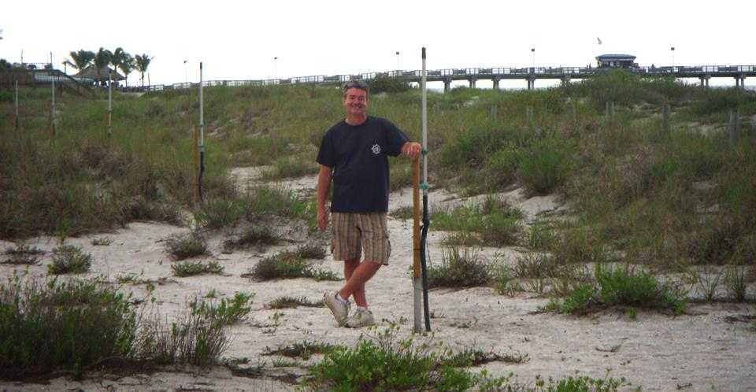
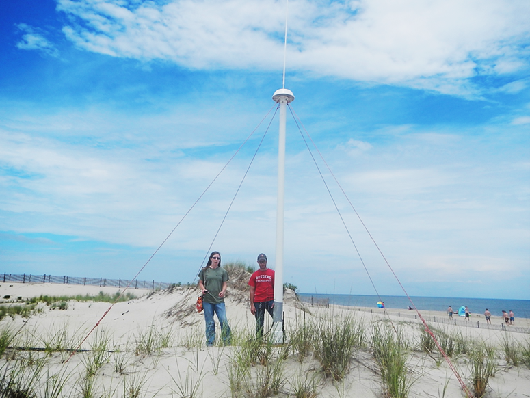

# Manual for Real-Time Quality Control of High Frequency Radar Surface

A Guide to Quality Control and Quality Assurance for High Frequency Radar Surface Current Observations

<https://doi.org/10.25923/4c5x-g538>

## Acknowledgements

Special thanks go to members of the high frequency radar surface current mapping committee,
who contributed their expertise to develop the content of the initial manual and also to reviewers,
whose many valuable suggestions greatly enhanced the manual content.

The early participation and support from Teresa Updyke (Old Dominion University),
Dr. Hugh Roarty (Rutgers University),
Sara Haines (University of North Carolina),
Dr. Mal Heron (James Cook University, Australia),
and Dr. George Voulgaris (University of South Carolina) are especially appreciated.

We thank Mark Otero (University of California San Diego/Scripps Institution of Oceanography) for providing existing QC documents.
We are also grateful for the substantial comments and suggestions provided by Don Barrick (CODAR Ocean Systems Ltd.).

In 2021 a team was formed to revise the initial version,
consisting of Brian Emery (University of California Santa Barbara),
Dale Trockel (CODAR Ocean Sensors),
Dr. Sung Yong Kim (Korea Advanced Institute of Science and Technology),
Teresa Updyke (Old Dominion University),
Manman Wang (Ocean Networks Canada),
Lorenzo Corgnati (Institute of Marine Science of the National Research Council of Italy),
Sara Haines (University of North Carolina),
Rachel Potter (University of Alaska Fairbanks),
and Dr. Hugh Roarty.
Support from Bill Rector at Codar Ocean Systems is appreciated.

Appendix A provides a full list of committee members,
reviewers,
and others involved in the QARTOD project.

## Acronyms and Abbreviations

|   |   |
|---|---|
|AOOS|Alaska Ocean Observing System|
|APM|Antenna pattern measurement|
|BF|Beam forming|
|CARICOOS|Caribbean Coastal Ocean Observing System|
|CeNCOOS|Central and Northern California Ocean Observing System|
|CMEMS|Copernicus Marine Environment Monitoring Service|
|cm/s|Centimeters per second|
|CO-OPS|(NOAA) Center for Operational Oceanographic Products and Services|
|dB|Decibel|
|DF|Direction finding|
|DOA|Direction of arrival|
|EMODnet|European Marine Observation and Data Network|
|EuroGOOS|European Global Ocean Observing System|
|GCOOS|Gulf of Mexico Coastal Ocean Observing System|
|GDOP|Geometric Dilution of Precision|
|GLOS|Great Lakes Observing System|
|HF|High frequency|
|HFR|High frequency radar|
|hr|Hour|
|HZM|HELZEL Messtechnik|
|INSTAC|In Situ Thematic Assembly Centre|
|IOOS|(U.S.) Integrated Ocean Observing System|
|km|Kilometer|
|LERA|Least Expensive Radar|
|MARACOOS|Mid-Atlantic Regional Association Coastal Ocean Observing System|
|MHz|Megahertz|
|m/s|Meters per second|
|MUSIC|Multiple Signal Classification|
|NANOOS|Northwest Association of Networked Ocean Observing Systems|
|NERACOOS|Northeastern Regional Association of Coastal Ocean Observing Systems|
|NOAA|National Oceanic and Atmospheric Administration|
|PacIOOS|Pacific Islands Ocean Observing System|
|QARTOD|Quality-Assurance/Quality Control of Real-Time Oceanographic Data|
|QA|Quality assurance|
|QC|Quality control|
|RA|Regional Association|
|RFI|Radio frequency interference|
|SCCOOS|Southern California Coastal Ocean Observing System|
|SDC|SeaDataCloud|
|SECOORA|Southeast Coastal Ocean Observing Regional Association|
|SNR|Signal-to-noise ratio|
|UNESCO|United Nations Educational, Scientific, and Cultural Organization|
|WERA|Wellen (Wave) Radar|

## Definitions of Selected Terms

This manual contains several terms whose meanings are critical to those using the manual. These terms are included in the following table to ensure that the meanings are clearly defined.

|  |  |
|---|---|
| Beam Forming (BF) System | A BF system is a high frequency radar surface current mapping system that employs a phased-array antenna system to estimate the incoming direction of a measured signal. |
| Codable Instructions | Codable instructions are specific guidance that can be used by a software programmer to design, construct, and implement a test. These instructions also include examples with sample thresholds. |
| Data Record | A data record is one or more messages that form a coherent, logical, and complete observation. |
| Direction Finding (DF) System | A DF system is a high frequency radar surface current mapping system that employs three orthogonal antenna elements to estimate the incoming direction of a measured signal. |
| Message | A message is a standalone data transmission. A data record can be composed of multiple messages. |
| Operator | Operators are individuals or entities who are responsible for collecting and providing data. |
| Quality Assurance (QA) | QA involves processes that are employed with hardware to support the generation of high-quality data. (section 2.0) |
| Quality Control (QC) | QC involves follow-on steps that support the delivery of high-quality data and requires both automation and human intervention. (section 3.0) |
| Radial Component | Radial component is the observed surface current speed toward or away from a single HF radar site, and is also often referred to as radial speed, radial velocity, or radial vector. A radial file contains a spatial array of radial components. |
| Real-Time | Real-time means that: data are delivered without delay for immediate use; time series extends only backwards in time, where the next data points are not available; and sample intervals may range from a few seconds to a few hours or even days, depending upon the sensor configuration. (section 1.0) |
| Total Vector | Total vector is the derived surface current velocity, obtained by combining radial components from multiple HF Radar sites. A total vector file contains a spatial array of total vectors. |
| Threshold | Thresholds are limits that are defined by the operator. They often vary in space and time and should be readily available to other operators and users. |
| Variable | Variable is an observation (or measurement) of biogeochemical properties within oceanographic and/or meteorological environments. |

## 1.0 Background and Introduction

The U.S. Integrated Ocean Observing System®(IOOS®) has a vested interest in collecting high quality data for the 34 core variables (https://ioos.noaa.gov/about/ioos-by-the-numbers) measured on a national scale.
In response to this interest,
U.S. IOOS continues to establish written,
authoritative procedures for the quality control (QC) of real-time data through the Quality Assurance/Quality Control of Real-Time Oceanographic Data (QARTOD) program, addressing each variable as funding permits (UNESCO 1993).
This manual update on the real-time QC of high frequency (HF) radar surface currents represents the ninth core variable to be addressed.
Other QARTOD guidance documents that have been published by the U.S. IOOS project to date are listed below and are also available at (https://ioos.noaa.gov/project/qartod/).

1. U.S. Integrated Ocean Observing System (2017). U.S IOOS QARTOD Project Plan-Accomplishments for 2012–2016 and Update for 2017–2021. 48 pp. (https://doi.org/10.7289/V5JQ0Z71).

2. U.S. Integrated Ocean Observing System (2018). Manual for Real-Time Quality Control of Dissolved Oxygen Observations Version 2.1: A Guide to Quality Control and Quality Assurance for Dissolved Oxygen Observations in Coastal Oceans. 53 pp. (https://doi.org/10.25923/q0m1-d488).

3. U.S. Integrated Ocean Observing System (2019). Manual for Real-Time Quality Control of In-Situ Surface Wave Data Version 2.1: A Guide to Quality Control and Quality Assurance of In-Situ Surface Wave Observations. 69 pp. (https://doi.org/10.25923/7yc5-vs69).

4. U.S. Integrated Ocean Observing System (2019). Manual for Real-Time Quality Control of In-Situ Current Observations Version 2.1 A Guide to Quality Control and Quality Assurance of Acoustic Doppler Current Profiler Observations. 54 pp. (https://doi.org/10.25923/sqe9-e310).

5. U.S. Integrated Ocean Observing System (2021). Manual for Real-Time Quality Control of Water Level Data Version 2.1: A Guide to Quality Control and Quality Assurance of Water Level Observations. 47 pp. (https://doi.org/10.25923/vpsx-dc82).

6. U.S. Integrated Ocean Observing System (2020). Manual for Real-Time Quality Control of In-situ Temperature and Salinity Data Version 2.1: A Guide to Quality Control and Quality Assurance of In-situ Temperature and Salinity Observations. 50 pp. (https://doi.org/10.25923/x02m-m555).

7. U.S. Integrated Ocean Observing System (2017). Manual for Real-Time Quality Control of Wind Data Version 1.1: A Guide to Quality Control and Quality Assurance of Coastal and Oceanic Wind Observations. 47 pp. (https://doi.org/10.7289/V5FX77NH).

8. U.S. Integrated Ocean Observing System (2017). Manual for Real-Time Quality Control of Ocean Optics Data Version 1.1: A Guide to Quality Control and Quality Assurance of Coastal and Oceanic Optics Observations. 49 pp. (https://doi.org/10.25923/v9p8-ft24).

9. U.S. Integrated Ocean Observing System (2018). Manual for Real-Time Quality Control of Dissolved Nutrients Data Version 1.1: A Guide to Quality Control and Quality Assurance of Coastal and Dissolved Nutrients Observations. 56 pp. (https://doi.org/10.7289/V5TT4P7R).

10. U.S. Integrated Ocean Observing System (2017). Manual for Real-Time Quality Control of Phytoplankton Data Version 1.0: A Guide to Quality Control and Quality Assurance of Phytoplankton Data Observations. 67 pp. (https://doi.org/10.7289/V56D5R6S).

11. U.S. Integrated Ocean Observing System (2017). Manual for Real-Time Quality Control of Passive Acoustics Data Version 1.0: A Guide to Quality Control and Quality Assurance of Passive Acoustics Observations. 43 pp. (https://doi.org/10.7289/V5PC30M9).

12. U.S. Integrated Ocean Observing System (2018). Manual for Real-Time Quality Control of Stream Flow Data Version 1.0: A Guide to Quality Control and Quality Assurance of Stream Flow Observations in Rivers and Streams. 46 pp. (https://doi.org/10.25923/gszc-ha43).

13. U.S. Integrated Ocean Observing System (2019). Manual for Real-Time Quality Control of pH Data Version 1.0: A Guide to Quality Control and Quality Assurance of pH Data Observations. 56 pp. (https://doi.org/10.25923/111k-br08).

Please reference this document as:

    U.S. Integrated Ocean Observing System (2022). Manual for Real-Time Quality Control of High Frequency Radar Surface Currents Data: A Guide to Quality Control and Quality Assurance of High Frequency Radar Surface Currents Data Observations. 57 pp. <https://doi.org/10.25923/4c5x-g538>

This manual is a living document that reflects the state-of-the-art QC testing procedures for HF radar surface currents observations.
It is written for the experienced operator but also provides examples for those who are just entering the field.

## 2.0 Purpose/Constraints/Applications

The HF radar capability was successfully demonstrated decades ago,
and its use to observe surface currents is now one of the most robust operational measurements employed by the oceanographic community.
The present U.S. IOOS program integrates HF radar observations from 11 participating Regional Associations (RAs),
31 participating organizations,
more than a decade of operations,
over 130 coastal sites,
and almost 8,000,000 data files.
The effort is well described in the *National Surface Currents Plan* (U.S. IOOS 2015).
Section 13.5 of that plan provides an overview of the existing and emerging QC techniques and serves as the basis for the QC processes described herein.

### 2.1 Purpose

The purpose of this manual is to document successful QC techniques already in place,
identify any shortcoming of those techniques,
and to suggest new QC tests that may be employed as resources and capabilities permit.

QC involves follow-on steps that support the delivery of high-quality data and requires both automation and human intervention.
QC practices include such things as data integrity checks (format, checksum,
timely arrival of data),
data value checks (threshold checks,
minimum/maximum rate of change), neighbor checks,
climatology checks,
model comparisons,
signal/noise ratios,
the mark-up of the data,
the verification of user satisfaction,
and generation of data flags (Bushnell 2005).

### 2.2 Constraints

The focus of the manual is on the real-time QC of data collected,
processed,
and disseminated by the U.S. IOOS RAs.
It is limited to the HF radar surface current mapping systems presently used by the RAs,
and to the data presently provided from them.
Therefore,
it addresses these systems and manufacturers:

- SeaSonde® - developed by CODAR Ocean Sensors. Ltd.
- WERA - manufactured by HELZEL Messtechnik GmbH (HZM)
- LERA - developed by Pierre Flament at the University of Hawaii

QC is also constrained to surface current observations.
All three systems provide surface gravity wave observations,
and these observations from HF radar systems are just now emerging operationally (Roarty et al. 2019).
For a U.S. IOOS National HF Radar Technical Steering Team position paper on the use of HF radar for wave measurement,
see (https://ioos.noaa.gov/project/hf-radar/).

In addition,
the manual does not focus on the quality assurance (QA) associated with the proper installation and operation of a HF radar site (Voulgaris 2011).
Operators typically monitor many performance metrics to ensure the health of an HF radar site,
see Mantovani et al. (2020) Tables 5 and 6,
or Cook et al (2008) which is specific to SeaSonde systems.

Each system is briefly described in the following subsections.

#### 2.2.1 CODAR SeaSonde

CODAR Ocean Sensors, Ltd. (CODAR) is the developer and manufacturer of the SeaSonde compact HF radar system.
Its founders were the creators and pioneers of the HF surface-wave radar field beginning in the 1970s.
CODAR offers software for outputting several data product categories, including surface current mapping,
wave measurements,
tsunami detection,
and recently ship detection.
The company has a history of HF research and transition to operations.
The CODAR compact direction-finding system is the most widely deployed oceanographic HF technology,
both within the U.S. (approximately 150 sites) and internationally (> 300).
The antenna system optionally combines the transmitting and receiving antennas within a single mast and also eliminates the horizontal ground plane whip antennas.
The company headquarters are in Mountain View, California.

#### 2.2.2 WERA

The Wellen Radar¹ (WERA) system was initially developed at the University of Hamburg in 1996.
One of the aims was to allow measurements of the ocean wave spectrum,
which requires access to the full backscatter Doppler spectrum for all ranges and directions.
This access is achieved by applying a beam-forming technique.

The design uses a modular system that can include 4, 8, 12, or 16 independent,
inter-calibrated receiver channels.
The processing of the signals is done on the software side and allows for employing beam forming (BF) using a linear array of 8 to 16 antennas and/or direction finding (DF) with 4 antennas in a square.
A recent software upgrade allows to also apply DF algorithms on the linear array; however,
DF implementations do not provide ocean wave parameters.

To avoid high-power transmit pulses in the range of some kilowatts as used in former systems,
a frequency-modulated continuous-wave signal at 30 watts is transmitted to achieve range resolution.
The depth of the range cells can be adopted to the requirements by reprogramming the frequency span of the transmitted frequency chirp.
Typical values for a system operated in the 12-MHz frequency band are 130 ranges at 1.5 kilometers (km) resolution.

<figcaption>Figure 2-1. WERA system</figcaption>

To reduce the impact of radio frequency interference (RFI),
the WERA receives simultaneously signal containing the backscattered echoes superimposed by RFI,
along with a second signal containing RFI only.

The RFI-only signal is used to mitigate the RFI component within the echo signal,
which results in much clearer access to the echoes from the ocean surface and from ships.

Data acquisition can be programmed for different integration times,
e.g., about 10 minutes for ocean currents and wind direction and 20 minutes for ocean wave spectra (Gurgel et al. 2007).
These short intervals help to track highly variable oceanographic processes,
e.g., the impact of a fast-moving meteorological front to the ocean surface.
For detection and tracking of tsunamis and ships, data sets with 2 minutes integration time can be processed in real time every 30 seconds.

In 2000, a technology transfer to HZM (http://www.helzel.com/) began.
WERA systems are now manufactured and further developed by HZM,
which is located in Kaltenkirchen, Germany.
More than 100 systems have been installed worldwide;
about ten are deployed within the U.S.
Additional information on WERA is available at http://ifmaxp1.ifm.uni-hamburg.de/WERA.shtml and https://helzel.com/product-detail-wera/.

HZM offers a software module with their own implementation of QC flags and QC tests which work on WERA data formats.
Although access to the description of the data format and to the description of the WERA QC procedure (Gomez et al. 2014) is not restricted,
the binary programs that implement it are typically provided with an additional software license cost.
WERA reports that the same tests applied by the WERA QC proprietary software are also considered in the recommendations provided in this document,
either in Table 3-2,
or as an additional potential QC test in appendix B (such as broadness of peak or trend limits).

<small>¹ Wellen Radar is German for wave radar.</small>

#### 2.2.3 UH-HFDR

The University of Hawai‘i High Frequency Doppler Radars (UH-HFDR; known colloquially as LERA) was developed at the University of Hawaii Radio Oceanography Laboratory starting in 1998.
The HFDR systems are produced with an open source model to minimize hardware costs. In the subsequent years,
the laboratory has developed projects and collaborations around the world: Hawaii (2002–present), Italy (2002–2004), Philippines (2008–present), Taiwan (2018–present), and Mexico (2005–present), to name a few.

### 2.3 Applications

The QC tests described here can be applied to the Doppler spectra,
to the radial components, or to the total vectors.
In HF radar surface current mapping,
much of the QC is already embedded in the acquisition system, especially for QC of the Doppler spectra.
Examples include:

- Noise floor detection and computation
- First-order Bragg peak detection and measurement
- Individual spectrum signal-to-noise ratio (SNR) computation for the first-order peak
- Detection and removal of burst interference (e.g., lightning)
- Detection and removal of ionospheric echo
- Detection and removal of ship echoes
- Detection and removal of other types of RFI

Doppler spectra may be rejected,
and radial components may not be produced from them depending on the outcome of these tests.
Because these processes influence the production of radial components,
they are inherently part of the quality control process for surface currents described in U.S. IOOS (2015).

## 3.0 Quality Control

To conduct real-time quality control (QC) on HF radar surface current observations,
the first prerequisite is to understand the science and context within which the measurements are being conducted.
Each HF radar radial site may have unique QC challenges.
HF radar measurements can be used to resolve many surface-current features,
such as oceanic fronts,
current shear,
divergent and convergence zones;
some of these features can be extreme events.
Human involvement is therefore important so that solid scientific principles are applied to data evaluation to ensure that good data are not discarded and bad data are not distributed.

The real-time QC of HF radar observations can be extremely challenging.
For example,
for real-time QC,
gradual calibration changes (e.g., changes in antenna patterns) and long-term system responses (component drift) most likely cannot be detected or corrected with real-time,
automated QC—at least,
not at the present time.

The QC described here may be conducted: 1) within the HF radar data collection system itself,
2) by the local system operator,
and 3) national and regional servers. Example of national and regional servers are:

- The University of California San Diego - http://cordc.ucsd.edu/projects/mapping
- NOAA’s National Data Buoy Center - http://hfradar.ndbc.noaa.gov/
- Rutgers University - https://rucool.marine.rutgers.edu/data/codar/

### 3.1 QC Flags

Data are evaluated using QC tests,
and the results of those tests are recorded by inserting flags in the data record.
Table 3-1 provides a simple set of flags and associated descriptions.
HF radar manufacturers already include additional flags for metadata records to further assist with troubleshooting.
For example,
CODAR Ocean Sensors (2009) identifies a variety of flags that are unique to SeaSonde systems.
For additional information regarding flags,
see the *Manual for the Use of Real-Time Oceanographic Data Quality Control Flags* (U.S. IOOS 2020) posted on the U.S. IOOS QARTOD website.
Extensive data flagging is already in place for HF radar and serves the observational needs quite well.
These flags can be a successful example for other systems;
however,
herein we focus on the use of the flagging scheme accepted by UNESCO/IOC in 2013 and adopted by U.S. IOOS/QARTOD in 2014.

Further post-processing of the data may yield different conclusions from those reached during initial assessments.
Flags set in real-time should not be changed to ensure that historical documentation is preserved. Results from post-processing should generate another set of flags.

| **Flag**                      | **Description**                                                                                                                                                                      |
| ----------------------------- | ------------------------------------------------------------------------------------------------------------------------------------------------------------------------------------ |
| Pass=1                        | Data have passed critical real-time QC tests and are deemed adequate for use as preliminary data.                                                                                    |
| Not Evaluated=2               | Data have not been QC-tested, or the information on quality is not available.                                                                                                        |
| Suspect or of High Interest=3 | Data are considered to be either suspect or of high interest to data providers and users. They are flagged suspect to draw further attention to them by operators.                   |
| Fail=4                        | Data are considered to have failed one or more critical real-time QC checks. If they are disseminated at all, it should be readily apparent that they are not of acceptable quality. |
| Missing Data=9                | Data are missing; used as a placeholder.                                                                                                                                             |

: Table 3-1. Flags for real-time data (UNESCO 2013)

### 3.2 Sensor Deployment Considerations

HF radars can be deployed in a variety of environments. Cook et al. (2008) and Mantovani et al. (2020) discuss the steps to follow when finding a suitable location for an HF radar installation.
Figure 3-1 shows an example of a SeaSonde antenna location with desirable features—close to the sea with low elevation and no nearby structures.

<figcaption>Figure 3-1. A SeaSonde 25 MHz combined transmitting and receiving antenna deployed at Cape Henlopen, Delaware.</figcaption>

### 3.3 QC Test Descriptions

A variety of tests can be performed to evaluate data quality in real time.
Some tests may already be embedded in the processing software;
some may be applied using optional manufacturer-supplied software modules, and others are conducted by the local operator or the national servers.
The tests listed in this section (Table 3-2) presume a time-ordered series of observations and denote these observations as follows:

Radial velocity: $R_{t-2}$, $R_{t-1}$, $R_{t}$ - Total vector: $T_{t-2}$, $T_{t-1}$, $T_{t}$

Sensor operators need to select the best thresholds for each test, which are determined at the operator level and may require trial and error before final selections are made.
A successful QC effort is highly dependent upon selection of the proper thresholds,
which should not be determined arbitrarily but can be based on historical knowledge or statistics derived from more recently acquired data.
Although this manual provides some guidance for selecting thresholds based on input from various operators,
it is assumed that operators have the expertise and motivation to select the proper thresholds to maximize the value of their QC effort.
Operators must openly provide thresholds as metadata for user support.
This shared information will help U.S. IOOS to document standardized thresholds that will be included in future releases of this manual.

In Table 3-2, tests that apply only to DF systems are marked with an asterisk (`*`).
This condition is further highlighted as needed within each test description in the test exceptions block.
A double asterisk (`**`) indicates that the use of both the U component and V component uncertainty tests is an acceptable alternative to the required GDOP threshold test.

Several additional tests were suggested by experienced operators who reviewed the manual,
but details of the tests were not available.
In order to ensure these tests remain available for consideration,
they have been listed in appendix B,
*Additional Potential Quality Control Tests*.
As this manual is updated and content for these tests becomes available,
they will be incorporated.

| Test Type | Test Name | Status | Test Control |
|---|---|---|---|
| Signal (or Spectral) Processing | Signal-to-Noise Ratio (SNR) for Each Antenna (Test 101) | Required | Embedded |
| | Cross Spectra Covariance Matrix Eigenvalues* (Test 102) | Suggested | Embedded |
| | Direction of Arrival (DOA) Metrics* (magnitude) (Test 103) | Suggested | Embedded |
| | Direction of Arrival (DOA) Function Widths* (3 dB) (Test 104) | Suggested | Embedded |
| | Positive Definiteness of 2×2 Signal Matrix* (Test 105) | Required | Embedded |
| Radial Components | Syntax (Test 201) | Required | National |
| | Max Threshold (Test 202) | Required | Local and National |
| | Valid Location (Test 203) | Required | Local and National |
| | Radial Count (Test 204) | Suggested | Local and National |
| | Spatial Median Filter (Test 205) | Suggested | Local and National |
| | Temporal Gradient (Test 206) | Suggested | Local and National |
| | Average Radial Bearing (Test 207) | Suggested | Local and National |
| | Baseline and Synthetic Radial (Test 208) | Suggested | Local and National |
| | Radial Stuck Value (Test 209) | Suggested | Local and National |
| | Phases (Test 210) | In development | TBD |
| Total Vectors | Data Density Threshold* (Test 301) | Required | Local and National |
| | GDOP Threshold** (Test 302) | Required | Local and National |
| | Max Speed Threshold (Test 303) | Required | Local and National |
| | Spatial Median Comparison (Test 304) | Suggested | Local and National |
| | Valid Location (Test 305) | Suggested | Local |
| | U Component Uncertainty** (Test 306) | Required | Local |
| | V Component Uncertainty** (Test 307) | Required | Local |

: Table 3-2. QC tests for real-time HF radar data. Tests with (`*`) apply only to systems using DF. **Use of both the U component uncertainty and V component uncertainty tests is an acceptable alternative to the required GDOP threshold test.

#### 3.4 Test Hierarchy

This section outlines the real-time QC tests that are required or suggested for HF radar measurements.
Operators should also consider that some of these tests can be carried out within the instrument,
where thresholds can be defined in configuration files.
These procedures are written as a high-level narrative from which a computer programmer can develop code to execute specific data flags (data quality indicators) within an automated software program.
A code repository where operators may find or post examples of code in use exists at https://github.com/rowg.
However,
HF radar surface current observations are well established,
and in most cases the QC applied will be quite uniform.
Tests are listed in table 3-3 and are divided into four groups:
those that are required,
strongly recommended,
suggested,
or in development.

**Table 3-3.** QC Test hierarchy

| Group | Test | Description |
|---|---|---|
| Group 1 — Required | Test 101 | Signal-to-Noise Ratio |
|  | Test 105 | Positive Definiteness of 2×2 Signal Matrix* |
|  | Test 201 | Syntax |
|  | Test 202 | Max Threshold |
|  | Test 203 | Valid Location (radial components) |
|  | Test 301 | Data Density Threshold* |
|  | Test 302 | GDOP Threshold** (or U component and V component tests) |
|  | Test 303 | Max Speed Threshold |
|  | Test 306 | U Component Uncertainty** |
|  | Test 307 | V Component Uncertainty** |
| Group 2 — Strongly Recommended | None | None. |
| Group 3 — Suggested | Test 102 | Cross Spectra Covariance Matrix Eigenvalues |
|  | Test 103 | DOA Metrics (magnitude)* |
|  | Test 104 | DOA Function Widths (3 dB)* |
|  | Test 204 | Radial Count* |
|  | Test 205 | Spatial Median Filter* (radial components) |
|  | Test 206 | Temporal Gradient |
|  | Test 207 | Average Radial Bearing* |
|  | Test 208 | Baseline and Synthetic Radial |
|  | Test 209 | Radial Stuck Value |
|  | Test 304 | Spatial Median Comparison (total vectors) |
|  | Test 305 | Valid Location |
| Group 4 — In Development | Test 210 | Phases |

#### 3.4.1 Signal Processing (or Spectral Processing)

These tests are presently, or likely would be,
conducted using algorithms embedded in the data acquisition software.

**Test 101 – Signal-to-Noise Ratio (SNR) for Each Antenna (Required)**

Ensures that measured signal is sufficiently above a noise level.

The signal-to-noise ratio (SNR) value should exceed the minimum value (SNRMIN). Different methods may be specified for different HF radar types (antenna configuration). For CODAR, SNRMIN can be set in Header.txt manually or by using cross spectra in post processing.

|Flags|Condition|Codable Instructions|
|---|---|---|
|Fail = 4|SNR for a specific antenna is less than a minimum value. Reject due to low signal level either on the monopole (SNR3) or on both loop antennas (SNR1 and SNR2).|If SNR3 < SNRMIN OR (SNR1 < SNRMIN AND SNR2 < SNRMIN), flag = 4|
|Suspect = 3|N/A|None|
|Pass = 1|SNR exceeds minimum on both monopole and either of the loop antennas.|If SNR3 ≥ SNRMIN AND (SNR1 ≥ SNRMIN OR SNR2 ≥ SNRMIN), flag = 1|

Test Exception: None.

Test specifications to be established by operator.

Example: `SNRMIN=6.0` (dB) (default) (6.0 to 9.0 dB CODAR-recommended).

**Test 102 – Cross Spectra Covariance Matrix Eigenvalues (Suggested)**

Test is part of the direction-of-arrival (DOA) decision process about whether to select single or dual angle for radial velocity value.

A single eigenvalue that is much larger than the others favors a single-angle decision.
Two larger eigenvalues favor dual-angle.

|Flags|Condition|Codable Instructions|
|---|---|---|
|Fail = 4|All eigenvalues are close to each other.|If Eig1, Eig2, Eig3 within 20% of each other, flag = 4|
|Suspect = 3|Two eigenvalues are moderately large.|If Eig1/Eig3 < 2 * Eig2/Eig3, flag = 3|
|Pass = 1|One eigenvalue is much larger than other two.|If Eig1 > 100 * Eig2 and Eig1 > 100 * Eig3, then accept single-angle decision, flag = 1|

Test Exception: Does not apply to systems using BF.

Test specifications to be established by operator. For SeaSonde systems, these thresholds are part of preference settings in the Header.txt file under MUSIC parameters.

**Test 103 - Direction of Arrival (DOA) Metrics (magnitude)`*` (Suggested)**

Evaluates whether the DOA response peak power is strong enough to produce good data for the specific DOA solution. (Kirincich et al. 2012).

DOA peak power for each solution should be above a specified threshold minimum (PPMIN).
For CODAR, MSEL is the multiple signal classification (MUSIC) bearing selected (1 = single, 2 = dual angle1, and 3 = dual angle2) has corresponding output columns in RadialMetric files for MUSIC DOA peak power response, MSR1, MDR1, and MDR2, respectively.

|Flags|Condition|Codable Instructions|
|---|---|---|
|Fail = 4|DOA response peak power is less than minimum value.|If (MSEL==1 AND MSR1 < PPMIN) OR (MSEL==2 AND MDR1 < PPMIN) OR (MSEL==3 AND MDR2 < PPMIN), flag = 4.|
|Suspect = 3|N/A|None|
|Pass = 1|DOA peak power exceeds minimum for specific DOA solution. Applies for test pass condition.|If (MSEL==1 AND MSR1 ≥ PPMIN) AND (MSEL==2 AND MDR1 ≥ PPMIN) AND (MSEL==3 AND MDR2 ≥ PPMIN), flag = 1.|

Test Exception: Does not apply to systems using BF.

Test specifications to be established by operator.

Example: PPMIN = 5.0 (dB)

**Test 104 – DOA Function Widths (3 dB)`*` (Suggested)**

Evaluates whether DOA function is too wide,
indicating a poor fit to the antenna pattern for a specific DOA solution.
(Kirincich et al. 2012).

DOA function width at 3 dB down from the response peak bearing for each solution should be below a specified threshold maximum width in degrees (PWMAX).
For CODAR, MSEL is the MUSIC bearing selected (1 = single, 2 = dual angle1, and 3 = dual angle2) and has corresponding output columns in RadialMetric files for MUSIC DOA function width—MSW1,
MDW1, and
MDW2,
respectively.

|Flags|Condition|Codable Instructions|
|---|---|---|
|Fail = 4|DOA function width is greater than maximum value.|If (MSEL==1 AND MSW1 ≥ PWMAX) OR (MSEL==2 AND MDW1 ≥ PWMAX) OR (MSEL==3 AND MDW2 ≥ PWMAX), flag = 4|
|Suspect = 3|N/A|N/A|
|Pass = 1|DOA function width is narrower than maximum value for a specific DOA solution. Applies for test pass condition.|If (MSEL==1 AND MSW1 < PWMAX) AND (MSEL==2 AND MDW1 < PWMAX) AND (MSEL==3 AND MDW2 < PWMAX), flag = 1|

Test Exception: Does not apply to systems using BF.

Test specifications to be established by operator.

Example: PWMAX = 50 degrees

**Test 105 - Positive Definiteness of 2x2 Signal Matrix`*` (Suggested)**

Test is part of DOA decision process to specifically check whether dual-angle decision fits the data.

A dual-angle situation implies two signals present from two directions.
From these a 2x2 signal matrix can be computed,
whose diagonal elements are the powers from each of the two directions.
The off-diagonal elements are complex noise numbers that would be zero under perfect dual-angle,
infinite-ensemble average conditions.
If these differ significantly from zero and are close to the diagonal elements (resulting in a matrix that is not positive definite),
the dual-angle hypothesis should not apply.

|Flags|Condition|Codable Instructions|
|---|---|---|
|Fail = 4|Dual angle decision fails because off- diagonal elements are too large.|If P1 * P2 < 3 * abs(C12), then flag = 4|
|Suspect = 3|Possibly single or dual angle; other criteria important for decision.|If 3 * abs(C12) < P1 * P2 < 5 * abs(C12), then flag = 3|
|Pass = 1|More likely dual-angle condition.|If P1 * P2 > 5 * abs(C12), then flag = 1|

Test Exception: Does not apply to systems using BF.

Test specifications to be established by operator.
This test may be used in conjunction with or in place of other DOA decision criteria.
Optimal values in the codable instructions should be tested because they may be site-specific,
depending on conditions.

#### 3.4.2 Radial Tests

This set of tests is conducted during the development of the radial velocities, or upon the resultant radial velocities. These tests may be carried out at the local, regional and/or national network levels.

**Test 201 – Syntax (Required)**

A collection of tests ensuring proper formatting and existence of fields within a radial file.

The radial file may be tested for proper parsing and content,
for file format (hfrweralluv1.0, for example),
site code,
appropriate time stamp,
site coordinates,
antenna pattern type (measured or ideal,
for DF systems),
and internally consistent row/column specifications.

|Flags|Condition|Codable Instructions|
|---|---|---|
|Fail = 4|One or more fields are corrupt or contain invalid data.|If “File Format” ≠ “hfrweralluv1.0”, flag = 4|
|Suspect = 3|N/A|N/A|
|Pass = 1|Applies for test pass condition.|N/A|

Test Exception: None.

Test specifications to be established by operator.
Acceptable files types, site codes, coordinates, APM names, etc., must be presented.
For example, the national network performs the following suite of tests:

- All radial files acquired by HFRNet portals report the data timestamp in the filename. The filename timestamp must not be any more than 72 hours in the future relative to the portals’ system time.
- The file name timestamp must match the timestamp reported within the file.
- Radial data tables (Lon, Lat, U, V, ...) must not be empty.
- Radial data table columns stated must match the number of columns reported for each row (a useful test for catching partial or corrupted files).
- The site location must be within range: − 180 ≤ Longitude ≤ 180 − 90 ≤ Latitude ≤ 90.
- As a minimum, the following metadata must be defined:
    - File type (LLUV)
    - Site code
    - Timestamp
    - Site coordinates
    - Antenna pattern type (measured or idealized)
    - Time zone (only Coordinated Universal Time or Greenwich Mean Time accepted)

**Test 202 - Max Threshold (Required)**

Ensures that a radial current speed is not unrealistically high.

The maximum radial speed threshold (RSPDMAX) represents the maximum reasonable surface radial velocity for the given domain.

|Flags|Condition|Codable Instructions|
|---|---|---|
|Fail = 4|Radial current speed exceeds the maximum radial speed threshold.|If RSPD > RSPDMAX, flag = 4|
|Suspect = 3|N/A|N/A|
|Pass = 1|Radial current speed is less than or equal to the maximum radial speed threshold.|If RSPD ≤ RSPDMAX, flag = 1|

Test Exception: None.

Test specifications to be established by operator.
The maximum total speed threshold is 1 m/s for the West Coast of the United States and 3 m/s for the East/Gulf Coast domain.
The threshold must vary by region.
For example, the presence of the Gulf Stream dictates the higher threshold on the East Coast.

**Test 203 – Valid Location (Required)**

Removes radial vectors placed over land or in other unmeasurable areas.

Radial vector coordinates are checked against a reference file containing information about which locations are over land **or** in an unmeasurable area (for example, behind an island or point of land). Radials in these areas will be flagged with a code (FLOC) in the radial file (+128 in CODAR radial files) and are not included in total vector calculations.

|Flags|Condition|Codable Instructions|
|---|---|---|
|Fail = 4|Radial contains a user-defined location flag code in the radial file.|If FLOC exists, flag = 4|
|Suspect = 3|N/A|None|
|Pass = 1|Radial does not contain a user-defined location flag code in the radial file.|If FLOC does not exist, flag = 1|

Test Exception: None.

Test specifications to be established by operator. For CODAR systems, the reference file is called AngSeg_XXXX.txt, where XXXX is the four-letter site code of the station and is located in the “RadialConfigs” folder. These vectors receive a code of +128 in the flag column of the radial text file. BF systems use pre-set grid locations for radials. For WERA systems, this information can be found in the params.cfg file in parameter WATT_NAME.

**Test 204 – Radial Count`*` (Suggested)**

Rejects radials in files with low radial counts (poor radial map coverage).

The number of radials (RCNT) in a radial file must be above a threshold value RCNT_MIN to pass the test and above a value RC_LOW to not be considered suspect.
If the number of radials is below the minimum level,
it indicates a problem with data collection. In this case,
the file should be rejected and none of the radials used for total vector processing.

|Flags|Condition|Codable Instructions|
|---|---|---|
|Fail = 4|Number of radials is less than RC_MIN.|If RCNT < RC_MIN, flag = 4|
|Suspect = 3|Number of radials is greater than or equal to RC_MIN and less than or equal to RC_LOW.|If RCNT ≥ RC_MIN and RCNT ≤ RC_LOW, flag = 3|
|Pass = 1|Number of radials is greater than RC_LOW.|If RCNT > RC_LOW, flag = 1|

Test Exception: Does not apply to BF systems.

Test specifications to be established by operator.
The RC_LOW threshold may be based on the national network performance metric threshold value of 300.
The choice of 300 radial solutions came from grouping radial files over a certain time period from all stations,
looking at the cumulative density function for counts,
and selecting a value around 10%.
However,
this threshold does not work for all stations.
A custom value for a site might be found by following the same procedure for the individual station.

**Test 205 – Spatial Median Filter (Suggested)**

Reduces outlier velocities in radials.

For each radial source vector, compute the median of all velocities within `<RCLim>` Range Step (km) and also within `<AngLim>` degrees in bearing. If the difference between the vector's velocity and the median velocity is greater than `<CurLim>` cm/s, then the vector is discarded; otherwise the median velocity is used.

In the codable instructions below, the radial velocity is designated as RV and the set of neighboring velocities is designated as RVNB.

A filtered and filled option for radials was introduced in CODAR Radial Suite software release 7. SeaSondeRadialSiteSetup can turn this feature on or off. Another way to do this is to change the value of line 22 in the AnalysisOptions.txt file in the RadialConfigs folder. It can be set to 0, 1, or 2 according to this guidance: 0 = Off, 1 = Area Filter + Interpolation, 2 = Area Filter Only.

The filtering and interpolation parameters are located on line 30 of the Header.txt in the RadialConfigs folder. Only the filtering is described below.

<small>(Information provided by personal communication with Bill Rector at CODAR.)</small>

|Flags|Condition|Codable Instructions|
|---|---|---|
|Fail = 4|Difference between the vector velocity and the median velocity is greater than the threshold.|If RV-median(RVNB) > CurLim, vector, flag = 4.|
|Suspect = 3|N/A|None.|
|Pass = 1|If the difference between the vector velocity and the median velocity is less or equal to the threshold, the vector value is CHANGED to the median value.|If RV-median(RVNB) ≤ CurLim, RV = median(RVNB) and flag = 1|

Test Exception: None.

Test specifications to be established by operator. If the feature is turned on, the default values are: RCLim = 2.1 steps, AngLim = 10 degrees, CurLim = 30 cm/s.

**Test 206 – Temporal Gradient (Suggested)**

Checks for satisfactory temporal rate of change of radial components.

Test determines whether changes between successive radial velocity measurements at a particular range and bearing cell are within an acceptable range. GRADIENT_TEMP = abs($R_{t-1}$ - $R_{t}$)

|Flags|Condition|Codable Instructions|
|---|---|---|
|Fail = 4|The temporal change between successive radial velocities exceeds the gradient failure threshold.|If GRADIENT_TEMP ≥ GRADIENT_TEMP_FAIL, flag = 4|
|Suspect = 3|The temporal change between successive radial velocities is less than the gradient failure threshold but exceeds the gradient warn threshold.|If GRADIENT_TEMP < GRADIENT_TEMP_FAIL & GRADIENT_TEMP ≥ GRADIENT_TEMP_WARN, flag = 3|
|Pass = 1|The temporal change between successive radial velocities is less than the gradient warn threshold.|If GRADIENT_TEMP < GRADIENT_TEMP_WARN, flag = 1|

Test Exception: None.

Test specifications to be established by operator. Example: GRADIENT_TEMP_FAIL = 54 cm/s * hr, GRADIENT_TEMP_WARN = 36 cm/s * hr

**Test 207 – Average Radial Bearing`*` (Suggested)**

Check that the average radial bearing remains relatively constant (Roarty et al. 2012).

It is expected that the average of all radial velocity bearings AVG_RAD_BEAR obtained during a sample interval (e.g., 1 hour) should be close to a reference bearing REF_RAD_BEAR and not vary beyond warning or failure thresholds.

|Flags|Condition|Codable Instructions|
|---|---|---|
|Fail = 4|The absolute difference between the average radial bearing and a reference bearing exceeds a failure threshold.|If abs(AVG_RAD_BEAR – REF_RAD_BEAR) ≥ RAD_BEAR_DIF_FAIL, flag = 4|
|Suspect = 3|The absolute difference between the average radial bearing and a reference bearing is less than the failure threshold but exceeds the warning threshold.|If abs(AVG_RAD_BEAR - REF_RAD_BEAR) ≥ RAD_BEAR_DIF_WARN AND abs(AVG_RAD_BEAR - REF_RAD_BEAR) < RAD_BEAR_DIF_FAIL, flag = 3|
|Pass = 1|The absolute difference between the average radial bearing and a reference bearing is less than the warning threshold.|If abs(AVG_RAD_BEAR - REF_RAD_BEAR) < 1RAD_BEAR_DIF_WARN, flag = 1|

Test Exception: Test becomes less useful as the observation azimuth increases, cannot be used for omnidirectional sites, and does not apply to BF systems.

Test specifications to be established by operator. Examples: RAD_BEAR_DIF_FAIL =30°, RAD_BEAR DIF_WARN = 15°.

**Test 208 – Baseline and Synthetic Radial Test (Suggested)**

Tests for the difference between actual radial and independent synthetic radial.

Total maps are computed from a subset of available radar station radial maps.
Synthetic radials for the excluded radial maps are back-computed from those totals and compared with observed radials.
A synthetic radial velocity (RS) is created for an independent site by using a total vector generated from two or more sites and comparing RS to the actual radial velocity (RA) from the independent site.

|Flags|Condition|Codable Instructions|
|---|---|---|
|Fail = 4|The absolute difference between the synthetic radial component $R_{S}$ and the actual independent radial component $R_{A}$ exceeds the $ΔR_{Fail}$ threshold.|If abs($R_{S}$ - $R_{A}$) > $ΔR_{Fail}$, flag = 4|
|Suspect = 3|The absolute difference between the synthetic radial component $R_{S}$ and the actual independent radial component $R_{A}$ is less than or equal to the $ΔR_{Fail}$ threshold and greater than the $ΔR_{Suspect}$ threshold.|If abs($R_{S}$ - $R_{A}$) ≤ $ΔR_{Fail}$ and abs($R_{S}$ - $R_{A}$) > $ΔR_{Suspect}$, flag = 3|
|Pass = 1|Applies for test pass condition.|abs($R_{S}$ - $R_{A}$) ≤ $ΔR_{Suspect}$, flag = 1|

Test Exception: Test cannot be conducted unless sites provide sufficient radial components with overlapping coverage.

Test specifications to be established by operator. Example: ΔRFail = 25 cm/s, ΔRSuspect = 15 cm/s

**Test 209 – Radial Stuck Value Test (Suggested)**

Tests for repeating values in radial time series at a location.

If the temporal change between successive radial velocities has not exceeded the resolution of the measurement for N successive time steps,
those velocities (excluding first occurrence of the repeating velocity in the evaluation period) are considered stuck values.

|Flags|Condition|Codable Instructions|
|---|---|---|
|Fail = 4|The temporal change between successive radial velocities has not exceeded the resolution (R) of the measurement for N successive time steps.|V = [ $V_{t=-(N-1)}$ … $V_{t=-1}$, $V_{t=0}$ ] IF MAX(ABS(DIFF(V))) < R, flag = 4|
|Suspect = 3|N/A|N/A|
|Pass = 1|The temporal change between successive radial velocities has exceeded the resolution of the measurement.|IF MAX(ABS(DIFF(V))) ≥ R, flag = 1|

Test Exception: Cannot be applied if there are less than N successive measurements at the location.

Test specifications to be established by operator. Example: N = 3, R = 0.01

**Test 210 -- Phases (In development)**

Tests ensuring proper setting of expected antenna phases for ideal pattern.

The radial file may be tested for absolute difference between phases used (P13_setting, P23_setting) to calculate radials versus measured (P13_actual, P23_actual).
How this test should be structured and implemented is not yet clear.
It should consider that differences of 180 degrees (or within the tolerance threshold of 180 degrees) are also acceptable if this is occurring in one of the two loops.
Operators should routinely check on the sea echo phases as a best practice.
Depending on the station,
operators might want to use this test for monitoring and not flagging,
since system phases could be stable while the sea echo phase estimates from spectra may not be as stable.

|Flags|Condition|Codable Instructions|
|---|---|---|
|Fail = 4| abs(P13_actual - P13_setting) > tolerance or abs(P23_actual - P23_setttings) > tolerance|Codable instructions needed|
|Suspect = 3|N/A|N/A|
|Pass = 1|Applies for test pass condition.|Codable instructions needed|

Test Exception:

Test specifications to be established by operator. Example:

#### 3.4.3 Total Vectors

This set of tests is conducted during the development of the total velocities.
These tests may be carried out at the local,
regional and/or national network levels.

**Test 301 - Data Density Threshold`*` (Required)**

Tests that a sufficient number of radial velocities exist to compute a total velocity vector.

A minimum number of radial velocities (RV_MIN) are required to construct a total velocity vector. RV_CNT is the number of radial velocities available to be used in the calculation.

|Flags|Condition|Codable Instructions|
|---|---|---|
|Fail = 4|Insufficient number of radial velocities exist.|If RV_CNT < RV_MIN, flag = 4|
|Suspect = 3|N/A|N/A|
|Pass = 1|A sufficient number of radial velocities exist.|If RV_CNT ≥ RV_MIN, flag = 1|

Test Exception: Does not apply to BF systems.

Test specifications to be established by operator. Recommend RV_MIN = 3

In CODAR software, this is set in line 1 of the AnalysisOptions.txt configuration file; the default value is 2.

**Test 302 - GDOP Threshold (Required)**

Tests that the uncertainty in velocity due to the geometric relationship between radials is low enough for the vector to be considered valid.

GDOP (Geometric Dilution of Precision) is a scalar representing the contribution of the radial (bearing) geometry to uncertainty in velocity at a given grid point.
Higher GDOP values indicate larger co-variances associated with the least square’s fit used in obtaining the solution.
GDOP must be less than a maximum allowed value of GDOP_MAX to pass and less than a GDOP_HIGH value to not be considered suspect (Kim et al. 2008).

<small>Note that there are different versions of the GDOP calculation, which make different assumptions about the radial uncertainties and the covariance between radial uncertainties.

For more information, see README_error_estimates.m in HFR Progs (https://github.com/rowg/hfrprogs/blob/master/matlab/totals/README_error_estimates.m) and Kaplan et al. (2005). </small>

|Flags|Condition|Codable Instructions|
|---|---|---|
|Fail = 4|Poor geometric relationship between radials yields a total vector with too much uncertainty to be valid.|If GDOP ≥ GDOP_MAX, flag = 4|
|Suspect = 3|The GDOP value associated with a total vector solution may be acceptable.|If GDOP < GDOP_MAX and GDOP ≥ GDOP_HIGH, flag = 3|
|Pass = 1|The GDOP associated with the total vector solution is sufficient.|If GDOP < GDOP_HIGH, flag = 1|

Test Exception: None.

Test specifications to be established by operator.

The national network uses a GDOP_MAX of 10 and a more conservative value of 1.25 for near-real time applications such as Web display.
The maximum and minimum values of GDOP may depend on the number of radials,
so we suggest examining statistics of regional GDOP and to determine appropriate thresholds.
The HFRprogs Toolbox includes several implementations of GDOP, some of which are more conservative than others,
but generally the differences are minimal.

**Test 303 - Max Speed Threshold (Required)**

||Ensures that a total current speed is not unrealistically high.||
||represents the maximum reasonable surface velocity for the given|Like the maximum radial velocity threshold, the maximum total speed threshold TSPDMAX domain.|

|Flags|Condition|Codable Instructions|
|---|---|---|
|Fail = 4|Total current speed exceeds the maximum total speed threshold.|If TSPD > TSPDMAX, flag = 4|
|Suspect = 3|N/A|None.|
|Pass = 1|Total current speed is below or equal to the maximum total speed threshold.|If TSPD ≤ TSPDMAX, flag = 1|

Test Exception: None.

Test specifications to be established by operator.

The maximum total speed threshold is 1 m/s for the West Coast of the United States and 3 m/s for the East/Gulf Coast domain.
The threshold must vary by region and is in general related to the inverse function of the radials.
For example, the presence of the Gulf Stream dictates the higher threshold on the East Coast.

**Test 304 – Spatial Median Comparison (Suggested)**

Reduces outlier velocities in totals.

Modeled after CODAR’s median filter for radials,
this test computes the difference between a total velocity (TV) and the median of a set of total velocities in an area surrounding that vector (TVNB).

For each total source vector, compute the median of all velocities within `<TCLim>` Grid Steps in u and v directions.
If the difference between the vector's velocity and the median velocity is greater than `<TCurLim>` cm/s then the vector is discarded.

In the instructions below,
the total velocity is designated as TV and the set of neighboring velocities is designated as TVNB.
The test rejects the vector when the difference is greater than TCurLim.

|Flags|Condition|Codable Instructions|
|---|---|---|
|Fail = 4|Difference between the vector velocity and the median velocity is greater than the threshold.|If TV-median(TVNB) > TCurLim, vector is rejected; flag = 4|
|Suspect = 3|N/A|None|
|Pass = 1|If the difference between the vector velocity and the median velocity is less or equal to the threshold, the vector passes the test.|If R = TV - median(TVNB) ≤ TCurLim, flag = 1|

Test Exception: None.

Test specifications to be established by operator. TCLim and TCurLim will be set by the operator and will depend on environmental conditions.

**Test 305 – Valid Location (Suggested)**

Removes total vectors placed over land or in other unmeasurable areas.

Total vector coordinates are checked against a reference (land mask) file containing information about which locations are over land or in an unmeasurable area (for example, behind an island or point of land).

|Flags|Condition|Codable Instructions|
|---|---|---|
|Fail = 4|Total is located on a grid point designated as land by the land mask reference file.|If LANDMASK exists, flag = 4|
|Suspect = 3|N/A|None|
|Pass = 1|Total is located on a grid point not designated as land by the land mask reference file.|If LANDMASK does not exist, flag = 1|

Test Exception: If the totals grid file only contains valid locations, this test is not necessary.

Test specifications to be established by operator.

**Test 306 - U Component Uncertainty (Required)**

Tests that the uncertainty in U velocity due to the geometric relationship between radials.

The uncertainty must be low enough for the vector to be considered valid.

UERR (U Component Uncertainty) is an uncertainty normalized by the a priori model covariance. normalized uncertainty of `u = <(u_hat - u)^2>/<u^2>` (good: 0, poor: 1)

Soh et al. 2018, pp. 770–771

Higher UERR values indicate larger co-variances associated with the least square’s fit used in obtaining the solution.
UERR must be less than a maximum allowed value of UERR_MAX to pass and less than a UERR_HIGH value to not be considered suspect.

|Flags|Condition|Codable Instructions|
|---|---|---|
|Fail = 4|Poor geometric relationship between radials yields a total vector with too much uncertainty in U component to be valid.|If UERR ≥ UERR_MAX, flag = 4|
|Suspect = 3|The U component uncertainty value associated with a total vector solution may be acceptable.|If UERR < UERR_MAX and UERR ≥ UERR_HIGH, flag = 3|
|Pass = 1|The U component uncertainty associated with the total vector solution is sufficient.|If UERR < UERR_HIGH, flag = 1|

Test Exception: Not needed if using Test 302 GDOP threshold.

Test specifications to be established by operator.

**Test 307 - V Component Uncertainty (Required)**

Tests that the uncertainty in V velocity due to the geometric relationship between radials.

The uncertainty must be low enough for the vector to be considered valid.

VERR (V Component Uncertainty) is an uncertainty normalized by the a priori model covariance.

normalized uncertainty of `v = <(v_hat - v)^2>/<v^2>` (good :0, poor: 1)

Soh et al., 2018 (pp 770–771)

Higher VERR values indicate larger co-variances associated with the least square’s fit used in obtaining the solution.
VERR must be less than a maximum allowed value of VERR_MAX to pass and less than a VERR_HIGH value to not be considered suspect.

|Flags|Condition|Codable Instructions|
|---|---|---|
|Fail = 4|Poor geometric relationship between radials yields a total vector with too much uncertainty in V component to be valid.|If VERR ≥ VERR_MAX, flag = 4|
|Suspect = 3|The V component uncertainty value associated with a total vector solution may be acceptable.|If VERR < VERR_MAX and VERR ≥ VERR_HIGH, flag = 3|
|Pass = 1|The V component uncertainty associated with the total vector solution is sufficient.|If VERR < VERR_HIGH, flag = 1|

Test Exception: Not needed if using Test 302 GDOP threshold.

Test specifications to be established by operator.

## 4.0 Case Studies

While global consistency within the high frequency radar (HFR) community is desirable,
different efforts inevitably will result in differing evolutions of the operational systems.
Two case studies are offered to provide background and further resources for users of this QC manual.

### 4.1 The European HFR Network

In 2014,
the European Global Ocean Observing System (EuroGOOS) launched the High Frequency Radar Task Team (http://eurogoos.eu/high-frequency-radar-task-team/) to promote the coordinated development of HFR technology in Europe.
The team followed up on many initiatives in Europe (e.g., EU H2020 Jerico-Next, EU H2020 SeaDataCloud, EU H2020 EuroSea,
EU H2020 Jerico-S3, and Copernicus Marine Environment Monitoring Service [CMEMS]$^2$) aimed at building an operational HFR European network based on coordinated data management for the development of operational ocean monitoring via HFR systems,
In 2014,
the European Global Ocean Observing System (EuroGOOS) launched the High Frequency Radar Task Team (http://eurogoos.eu/high-frequency-radar-task-team/) to promote the coordinated development of HFR technology in Europe.
The team followed up on many initiatives in Europe (e.g., EU H2020 Jerico-Next, EU H2020 SeaDataCloud, EU H2020 EuroSea,
EU H2020 Jerico-S3, and Copernicus Marine Environment Monitoring Service [CMEMS]²) aimed at building an operational HFR European network based on coordinated data management for the development of operational ocean monitoring via HFR systems,
and integration of HFR products into the major platforms for marine data distribution.

These efforts achieved the harmonization of system requirements and design, data quality,
and standardization of HFR data access and tools (Mantovani et al. 2020).
The European standard format for HFR data and metadata model has been defined and implemented (Corgnati et al. 2018),
compliant with Climate and Forecast Metadata Convention version 1.6 (CF-1.6),
OceanSITES convention,
CMEMS-In Situ TAC$^3$ and SDC requirements and INSPIRE directive.
Furthermore, a battery of the QC tests to be mandatorily applied to HFR data has been defined according to the EuroGOOS Data Management,
These efforts achieved the harmonization of system requirements and design, data quality,
and standardization of HFR data access and tools (Mantovani et al. 2020).
The European standard format for HFR data and metadata model has been defined and implemented (Corgnati et al. 2018),
compliant with Climate and Forecast Metadata Convention version 1.6 (CF-1.6),
OceanSITES convention,
CMEMS-In Situ TAC³ and SDC requirements and INSPIRE directive.
Furthermore, a battery of the QC tests to be mandatorily applied to HFR data has been defined according to the EuroGOOS Data Management,
Exchange and Quality Work Group (DATAMEQ) working recommendations on real-time QC and building on the initial U.S. IOOS QARTOD HF radar manual (U.S. IOOS 2016).

Thanks to these achievements,
the inclusion of HFR data into CMEMS-INSTAC (Copernicus Marine in situ TAC, 2021; Copernicus Marine in situ TAC, 2020a;
Copernicus Marine in situ TAC, 2020b),
the European Marine Observation and Data Network (EMODnet) Physics and SDC Data Access (Corgnati et al. 2019) was completed,
ensuring the improved management of several related key issues as marine safety, marine resources,
coastal and marine environment, weather, climate and seasonal forecast.

The EU HFR Node was established in 2018 by AZTI,
CNR-ISMAR and SOCIB,$^4$ under the coordination of the EuroGOOS HFR Task Team,
as the focal point and operational asset in Europe for HFR data management and dissemination,
also promoting networking between EU infrastructures and the Global HFR network.
The EU HFR Node is fully operational since December 2018 in distributing tools and support for standardization to the HFR providers as well as standardized near-real-time (NRT) and delayed-mode HFR radial and total current data to CMEMS-INSTAC,
The EU HFR Node was established in 2018 by AZTI,
CNR-ISMAR and SOCIB,⁴ under the coordination of the EuroGOOS HFR Task Team,
as the focal point and operational asset in Europe for HFR data management and dissemination,
also promoting networking between EU infrastructures and the Global HFR network.
The EU HFR Node is fully operational since December 2018 in distributing tools and support for standardization to the HFR providers as well as standardized near-real-time (NRT) and delayed-mode HFR radial and total current data to CMEMS-INSTAC,
EMODnet Physics and SDC Data Access.

The European common data and metadata model for real-time HFR data requires real-time data to be mandatorily processed by the QC tests listed in Table 4-1 (for radial velocity data) and in Table 4-2 (for total velocity data). These tests were selected by the dedicated working group (composed by the HFR operators and by the EuroGOOS HFR Task Team members) and the tests are among the ones defined in this QARTOD manual, according to the defined hierarchy.

The mandatory QC tests were selected to be manufacturer-independent, i.e. not to rely on particular variables or information provided only by a specific device. These standard sets of tests have been defined both for radial and total velocity data and they are the required ones for labelling the data as Level 2B (for radial velocity) and Level 3B (for total velocity) data, as defined in Table 4-3.

<small>² See https://ec.europa.eu/info/research-and-innovation/funding/funding-opportunities/funding-programmes-and-open-calls/horizon-2020_en.

³ See http://www.marineinsitu.eu/.

⁴ AZTI is a scientific and technological center that develops high-impact transformation projects with organizations aligned with the United Nations 2030 SDGs. CNR-ISMAR is a marine institute in Italy, and SOCIB is the Balearic Islands Coastal Ocean Observing and Forecasting System.</small>

| QC test | Code | Meaning | QC variable type |
|---|---|---|---|
| Syntax | QC201 | This test will ensure the proper formatting and the existence of all the necessary fields within the radial netCDF file. This test is performed on the netCDF files, and it assesses the presence and correctness of all data and attribute fields and the correct syntax throughout the file. | N/A—it is a test on the netCDF file structure, not on data content. |
| Over-water | QC203 | This test labels radial vectors that lie on land with a “bad data” flag and radial vectors that lie on water with a “good data” flag. | gridded |
| Velocity Threshold | QC202 | This test labels radial velocity vectors whose module is bigger than a maximum velocity threshold with a “bad data” flag and radial vectors whose module is smaller than the threshold with a “good data” flag. | gridded |
| Variance Threshold |  | This test labels radial vectors whose temporal variance is bigger than a maximum threshold with a “bad data” flag and radial vectors whose temporal variance is smaller than the threshold with a “good data” flag. The CODAR manufacturer suggests not to use variance data for real-time QC, as documented in the fall 2013 CODAR Currents Newsletter. The indication is due to the fact that the CODAR parameter defining the variance is computed at each time step, and therefore considered not statistically solid. Thus, this test is applicable only to Beam Forming (BF) systems. Data files from Direction Finding (DF) systems will apply instead the “Temporal Derivative” test reporting the explanation “Test not applicable to Direction Finding systems. The Temporal Derivative test is applied.” in the comment attribute. | gridded |
| Temporal Derivative | QC206 | For each radial bin, the current hour velocity vector is compared with the previous and next hour ones. If the differences are bigger than a threshold (specific for each radial bin and evaluated on the basis of the analysis of a one-year-long time series), the present vector is flagged as bad data; otherwise, it is labeled with a “good data” flag. Since this method implies a one-hour delay in the data provision, the current hour file should have the related QC flag set to 0 (no QC performed) until it is updated to the proper values when the next hour file is generated. | gridded |
| Median Filter | QC205 | For each source vector, the median of all velocities within a radius of `<RCLim>` and whose vector bearing (angle of arrival at site) is also within an angular distance of `<AngLim>` degrees from the source vector's bearing is evaluated. If the difference between the vector’s velocity and the median velocity is greater than the specified threshold, then the vector is labeled with a “bad data” flag, otherwise it is labeled with a “good data” flag. | gridded |
| Average Radial Bearing | QC207 | This test labels the entire data file with a “good data” flag if the average radial bearing of all the vectors contained in the data file lies within a specified margin around the expected value of normal operation. Otherwise, the data file is labeled with a “bad data” flag. The value of normal operation must be defined within a time interval when the proper functioning of the device is assessed. The margin must be set according to site-specific properties. This test applies only to DF systems. Data files from BF systems will have this variable filled with “good data” flags (1) and the explanation “Test not applicable to Beam Forming systems” in the comment attribute. | scalar |
| Radial Count | QC204 | Test labeling radial data having a number of velocity vectors bigger than the threshold with a “good data” flag and radial data having a number of velocity vectors smaller than the threshold with a “bad data” flag. | scalar |

: Table 4-1. Mandatory QC tests for radial velocity data.

| QC test | Code | Meaning | QC variable type |
|---|---|---|---|
| Syntax | Similar to QC201 | This test will ensure the proper formatting and the existence of all the necessary fields within the total netCDF file. This test is performed on the netCDF files, and it assesses the presence and correctness of all data and attribute fields and the correct syntax throughout the file. | N/A, it is a test on the netCDF file structure, not on data content. |
| Data Density Threshold | QC301 | This test labels total velocity vectors with a number of contributing radials bigger than the threshold with a “good data” flag and total velocity vectors with a number of contributing radials smaller than the threshold with a “bad data” flag. | gridded |
| Velocity Threshold | QC303 | This test labels total velocity vectors whose module is bigger than a maximum velocity threshold with a “bad data” flag and total vectors whose module is smaller than the threshold with a “good data” flag. | gridded |
| Variance Threshold | Similar to QC306 and QC307 | This test labels total vectors whose temporal variance is bigger than a maximum threshold with a “bad data” flag and total vectors whose temporal variance is smaller than the threshold with a “good data” flag. The CODAR manufacturer suggests not to use variance data for real-time QC, as documented in the fall 2013 CODAR Currents Newsletter. The indication is due to the fact that the CODAR parameter defining the variance is computed at each time step, and therefore considered not statistically solid. Thus, this test applies only to Beam Forming (BF) systems. Data files from Direction Finding (DF) systems will apply instead the “Temporal Derivative” test reporting the explanation “Test not applicable to Direction Finding systems. The Temporal Derivative test is applied.” in the comment attribute. | gridded |
| Temporal Derivative | QC206 | For each grid cell, the current hour velocity vector is compared with the previous and next ones. If the differences are bigger than a threshold (specific for each grid cell and evaluated on the basis of the analysis of one-year-long time series), the present vector is flagged as “bad data,” otherwise it is labelled with a “good data” flag. Since this method implies a one-hour delay in the data provision, the current hour file should have the related QC flag set to 0 (no QC performed) until it is updated to the proper values when the next hour file is generated. | gridded |
| GDOP Threshold | QC302 | This test labels total velocity vectors whose GDOP is bigger than a maximum threshold with a “bad data” flag and the vectors whose GDOP is smaller than the threshold with a “good data” flag. | gridded |

: Table 4-2. Mandatory QC tests for total velocity data.

|Processing Level|Definition|Products|
|---|---|---|
|LEVEL 0|Reconstructed, unprocessed instrument/payload data at full resolution; any and all communications artifacts, e.g., synchronization frames, communications headers, duplicate data removed.|Signal received by the antenna before the processing stage. (No access to these data in CODAR systems)|
|LEVEL 1A|Reconstructed, unprocessed instrument data at full resolution, time-referenced and annotated with ancillary information, including radiometric and geometric calibration coefficients and georeferencing.|Spectra by antenna channel|
|LEVEL 1B|Level 1A data that have been processed to sensor units for next processing steps. Not all instruments will have data equivalent to Level 1B.|Spectra by beam direction|
|LEVEL 2A|Derived geophysical variables at the same resolution and locations as the Level 1 source data.|HFR radial velocity data|
|LEVEL 2B|Level 2A data that have been processed with a minimum set of QC tests.|HFR radial velocity data|
|LEVEL 2C|Level 2A data that have been reprocessed for advanced QC.|Reprocessed HFR radial velocity data|
|LEVEL 3A|Variables mapped on uniform space-time grid scales, usually with some completeness and consistency|HFR total velocity data|
|LEVEL 3B|Level 3A data that have been processed with a minimum set of QC tests.|HFR total velocity data|
|LEVEL 3C|Level 3A data that have been reprocessed for advanced QC.|Reprocessed HFR total velocity data|
|LEVEL 4|Model output or results from analyses of lower-level data, e.g., variables derived from multiple measurements|Energy density maps, residence times, etc.|

: Table 4-3. Processing levels for HFR data.

Each QC test results in a flag related to each data vector,
which is inserted in a specific test variable.
These variables can be: 1) matrices with the same dimensions of the data variable,
containing (for each cell), the flag related to the vector lying in that cell,
when the QC test evaluates each cell of the gridded data,
or 2) a scalar, in case the QC test assesses an overall property of the data.

An overall QC variable also reports the quality flags related to the results of all the QC tests:
it is a “good data” flag if and only if all QC tests are passed.

The flagging policy is not to modify the data, but only to label them with flags.
Thus,
each geophysical variable in the standard output files contains exactly the measured data and QC variables containing flags can be used as masks to the geophysical variables for having information about data quality.

The adopted QC flagging scheme is the ARGO QC flag scale (Wong et al. 2022), shown in Table 4-4, which extends the UNESCO scale reported in Table 3-1.

|Code|Meaning|Comment|
|---|---|---|
|0|unknown|No QC was performed.|
|1|good data|All QC tests passed.|
|2|probably good data|These data should be used with caution.|
|3|potentially correctable bad data|These data are not to be used without scientific correction or re-calibration.|
|4|bad data|Data have failed one or more QC tests.|
|5|value changed|Data may be recovered after transmission error.|
|6|N/A|This number was not used.|
|7|nominal value|The provided value is not measured but comes from a priori knowledge (instrument design or deployment), e.g. instrument target depth.|
|8|interpolated value|Missing data may be interpolated from neighboring data in space or time.|
|9|missing value|Value was missing.|

: Table 4-4. Argo quality control flag scale.

For some of these tests, HFR operators will need to select the best thresholds.
Since a successful QC effort is highly dependent upon selection of the proper thresholds,
this choice is not straightforward,
and may require trial and error before final selections are made.
These thresholds should not be determined arbitrarily but based on historical knowledge or statistics derived from historical data.

The threshold values are reported in the ‘comment’ variable attribute of each QC variable.
The flagging scheme is reported as well in the ‘flag values’ and ‘flag meanings’ variable attributes of each QC variable.

The standard netCDF radial and total files including the aforementioned QC procedures are generated by the following software tools,
that were developed and are continuously improved by the EU HFR NODE:

- HFR_Node__Centralized_Processing: [DOI 10.5281/zenodo.2639558](https://doi.org/10.5281/zenodo.2639558)
- HFR_Node__Historical_Data_Processing: [DOI 10.5281/zenodo.3569518](https://doi.org/10.5281/zenodo.3569518)
- HFR_Node__REP_Temporal_Aggregation: [DOI 10.5281/zenodo.3707649](https://doi.org/10.5281/zenodo.3707649)
- HFR_Node_tools: [DOI 10.5281/zenodo.2639555](https://doi.org/10.5281/zenodo.2639555)

### 4.2 MARACOOS HFR Network

The Mid-Atlantic Regional Association Coastal Ocean Observing System (MARACOOS) provides hourly surface current velocity maps to the U.S. Coast Guard for the Mid-Atlantic waters stretching from Cape Hatteras to Cape Cod (Table 4-5).
Those maps are produced by combining radial data from seventeen CODAR SeaSonde long range high frequency radar (HFR) systems onto a 6-kilometer grid using an optimal interpolation method.
This case study describes the efforts to expand real-time quality control in this regional surface current product and implement QC more formally through assignment of quality flags as recommended by IOOS QARTOD manuals.

| Processing Step | Description | Software |
|---|---|---|
| 1: Signal QC, Radial Generation & Transfer | SeaSonde radials (and QCD radials from North Carolina radars) are produced at the radar stations and transferred to Rutgers University. | SeaSonde software; qccodar Python toolbox |
| 2: Radial QC | Load the radial data, run the radial QC tests and output a radial QC file (Table 4-6). | HFRadarPy Python toolbox |
| 3: Compute Totals | Load radial QC files and create total vector files in MAT format. Radials with fail codes in the primary flag are NOT included in totals. | MATLAB scripts & HFR-Progs toolbox |
| 4: Total QC | Run the total QC tests and save secondary and primary flags for totals vectors as additional fields in the HFR-Progs TUV MATLAB structure. | MATLAB scripts & HFR-Progs toolbox |
| 5: NetCDF Output | Convert MATLAB totals data to NetCDF and include total vector flag information following CF metadata conventions. | HFRadarPy Python toolbox |

: Table 4-5. MARACOOS HFR Processing Steps.

#### 4.2.1 Signal and Radial Metric QC

QARTOD tests 101 and 105 are part of SeaSonde software and used on every station.
The three North Carolina stations implement radial metric QC (QARTOD tests 102, 103, 104) on the site computer with a toolbox called qccodar developed by Sara Haines.
Radial output from these qccodar scripts are called QCD radials.
Haines et al. (2017) provide more information on radial metric QC.

#### 4.2.2 Radial QC

MARACOOS writes radial QC files for CODAR Oceans Sensors SeaSonde data that include secondary flags for individual QC tests as well as a primary flag (Table 4-6).
Both levels of flags follow the IOC 54:V3 Primary Level flagging standard (UNESCO 2013), which has been adopted by QARTOD.
The new QC radial file retains the same name as the original radial file and keeps all information from the original file.

| Test Name | Code | Description | Suspect Flag | Fail Flag |
|---|---|---|---|---|
| Syntax | QC201 | A collection of tests ensuring proper formatting and existence of fields within a radial file. | N/A | Tests reveal invalid formatting or fields. |
| Max Threshold | QC202 | Ensures that a radial current speed is not unrealistically high. | N/A | velocity > RSPDMAX; RSPDMAX = 300 cm/s |
| Valid Location | QC203 | Removes radial vectors placed over land or in other unmeasurable areas. Operator defines the invalid areas in SeaSonde software. | N/A | VFLG = 128 |
| Radial Count | QC204 | Rejects radials in files with low radial counts. | RCMIN >= count <= RCLOW | count < RCMIN |
| Spatial Median | QC205 | The difference between the vector's velocity and the median velocity of its neighbors (within radius of `<RCLim>` * Range Step (km) whose vector bearing is also within `<AngLim>` degrees) must be less or equal to `<CurLim>` cm/s to pass the test. | N/A | velocity > CURLIM; RCLIM = 2.1 cells, ANGLIM = 10 degrees, CURLIM = 30 cm/s (or 50 cm/s for stations near Gulf Stream) |
| Primary Flag | PRIM | Highest flag value of QC201, QC202, QC203, QC204, QC205 (will be set to “not evaluated” only if ALL tests were “not evaluated”). | N/A | N/A |

: Table 4-6. MARACOOS Radial Data QC Tests

#### 4.2.3 Totals QC

Total vector flags are recorded with total velocities in MATLAB MAT files. They are saved in the HFR-Progs TUV structure as additional fields. When the MATLAB file is converted to NetCDF, the flags are represented as additional variables and those variables include attributes that describe the flags. Following CF conventions, the “ancillary variable” attributes of the velocity variables provide a reference to the flag variables (Table 4-7).

|Test Name|Code|Description|Suspect Flag|Fail Flag|
|---|---|---|---|---|
|Data Density|QC301|Tests that a sufficient number of radial velocities exist to compute a total velocity vector.|N/A|N/A, 3 radial velocities sourced from at least 2 radar stations are required to compute a total velocity vector.|
|Max Threshold|QC303|Ensures that a total current speed is not unrealistically high.|N/A|velocity > RSPDMAX RSPDMAX = 300 cm/s|
|Valid Location|QC305|The radial must not be located over land or in any other location where valid measurements are not possible.|N/A|Fail locations are identified by a regional land mask file.|
|U Component Uncertainty|QC306|Tests that the uncertainty in U component of velocity due to the geometric relationship between radials is low enough for the vector to be considered valid.|N/A|Uerr uncertainty > 0.6|
|V Component Uncertainty|QC307|Tests that the uncertainty in V component of velocity due to the geometric relationship between radials is low enough for the vector to be considered valid.|N/A|Verr uncertainty > 0.6|
|Primary Flag|PRIM|Highest flag value of QC301, QC303,QC305,QC306,QC307 (will be set to “not evaluated” only if ALL tests were “not evaluated”). 35|N/A|N/A|

: Table 4-7. MARACOOS Totals Data QC Tests.

#### 4.2.4 Primary Flag Definition

The primary flag is explicitly defined in metadata as the highest flag value of test1,
test2, etc. with a note that it will be set to “not evaluated” only if ALL tests were “not evaluated”.
The flag is NOT the highest value of all individual test flags.
This allows the inclusion of a secondary flag in the file that does not affect the primary (e.g., for testing purposes).
It also avoids assigning the primary as “not evaluated” in a case where it may not be a useful designation (e.g., all tests pass except the radial was at the edge of coverage, and there were not enough neighbors for the spatial median test to be evaluated).

#### 4.2.5 Thresholds

Thresholds for a low radial count test (QC204) are site specific.
The failure threshold is 10% of the number of valid radial locations and the suspect threshold is 30% of the number of valid radial locations.
The number of valid locations is based on a radial grid with a maximum of 40 range cells and 5-degree bins.
Every cell that falls over land or is otherwise blocked from obtaining a good signal (e.g., behind land) is not counted as a valid location.
The SeaSonde AngSeg_XXXX.txt file is helpful in obtaining the valid location count.
A MATLAB script was written to count the good locations from the AngSeg file and the resulting number is “rounded” to the nearest 25.

## 5.0 Summary

The QC tests in this HF radar document have been compiled using the guidance provided by the HF radar committee and valuable reviewers (appendix A),
earlier U.S. IOOS/QARTOD manuals,
and all QARTOD workshops (https://ioos.noaa.gov/ioos-in-action/qartod-meetings/).
Test suggestions came from both operators and HF radar data users with extensive experience.
The considerations of operators who ensure the quality of real-time data may be different from those whose data are not published in real time,
and these and other differences must be balanced according to the specific circumstances of each operator.
Although these real-time tests are required,
recommended,
suggested, or in development,
it is the operator who is responsible for deciding which tests are appropriate.

The QC tests identified in this manual apply to HF radar observations from three HF radar types that are used in U.S. IOOS.
The existing program has developed QC tests that are documented in this U.S. IOOS QARTOD manual.
The QARTOD HF radar committee intends for the QC tests of these programs to be compliant with U.S. IOOS QARTOD requirements and recommendations.
The individual tests are described and include codable instructions,
output conditions,
example thresholds,
and exceptions (when applicable).

Selection of the proper thresholds is critical to a successful QC effort.
Thresholds can be based on historical knowledge or statistics derived from more recently acquired data,
but they should not be determined arbitrarily.
This manual provides guidance for selecting thresholds based on input from various operators,
but also notes that operators need the subject matter expertise and motivation to select the proper thresholds to maximize the value of their QC effort.

Future QARTOD reports will address standard QC test procedures and best practices for all types of common and uncommon platforms and sensors for all the U.S. IOOS core variables.
We anticipate growth in the test procedures that will take place within the sensor package.
Significant components of metadata will reside in the sensor and be transmitted either on demand or automatically along with the data stream.
Users may also reference metadata through Uniform Resource Locators to simplify the identification of which QC steps have been applied to data.
However,
QARTOD QC test procedures in this manual address only real-time in-situ observations.
The tests do not include post-processing,
which is not in real time but may be useful for ecosystem-based management,
or delayed-mode,
which might be suitable for climate studies

Each QARTOD manual is envisioned as a dynamic document and will be posted on the QARTOD website at https://ioos.noaa.gov/project/qartod/.
This process allows for QC manual updates as technology development occurs for both upgrades of existing sensors and new sensors.

## 6.0 References

> Bushnell, M., Presentation at QARTOD III: (2005). Scripps Institution of Oceanography, La Jolla, California.

> CODAR Ocean Sensors (2009). SeaSonde Radial Site Release 6, Radial Vector and Grid Flag. (Copyright CODAR Ocean Sensors)

> Cook, Thomas, Lisa Hazard, Mark Otero, and Brian Zelenke. (2008) “Deployment and Maintenance of a High-frequency Radar (HFR) for Ocean Surface Current Mapping: Best Practices.”

> Copernicus Marine In Situ Tac Data Management Team (2021). Copernicus Marine In Situ NetCDF format manual. <https://doi.org/10.13155/59938>

> Copernicus Marine in situ TAC (2020a). Copernicus in situ NRT current product user manual (PUM). CMEMS-INS-PUM-013-048. <https://doi.org/10.13155/73192>

> Copernicus Marine In Situ Tac (2020b). For Global Ocean-Delayed Mode in-situ Observations of surface (drifters and HFR) and sub-surface (vessel-mounted ADCPs) water velocity. Quality Information Document (QUID). CMEMS-INS-QUID-013-044. <https://doi.org/10.13155/41256>

> Corgnati, L., Mantovani, C., Novellino, A., Jousset, S., Cramer, R. N., and Thijsse, P. (2019) SeaDataNet data management protocols for HF Radar data, <https://repository.oceanbestpractices.org/handle/11329/1511>.

> Corgnati, L., Mantovani, C., Novellino, A., Rubio, A., Mader, J., Reyes, E., Griffa, A., Asensio, J. L.., Gorringe, P., Quentin, C., Breitbach, G., and Widera, J. (2018) Recommendation Report 2 on improved common procedures for HFR QC analysis. <https://repository.oceanbestpractices.org/handle/11329/1441>.

> Gomez, R. et al. (2014) “Real-time quality control of current velocity data on individual grid cells in WERA HF radar,” OCEANS 2014 - TAIPEI, 2014, pp. 1–7, doi: 10.1109/OCEANS-TAIPEI.2014.6964502.

> Gurgel, K.W., Barbin, Y., Schlick, T. (2007) “Radio Frequency Interference Suppression Techniques in FMCW Modulated HF Radars”, Proc. of IEEE/OES Oceans ’07 Europe, Aberdeen, Scotland, UK, June 2007.

> Haines, S., Seim, H., & Muglia, M. (2017). Implementing Quality Control of High-Frequency Radar Estimates and Application to Gulf Stream Surface Currents, *Journal of Atmospheric and Oceanic Technology*, *34*(6), 1207-1224. <https://journals.ametsoc.org/view/journals/atot/34/6/jtech-d-16-0203.1.xml>

> Kaplan, D., Largier, J., and Botsford, L. (2005) “HF radar observations of surface circulation off Bodega Bay (northern California, USA).” *Journal of Geophysical Research: Oceans* 110, no. C10.

> Kim, S. Y., Terrill, E.J., and Cornuelle, B.D. (2008) “Mapping surface currents from HF radar radial velocity measurements using optimal interpolation.” *Journal of Geophysical Research*: *Oceans* 113.C10.

> Kirincich, A.R., De Paolo, T., and Terrill, E. (2012) “Improving HF radar estimates of surface currents using signal quality metrics, with application to the MVCO high-resolution radar system.” *Journal of Atmospheric* *and Oceanic Technology* 29, no. 9: 1377-1390.

> Mantovani, C., Corgnati, L., Horstmann, J., Rubio, A., Reyes, E., Quentin, C., Cosoli, S., Asensio, J.L., Mader, J. and Griffa, A. (2020). Best Practices on High Frequency Radar Deployment and Operation for Ocean Current Measurement. Front. Mar. Sci. 7:210. doi: 10.3389/fmars.2020.00210 <https://www.frontiersin.org/articles/10.3389/fmars.2020.00210/full>

> Paris. Intergovernmental Oceanographic Commission of UNESCO (2013). Ocean Data Standards, Vol. 3: Recommendation for a Quality Flag Scheme for the Exchange of Oceanographic and Marine Meteorological Data. (IOC Manuals and Guides, 54, Vol. 3.) 12 pp. (English.) (IOC/2013/MG/54-3). <http://www.ioccp.org/images/D4standards/IOC-OceanDataStandards54-3-2013.pdf>

> Roarty, H., M. Smith, J. Kerfoot, J. Kohut and S. Glenn (2012). Automated quality control of High Frequency radar data. Oceans, 2012 Virginia Beach, Va.

> Roarty, H., J. Klein, S. Dante, A. Cope, S. Johnson and M. Daugharty (2019). “Evaluation of Wave Data from HF Radar by the National Weather Service,” 2019 IEEE/OES Twelfth Current, Waves and Turbulence Measurement (CWTM), pp. 1-4, doi: 10.1109/CWTM43797.2019.8955189.

> Soh, Hyun Sup, et al. (2018)“Do Nonorthogonally and Irregularly Sampled Scalar Velocities Contain Sufficient Information to Reconstruct an Orthogonal Vector Current Field?” *Journal of Atmospheric and* *Oceanic Technology* 35.4: 763-795.

> UNESCO (1993). Manual and Guides 26, Manual of Quality Control Procedures for Validation of Oceanographic Data, Section 2.2, Appendix A1: Wave Data. Prepared by CEC: DG-XII, MAST and IOC: IODE. 436 pp. <http://unesdoc.unesco.org/images/0013/001388/138825eo.pdf>

> U.S. IOOS Interagency Working Group on Ocean Observations (2015). A Plan to Meet the Nation’s Needs for Surface Current Mapping. 62 pp. <https://cdn.ioos.noaa.gov/media/2017/12/national_surface_current_plan.pdf>

> U.S. Integrated Ocean Observing System (2016). Manual for Real-Time Quality Control of High Frequency Radar Surface Currents Data: A Guide to Quality Control and Quality Assurance of High Frequency Radar Surface Currents Data Observations. 58 pp. <https://repository.library.noaa.gov/view/noaa/15482>

> U.S. Integrated Ocean Observing System (2020). Manual for Real-Time Oceanographic Data Quality Control Flags Version 1.2. 24 pp. <https://repository.library.noaa.gov/view/noaa/24982>

> Voulgaris, G. (2011). Guidelines for assessing HF radar capabilities and performance. Technical Report CPSD #11-01. University of South Carolina. Columbia, S.C.

> Wong Annie, Keeley Robert, Carval Thierry, Argo Data Management Team (2022). Argo Quality Control Manual for CTD and Trajectory Data. <https://doi.org/10.13155/33951>

Additional References to Related Documents:

> The U.S. IOOS website page on HF Radar can be found at <https://ioos.noaa.gov/project/hf-radar/ - documents>

> The Ocean Data Standards resource pool can be found at: <http://www.oceandatastandards.org/>

> Scheme on QC flags, which is a general document that discusses how to write the results of tests but does not discuss the actual tests. <http://www.iode.org/index.php?option=com_oe&task=viewDocumentRecord&docID=10762>

> U.S. IOOS Office, (2010). A Blueprint for Full Capability, Version 1.0, 254 pp. <http://www.iooc.us/wp-content/uploads/2010/11/US-IOOS-Blueprint-for-Full-Capability-Version-1.0.pdf>

> National Oceanographic Partnership Program (NOPP) January 2006. The First U.S. Integrated Ocean Observing System (IOOS)Development Plan – A report of the national Ocean Research Leadership Council and the Interagency Committee on Ocean Science and Resource Management Integration. The National Office for Integrated and Sustained Ocean Observations. Ocean US Publication No. 9. <http://www.iooc.us/wp-content/uploads/2010/12/9.pdf>

> National Data Buoy Center (NDBC) Technical Document 09-02, Handbook of Automated Data Quality Control Checks and Procedures, August 2009. National Data Buoy Center, Stennis Space Center, Mississippi 39529-6000.

> NOAA, 2005. Second Workshop Report on the QA of Real-Time Ocean Data, July 2005. 48 pp. Norfolk, Virginia. CCPO Technical Report Series No. 05-01

> NOAA, 2009. Fifth Workshop on the QA/QC of Real-Time Oceanographic Data. November 16-19, 2009. 136 pp. Omni Hotel, Atlanta, Georgia.

> Ocean.US, 2006. National Office for Integrated and Sustained Ocean Observations. The First U.S. Integrated Ocean Observing System (IOOS) Development Plan, Publication 9, January 2006.

> U.S. IOOS QARTOD Project Plan, February 18, 2012. <http://dx.doi.org/10.25607/OBP-533>

> Data QC Flags from CSIRO Cookbook <https://repository.oceanbestpractices.org/handle/11329/127>

> Integrated Marine Observing System Toolbox <https://github.com/aodn/imos-toolbox>

> IMOS ACORN Quality Control Procedures for IMOS Ocean Radar Manual <http://dx.doi.org/10.26198/5c89b59a931cb>

> Lipa, B., Barrick, D., and Whelan, C. (2019) “A quality control method for broad-beam HF radar current velocity measurements.” *Journal of Marine Science and Engineering* 7, no. 4: 112.

Supporting Documents Available from the QARTOD Website:
(https://ioos.noaa.gov/ioos-in-action/manual-real-time-quality-control-high-frequency-radar-surface-current-data/)

    *These documents were particularly useful to the committee and reviewers when developing this manual. They do not contain copyright restrictions and are posted on the U.S. IOOS QARTOD website for easy reference*.

Guidelines for Assessing HF Radar Capabilities and Performance

Encoding NetCDF Radial Data in the HF-Radar Network

QA/QC and Related Practices at CODAR

HF-Radar Network Near-Real Time Ocean Surface Current Mapping

Real-Time Quality Control of Current Velocity Data on Individual Grid Cells in WERA HF Radar

Remote Monitoring Checklist

QC_procedures_for_IMOS_Ocean_Radar_manual_v2.1

## Appendix A. QARTOD HF Radar Manual Version 2.0 Team

**HF Radar Manual Committee, Contributors and Reviewers**

|Name|Organization|
|---|---|
|Mark Bushnell|U.S. IOOS|
|Lorenzo Corgnati|Institute of Marine Science of the National Research Council of Italy|
|Brian Emery|University of California Santa Barbara|
|Roberto Gomez|HELZEL|
|Sara Haines|University of North Carolina/Wilmington|
|Rachel Potter|University of Alaska Fairbanks|
|Bill Rector|Codar Ocean Sensors|
|Hugh Roarty|Rutgers University|
|Dale Trockel|CODAR Ocean Sensors|
|Teresa Updyke|Old Dominion University|
|Manman Wang|Ocean Networks Canada|

**QARTOD Board of Advisors**

|Name|Organization|
|---|---|
|Eugene Burger, Chair|NOAA/Pacific Marine Environmental Laboratory|
|Kathleen Bailey|U.S. IOOS|
|Jim Behrens|SCCOOS/Scripps Institution of Oceanography/Coastal Data Information Program|
|Matthew Biddle|U.S. IOOS|
|Julie Bosch|NOAA/National Centers for Environmental Information|
|Mark Bushnell|U.S. IOOS|
|Jennifer Dorton|Southeast Coastal Ocean Observing Regional Association|
|Regina Easley|National Institute for Standards and Technology|
|Karen Grissom|National Data Buoy Center|
|Bob Heitsenrether|NOAA/CO-OPS|
|Bob Jensen|U.S. Army Corps of Engineers|
|Mario Tamburri|University of Maryland/Alliance for Coastal Technologies|
|Christoph Waldmann|University of Bremen (MARUM)|

**U.S. IOOS Regional Associations**

|Name|Organization|
|---|---|
|Josie Quintrell|U.S. IOOS Association|
|Clarissa Anderson|SCCOOS|
|Jorge Brenner|GCOOS|
|Debra Hernandez|SECOORA|
|Melissa Iwamoto|PacIOOS|
|Jake Kritzer, Ph.D.|NERACOOS|
|Gerhard Kuska|MARACOOS|
|Julio Morell|CARICOOS|
|Jan Newton|NANOOS|
|Kelli Paige|GLOS|
|Henry Ruhl|CeNCOOS|
|Sheyna Wisdom|AOOS|

**HF Radar Manual Version 1.0 Committee and Reviewers**

**HF Radar Manual Committee and Reviewers**

| Name | Organization |
|---|---|
| Mark Bushnell, Lead Editor | CoastalObsTechServices LLC/CO-OPS |
| Jack Harlan, Co-Editor | NOAA |
| Teresa Updyke, Co-Editor | Old Dominion University |
| Helen Worthington, Editor | REMSA/CO-OPS |
| Kathy Bailey | U.S. IOOS |
| Don Barrick | CODAR Ocean Sensors Ltd. |
| Simone Cosoli | University of Western Australia |
| Maeve Daugharty | CODAR Ocean Sensors Ltd. |
| Greg Dusek | CO-OPS |
| Brian Emery | University of California Santa Barbara |
| Pierre Flament | University of Hawaii |
| Klaus-Werner Gurgel | University of Hamburg/Institute of Oceanography |
| Sara Haines | University of North Carolina |
| Birgit Hansen | HELZEL Messtechnik GmbH |
| Mal Heron | IEEE/James Cook University, Townsville, Australia |
| Anthony Kirincich | Woods Hole Oceanographic Institution |
| Mike Kosro | Oregon State University |
| Jeff Paduan | Naval Postgraduate School |
| Hugh Roarty | Rutgers University |
| Julie Thomas | University of California San Diego/Scripps Institution of Oceanography |
| George Voulgaris | University of South Carolina |
| Libe Washburn | University of California Santa Barbara |
| Brian Whitehouse | OEA Technologies |
| Brian Zelenke | Bureau of Ocean Energy Management |

**QARTOD Board of Advisors**

| Name | Organization |
|---|---|
| Joe Swaykos - Chair | NOAA/National Data Buoy Center |
| Kathy Bailey | U.S. IOOS |
| Julie Bosch | NOAA/National Centers for Environmental Information |
| Eugene Burger | NOAA/Pacific Marine Environmental Laboratory |
| Janet Fredericks | Woods Hole Oceanographic Institution |
| Matt Howard | GCOOS/Texas A&M University |
| Bob Jensen | U.S. Army Corps of Engineers |
| Chris Paternostro | NOAA/CO-OPS |
| Mario Tamburri | University of Maryland/Alliance for Coastal Technologies |
| Julie Thomas | SCCOOS/Scripps Institution of Oceanography/Coastal Data Information Program |

**U.S. IOOS Regional Associations**

|Name|Organization|
|---|---|
|Josie Quintrell|U.S. IOOS Association|
|David Anderson|CeNCOOS|
|Debra Hernandez|SECOORA|
|Barbara Kirkpatrick|GCOOS|
|Gerhard Kuska|MARACOOS|
|Molly McCammon|AOOS|
|Julio Morell|CariCOOS|
|Ru Morrison|NERACOOS|
|Jan Newton|NANOOS|
|Melissa Iwamoto|PacIOOS|
|Kelli Paige|GLOS|
|Julie Thomas|SCCOOS|

## Appendix B. Additional Potential Quality Control Tests

During the review process for the HF Radar QC Manual, several suggestions for potential tests were made by various contributors during manual preparation. The manual was distributed for review several times, but no one offered content for these tests. However, the tests can be reconsidered when the manual is updated. Tests marked with a # have been implemented in WERA software.

- Methods suggested by Lipa et al. (2019)⁵
- Separation of 1ˢᵗ Order Bragg Lines (Phased array systems)
- Broadening of Bragg Lines (3 dB, Phased array systems) # o This can be comparable to the parameter VARX on the WERA SW, or with the accuracy tests applied by the WERA RT QC.
- Trend Limits # o Trend limits are applied in the WERA RT QC software module.
- Spatial Gradient # o Can be configured in parameter MAX_UR_CHANGE in params.cfg on the WERA.
- Trend Limits for u,v components
- Measured Minus Model

<small>⁵ Lipa, B., Barrick, D., and Whelan, C. (2019) “A quality control method for broad-beam HF radar current velocity measurements.” *Journal of Marine Science and Engineering* 7, no. 4: 112.</small>
