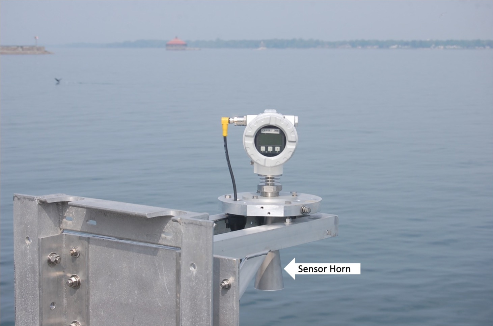
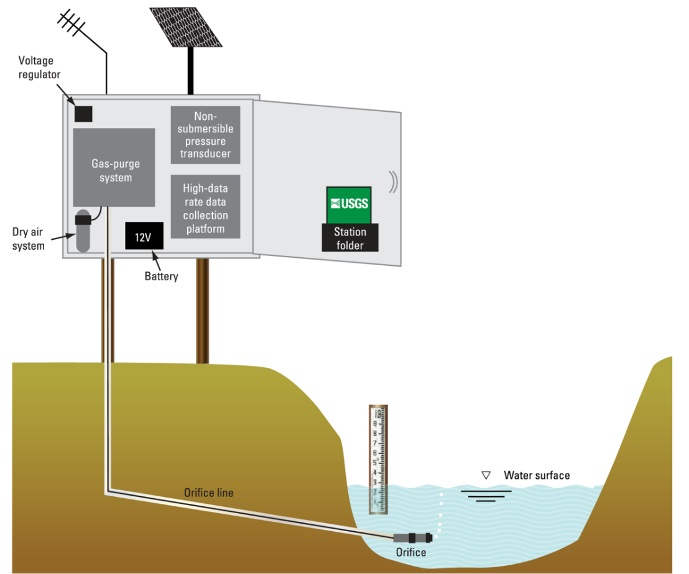
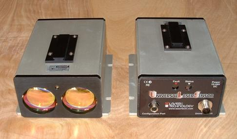
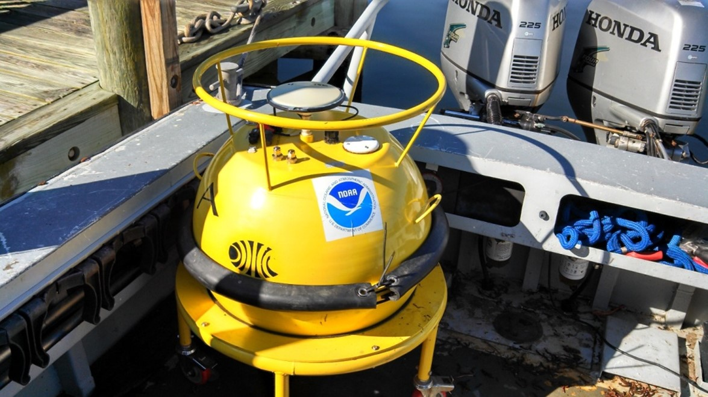
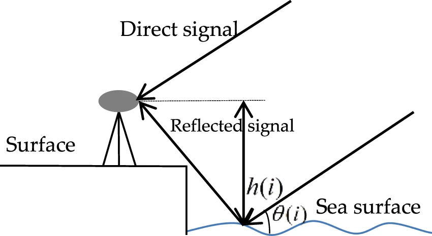

# Manual for Real-Time Quality Control of Water Level Data

A Guide to Quality Control and Quality Assurance for Water Level Observations

**Version 2.1**
**March 2021**

## Document Validation

## Revision History

| **Date**   | **Revision Description**                                                                                                                      | **Notes**                                         |
| ---------- | --------------------------------------------------------------------------------------------------------------------------------------------- | ------------------------------------------------- |
| May 2014   | Original Document Published                                                                                                                   |                                                   |
| April 2016 | Revise cover page to include new IOOS logo.                                                                                                   | Manual updated with revisions listed sequentially |
|            | Revise dates on _Document Validation_ page and substitute new logo (page ii).                                                                 |                                                   |
|            | Add statement requesting feedback from _Manual Users_ (page vi).                                                                              |                                                   |
|            | Update _Acknowledgements_ to include Version 2.0 team members (page vii).                                                                     |                                                   |
|            | Update definition of real time in _Definitions of Selected Terms_ (page ix).                                                                  |                                                   |
|            | Revise _Background and Introduction_ to reflect updated and additional manuals that have been developed (page 1).                             |                                                   |
|            | Revise section 2.0 content in various places to reflect updated content from previous manuals and feedback from reviewers (pages 3-6; 10-11). |                                                   |
|            | Update content in section 3.1 (page 12) and add section 3.3.2 (page 22).                                                                      |                                                   |
|            | Update language in section 4.0, _Summary_ (page 23).                                                                                          |                                                   |
|            | Update _References_ and _Supporting Documents_ (page 24-26).                                                                                  |                                                   |
|            | Revise good process description in table A-1 (page A-4).                                                                                      |                                                   |
|            | Update Version 2.0 Water Level Manual Team members (page B-1).                                                                                |                                                   |
| March 2021 | Revise cover to match updated QARTOD manuals                                                                                                  |                                                   |
|            | Revise _Document Validation_ page to reflect new signatories and dates (page ii)                                                              |                                                   |
|            | Revise _Request to Manual Users_ statement to reflect new QARTOD email address (page vi)                                                      |                                                   |
|            | Update _Acknowledgements_ to include Version 2.1 team members (page vii)                                                                      |                                                   |
|            | Revise _Acronyms and Abbreviations_ to include DQAP (page viii)                                                                               |                                                   |
|            | Revise _Definitions of Selected Terms_ to include physical properties in variable definition (page ix)                                        |                                                   |
|            | Revise _Background and Introduction_ to reflect updated and additional manuals that have been developed (pages 1-2)                           |                                                   |
|            | Update _Section 2.0_, specifically 2.1, 2.2.1, 2.2.4, and 2.4 (pages 3--12)                                                                   |                                                   |
|            | Update _Section 3.0,_ specifically 3.1, 3.2, 3.3.2 (Test 8 and Test 11), and add 3.3.3                                                        |                                                   |
|            | Update _Section 4.0_ -- minor edits (page 25)                                                                                                 |                                                   |
|            | Update links in _References and Supporting Documents_ (pages 27--30)                                                                          |                                                   |
|            | Update _Appendix A_ manual reviewers (page A-1)                                                                                               |                                                   |
|            | Delete _Appendix B_ (page B-1)                                                                                                                |                                                   |

## Endorsement Disclaimer

> **Mention of a commercial company or product does not constitute an endorsement by NOAA.
> Use of information from this publication for publicity or advertising purposes concerning proprietary products or the tests of such products is not authorized.**

## Request to Manual Users

> **To gauge the success of the QARTOD project,
> it helps to be aware of groups working to utilize these QC tests.
> Please notify us of your efforts or intentions to implement QARTOD processes by sending a brief email to <qartod.board@noaa.gov> or posting a notice at <http://www.linkedin.com/groups?gid=2521409>.**

## Acknowledgements

We are grateful to our entire Water Level Data Quality Control Manual team, which is listed in appendix A. Special thanks go to those who served on the initial Water Level Data Quality Control Manual Committee and provided content and suggestions for the initial draft, as well as all who reviewed each draft and provided valuable feedback.

Special thanks go to Dr. Cristina Forbes (NOAA/National Ocean Service/National Hurricane Center), Bob Heitsenrether (NOAA//NOS/Center for Operational Oceanographic Products and Services),\
Rob Loesch (NOAA/NOS/Center for Operational Oceanographic Products and Services), Peter Stone (NOAA/NOS/Center for Operational Oceanographic Products and Services), Manoj Samant (NOAA/NOS/Center for Operational Oceanographic Products and Services), and Richard Bouchard (NOAA/National Weather Service/National Data Buoy Center) for their extensive reviews and valuable input to Version 2.0.

We are grateful to those who provided reviews and input to Version 2.1, including Lindsay Abrams (NOAA/NOS/Center for Operational Oceanographic Products and Services), Gregory Dusek (NOAA/Center for Operational Oceanographic Products and Services), Robert Heitsenrether (NOAA/Center for Operational Oceanographic Products and Services), Peter Stone (NOAA/ Center for Operational Oceanographic Products and Services), Jacquelyn Overbeck (Alaska Department of Natural Resources), Julia Powell (NOAA/Office of Coast Survey), Greg Seroka (NOAA/Office of Coast Survey), and Shep Smith (NOAA/Office of Coast Survey). We are especially grateful to Matthew Widlansky (University of Hawaii Sea Level Center) for his enthusiastic and detailed review. We also thank George Mungrov and Aaron Sweeney (both at the NOAA / National Centers for Environmental Information) for their thoughts and suggestions.

## Acronyms and Abbreviations

|          |                                                                      |
| -------- | -------------------------------------------------------------------- |
| ACT      | Alliance for Coastal Technologies                                    |
| AOOS     | Alaska Ocean Observing System                                        |
| CARICOOS | Caribbean Coastal Ocean Observing System                             |
| CeNCOOS  | Central and Northern California Ocean Observing System               |
| CO-OPS   | Center for Operational Oceanographic Products and Services           |
| DQAP     | Data Quality and Assurance Procedure                                 |
| GCOOS    | Gulf of Mexico Coastal Ocean Observing System                        |
| GLOS     | Great Lakes Observing System                                         |
| GLOSS    | Global Sea Level Observing System                                    |
| GMT      | Greenwich Mean Time                                                  |
| GNSS     | Global Navigation Satellite System                                   |
| GPS      | Global Positioning System                                            |
| IOC      | Intergovernmental Oceanographic Commission                           |
| IOOS     | Integrated Ocean Observing System                                    |
| MARACOOS | Mid-Atlantic Regional Association Coastal Ocean Observing System     |
| NANOOS   | Northwest Association of Networked Ocean Observing Systems           |
| NERACOOS | Northeastern Regional Association of Coastal Ocean Observing Systems |
| NIST     | National Institute of Standards and Technology                       |
| NOAA     | National Oceanic and Atmospheric Administration                      |
| NOS      | National Ocean Service                                               |
| NWLON    | National Water Level Observation Network                             |
| OSTEP    | Ocean Systems Test and Evaluation Program                            |
| PacIOOS  | Pacific Islands Ocean Observing System                               |
| PVC      | Polyvinyl Chloride                                                   |
| QARTOD   | Quality-Assurance/Quality Control of Real-Time Oceanographic Data    |
| QA       | Quality Assurance                                                    |
| QC       | Quality Control                                                      |
| SCCOOS   | Southern California Coastal Ocean Observing System                   |
| SD       | Standard Deviation                                                   |
| SECOORA  | Southeast Coastal Ocean Observing Regional Association               |
| UK       | United Kingdom                                                       |
| UNESCO   | United Nations Organization for Education, Science, and Culture      |
| UTC      | Coordinated Universal Time                                           |
| USGS     | United States Geological Survey                                      |
| WL       | Water Level                                                          |

## Definitions of Selected Terms

This manual contains several terms whose meanings are critical to those using the manual. These terms are included in the following table to ensure that the meanings are clearly defined.

|                        |                                                                                                                                                                                                                                                                                                                                                                                                         |
| ---------------------- | ------------------------------------------------------------------------------------------------------------------------------------------------------------------------------------------------------------------------------------------------------------------------------------------------------------------------------------------------------------------------------------------------------- |
| Codable Instructions   | Codable instructions are specific guidance that can be used by a software programmer to design, construct, and implement a test. These instructions also include examples with sample thresholds.                                                                                                                                                                                                       |
| Data Record            | A data record is one or more messages that form a coherent, logical, and complete observation.                                                                                                                                                                                                                                                                                                          |
| Datum                  | For marine applications, datum is a base elevation used as a reference from which to reckon heights or depths. It is called a tidal datum when defined in terms of a certain phase of the tide (Gill and Schultz 2001).                                                                                                                                                                                 |
| Leveling               | Leveling is the determination of the elevation differences between bench marks, to extend vertical control and monitor the stability of the water level measurement gauge. The quality of leveling is a function of the procedures used, the sensitivity of the leveling instruments, the precision and accuracy of the rod, the attention given by surveyors, and the refinement of the computations\  |
|                        | (Gill and Schultz 2001).                                                                                                                                                                                                                                                                                                                                                                                |
| Message                | A message is a standalone data transmission. A data record can be composed of multiple messages.                                                                                                                                                                                                                                                                                                        |
| Operator               | Operators are individuals or entities who are responsible for collecting and providing data.                                                                                                                                                                                                                                                                                                            |
| Quality Assurance (QA) | QA involves processes that are employed with hardware to support the generation of high quality data (section 2.0 and appendix A).                                                                                                                                                                                                                                                                      |
| Quality Control (QC)   | QC involves follow-on steps that support the delivery of high quality data and requires both automation and human intervention (section 3.0).                                                                                                                                                                                                                                                           |
| Real-Time              | Real-time means that: data are delivered without delay for immediate use; time series extends only backwards in time, where the next data point is not available; and sample intervals may range from a few seconds to a few hours or even days, depending upon the sensor configuration (section 1.0).                                                                                                 |
| Threshold              | Thresholds are limits that are defined by the operator.                                                                                                                                                                                                                                                                                                                                                 |
| Variable               | An observation (or measurement) of physical or biogeochemical properties within oceanographic and/or meteorological environments.                                                                                                                                                                                                                                                                       |

## 1.0 Background and Introduction

The U.S. Integrated Ocean Observing System (IOOS®) has a vested interest in collecting high-quality data for the 34 core variables (https://ioos.noaa.gov/about/ioos-by-the-numbers) measured on a national scale. In response to this interest, U.S. IOOS continues to establish written, authoritative procedures for the quality control (QC) of real-time data through the Quality Assurance/Quality Control of Real-Time Oceanographic Data (QARTOD) program, addressing each variable as funding and requirements permits. This water level (WL) manual was first published in May 2014 as the fifth in a series of guidance documents that address QC of real-time data of each core variable. It was the fifth manual to be updated (2016) and is now the fifth manual to receive a second update.

Please refer to <https://ioos.noaa.gov/project/qartod/> for the following documents.

1.  U.S. Integrated Ocean Observing System, 2017. U.S IOOS QARTOD Project Plan - Accomplishments for 2012--2016 and Update for 2017--2021. 48 pp. <https://doi.org/10.7289/V5JQ0Z71>.
2.  U.S. Integrated Ocean Observing System, 2018. Manual for Real-Time Quality Control of Dissolved Oxygen Observations Version 2.1: A Guide to Quality Control and Quality Assurance for Dissolved Oxygen Observations in Coastal Oceans. 53 pp. <https://doi.org/10.25923/q0m1-d488>
3.  U.S. Integrated Ocean Observing System, 2019. Manual for Real-Time Quality Control of In-Situ Surface Wave Data Version 2.1: A Guide to Quality Control and Quality Assurance of In- Situ Surface Wave Observations. 69 pp. <https://doi.org/10.25923/7yc5-vs69>
4.  U.S. Integrated Ocean Observing System, 2019. Manual for Real-Time Quality Control of In-Situ Current Observations Version 2.1 A Guide to Quality Control and Quality Assurance of Acoustic Doppler Current Profiler Observations. 54 pp. <https://doi.org/10.25923/sqe9-e310>
5.  U.S. Integrated Ocean Observing System, 2020. Manual for Real-Time Quality Control of In-situ Temperature and Salinity Data Version 2.1: A Guide to Quality Control and Quality Assurance of In-situ Temperature and Salinity Observations. 50 pp. <https://doi.org/10.25923/x02m-m555>
6.  U.S. Integrated Ocean Observing System, 2017. Manual for Real-Time Quality Control of Wind Data Version 1.1: A Guide to Quality Control and Quality Assurance of Coastal and Oceanic Wind Observations. 47 pp. [[https://doi.org/10.7289/V5FX77NH].
7.  U.S. Integrated Ocean Observing System, 2017. Manual for Real-Time Quality Control of Ocean Optics Data Version 1.1: A Guide to Quality Control and Quality Assurance of Coastal and Oceanic Optics Observations. 49 pp. <https://doi.org/10.25923/v9p8-ft24>.
8.  U.S. Integrated Ocean Observing System, 2018. Manual for Real-Time Quality Control of Dissolved Nutrients Data Version 1.1: A Guide to Quality Control and Quality Assurance of Coastal and Dissolved Nutrients Observations. 56 pp. <https://doi.org/10.7289/V5TT4P7R>
9.  U.S. Integrated Ocean Observing System, 2016. Manual for Real-Time Quality Control of High Frequency Radar Surface Currents Data Version 1.0: A Guide to Quality Control and Quality Assurance of High Frequency Radar Surface Currents Data Observations. 60 pp. <https://doi.org/10.7289/V5T43R96>
10. U.S. Integrated Ocean Observing System, 2017. Manual for Real-Time Quality Control of Phytoplankton Data Version 1.0: A Guide to Quality Control and Quality Assurance of Phytoplankton Data Observations. 67 pp. <https://doi.org/10.7289/V56D5R6S>
11. U.S. Integrated Ocean Observing System, 2017. Manual for Real-Time Quality Control of Passive Acoustics Data Version 1.0: A Guide to Quality Control and Quality Assurance of Passive Acoustics Observations. 43 pp. <https://doi.org/10.7289/V5PC30M9>
12. U.S. Integrated Ocean Observing System, 2018. Manual for Real-Time Quality Control of Stream Flow Data Version 1.0: A Guide to Quality Control and Quality Assurance of Stream Flow Observations in Rivers and Streams. 46 pp. <https://doi.org/10.25923/gszc-ha43>
13. U.S. Integrated Ocean Observing System, 2019. Manual for Real-Time Quality Control of pH Data Version 1.0: A Guide to Quality Control and Quality Assurance of pH Data Observations. 56 pp. <https://doi.org/10.25923/111k-br08>

Please reference this document as:

> U.S. Integrated Ocean Observing System, 2021. Manual for Real-Time Quality Control of Water Level Data Version 2.1: A Guide to Quality Control and Quality Assurance of Water Level Observations. 47 pp. <https://doi.org/10.25923/vpsx-dc82>

This manual is a living document that reflects the state-of-the-art QC testing procedures for water level observations.
It is written for the experienced operator but also provides examples for those who are just entering the field.

## 2.0 Purpose/Constraints/Applications

The following sections describe the purpose of this manual, as well as the constraints that operators may encounter when performing QC of WL data and specific applications of those data.

### 2.1 Purpose

The purpose of this manual is to provide guidance to the U.S. IOOS and the WL community at large for the real-time QC of WL measurements using an agreed-upon, documented, and implemented standard process. This manual is also a deliverable to the U.S. IOOS Regional Associations and the ocean observing community and represents a contribution to a collection of core variable QC documents.

WL observations covered by these test procedures are collected in oceans and lakes in real time or near-real time. These tests are based on guidance from QARTOD workshops (QARTOD 2003-2009) and draw from existing expertise in programs such as the National Oceanic and Atmospheric Administration National Ocean Service (NOAA/NOS) National Water Level Observation Network (NWLON) (Nault 2004), the University of Hawaii Sea Level Center, and the Global Sea Level Observing System (GLOSS). The Global Climate Observing System recognizes GLOSS as one of the international operational activities that provides essential sea level climate data. The GLOSS Global Core Network is comprised of 290 globally distributed sea level stations (23 in the U.S.) (GLOSS 2012).

This manual differs from existing QC procedures for WL in that its focus is on real-time data. It presents a series of eleven tests that operators can incorporate into practices and procedures for QC of WL measurements. These tests apply only to the in-situ, real-time measurement of WL as observed by sensors deployed on fixed platforms and not to remotely sensed WL measurements (e.g., satellite observations).

Table 2-1 shows technologies that are included and excluded in this manual.

| **Technologies Included**            | **Technologies Excluded** |
| ------------------------------------ | ------------------------- |
| Microwave radar                      | Satellite altimetry       |
| Acoustic                             | Lidar                     |
| Float/stilling well                  |                           |
| Pressure                             |                           |
| Laser                                |                           |
| Global Positioning System (GPS) buoy |                           |
| GNSS reflectometry                   |                           |

: Table 2-1. Technologies included and excluded in this manual

These test procedures are written as a high-level narrative from which a computer programmer can develop code to execute specific tests and set data flags (data quality indicators) within an automated software program. IOOS QARTOD documentation and other QC tests, implemented in Python with notebook examples, have been developed by the community and are shared at <https://github.com/ioos/ioos_qc> and <https://ioos.github.io/ioos_qc/>. Although certain tests are recommended, thresholds can vary among operators. The tests described here are designed to support a range of WL sensors and operator capabilities. Some well-established programs with the highest standards have implemented very rigorous QC processes. Others, with different requirements, may utilize sensors with data streams that cannot support as many QC checks---all have value when used prudently. Users must understand and appropriately utilize data of varying quality, and operators must provide support by documenting and publishing their QC processes. A balance must be struck between the time-sensitive needs of real-time observing systems and the degree of rigor that has been applied to non-real-time systems by operators with decades of QC experience.

High quality marine observations require sustained quality assurance (QA) and QC practices to ensure credibility and value to operators and data users. QC and QA are interrelated, and both are important to the process. QA practices involve processes that are employed with hardware to support the generation of high quality data, such as a sufficiently accurate, precise, and reliable sensor with adequate resolution. Other QA practices include: sensor calibration; calibration checks and/or in-situ verification, including post-deployment calibration; proper deployment considerations, such as measures for corrosion control and anti-fouling; solid data communications, including accurate time stamps with time zone identification; adequate maintenance intervals; and creation of a robust quality control process. Bushnell et al. (2019) provide more information about QA, which includes issues that are not part of the scope of this manual such as post-deployment calibration (instrument verification after recovery).

QC involves follow-on steps that support the delivery of high quality data and requires both automation and human intervention. QC practices include such things as data integrity checks (format, checksum, timely arrival of data), data value checks (threshold checks, minimum/maximum rate of change), neighbor checks, climatology checks, model comparisons, signal/noise ratios, the generation of QC metadata, the verification of user satisfaction, and generation of data flags (Bushnell 2005).

The process of ensuring data quality is not always straightforward. QA/QC procedures may be specific to a sensor technology or even to a particular manufacturer's model, so the establishment of a methodology that is applicable to every sensor is challenging.

### 2.2 Constraints

#### 2.2.1 Datums and Leveling Considerations

Observed water levels are reported relative to another vertical elevation that serves as a reference point or datum (Gill and Schultz 2001). Vertical datums can be a local station datum (relative only to some fixed hardware point or arbitrary value), a tidal datum (such as mean lower low water), a gravimetric datum (such as the North American Vertical Datum of 1988, based on an equipotential gravity surface commonly called the geoid), or a geodetic datum (the fundamental datum for GPS satellites and based on a mathematical model of the earth called an ellipsoid).

To monitor station stability and provide continuity when replacing a WL station, several nearby bench marks are typically installed to support level (or vertical) surveying, and the local station datum and tidal datum elevations are determined relative to them (Hailegeberel et al. 2018)[^1]. The number of bench marks deployed depends upon the application of the operator, and as many as ten can be called for when the WL station is used for the most demanding applications, such as long-term sea level changes. Three stable bench marks are required to demonstrate stability, and more bench marks are typically required as the duration of station operation increases. Some operators consider the bench marks the most important part of a WL station, as they preserve the tidal datums established by the station long after it is gone[^2].

While datums and vertical leveling surveys are beyond the scope of this manual, their importance must be noted, as they are critical to the successful use of the WL data. Gradual station subsidence or rise, datum determinations, and leveling precision are not issues that can be addressed through real-time QC, but they are vitally important to the QA of the observing system and its corresponding data. It is especially critical for operators to correctly convey the datum in use to users and to include this important metadata with every water level observation.

#### 2.2.2 Data Processing Methodology

The type of sensor used to collect WL data and the system used to process and transmit the WL measurements determine which QC algorithms are used. In-situ systems with sufficient onboard processing power within the sensor may process the original (raw) data and produce derived products. Many sensors may sample at high-rate or burst mode (e.g., 1 Hz or greater). These samples are used to produce the actual real-time value transmitted (e.g., 6-minute value). Statistical information about the high rate sample distributions can also be used and transmitted as real-time QC parameters (e.g., sample standard deviations and outliers). If ample transmission capability is available, the entire original data stream may be transmitted and subsequently quality controlled from there. Therefore, because operators have different data processing methodologies, three levels of QC are proposed: required, strongly recommended, and suggested.

#### 2.2.3 Traceability to Accepted Standards

To ensure that WL sensors produce accurate data, rigorous calibrations and calibration checks must be performed in addition to QC checks. Most operators rely upon manufacturer calibrations and conduct calibration checks only before deployment. These calibration checks are critical to ensuring that the manufacturer calibration is still valid. Manufacturers describe how to conduct these calibration checks in their user manuals.

Calibrations and calibration checks must be traceable to accepted standards. The National Institute of Standards and Technology (NIST) ([http://www.nist.gov/index.html),] a provider of internationally accepted standards, is often the source for accepted standards. Calibration activities must be tailored to match data use and resources. Calibration cost and effort increase dramatically as accuracy requirements increase. Fundamental NIST standards such as length, temperature, and pressure will suffice when conducting calibration checks on most WL sensors.

#### 2.2.4 Sensor Deployment Considerations and Hardware Limitations

WL sensors can be deployed in several ways. Most sensors are fixed to platforms that are designed to ensure minimal vertical or horizontal movement, and they observe the water level from below, at, or above the surface. Pressure sensors may be directly submerged or configured within a bubbler system to observe the back pressure. GPS buoys, which measure water elevation derived from a GPS antenna position, have recently been used operationally; this technology should improve as GPS accuracy and real-time processing capability improve. Acoustic and microwave sensors are examples of WL sensors measuring from above the surface.

While outside the scope of the real-time tests described in this manual, QA is critical to data quality. Sensors require attention to proper QA measures both before and after the deployment. Operators must follow the manufacturer's recommendations for factory calibration schedules and proper sensor maintenance.

The following sections describe the sensor technologies that are most often used, with a brief note about their attributes and shortcomings.

##### **Microwave Radar**

Microwave radar altimeters have become popular within the past decade as this technology has evolved (Park et al. 2014). While free of many of the drawbacks of other WL sensors, microwave radar technology brings new modes of failure, such as the inability to measure water levels in the presence of ice and surprise occasional problems such as a bee's nest in the sensor horn. Figure 2-1 shows an example of a Xylem/Design Analysis H3611 microwave water level sensor installation by the NOS Center for Operational Oceanographic Products and Services (CO-OPS).

<figcaption>Figure 2-1. Xylem/Design Analysis H3611 microwave water level sensor as installed by NOS/CO-OPS. Photo courtesy of NOS/CO-OPS.</figcaption>

##### **Acoustic**

Acoustic altimeters typically use a sounding tube but can also operate in open air. They are sensitive to variations in the speed of sound caused by temperature changes and temperature gradients along the acoustic transmission path. Sounding tubes may become obstructed with biota or ice, causing errors in the measurements. Effects of waves and currents have been partially mitigated using protective wells and orifice configurations (which may be expensive to install and maintain, depending on the project). Figure 2-2 shows a single-pile NOS/CO-OPS installation using an acoustic sensor. The inset depicts an Aquatrak sensor mounted atop a sounding tube in a protective well.

<figcaption>Figure 2-2. An elevated NOS/CO-OPS NWLON station using an Aquatrak acoustic WL sensor (inset) with a sounding tube housed inside a protective 6-inch PVC well. Photo courtesy of NOS/CO-OPS.</figcaption>

##### **Float/Stilling Wells**

Floats deployed in stilling wells are an old and proven technology. These systems can be fortified to operate in the presence of ice, but they are expensive to install. Intakes can become clogged with sediment, and the mechanisms used to transfer the float elevation to sensors (e.g., shaft-angle encoders) can have unique failure modes. Stilling wells in tidal areas are known to cause significant error in WL observations in the presence of high waves and currents. Figure 2-3 shows a typical NOS/CO-OPS Great Lakes installation of dual shaft-angle encoders and their respective floats deployed in the stilling well, also referred to as the sump. Sumps are large stilling wells that have an intake valve used to dampen wave action that might be transferred through the intake pipe to the sump.

<figcaption>Figure 2-3. Redundant shaft-angle encoders (left) digitize the elevation of floats in a stilling well (right).</figcaption>

##### **Pressure Sensors**

Pressure sensors can be immune to ice, but pressure readings must be adjusted for variations in barometric pressure _and_ water density in real time as part of the conversion to derived real-time water level measurements. Pressure sensors can be vented to the atmosphere to automatically account for variations in atmospheric pressure; however, water density variations still must be accounted for. Sensor drift can be an issue for low-quality sensors, and moisture damage in the air tube is a common failure mode. Allowance for gravity variations must also be made at each installation site. Figure 2-4 provides a generalized schematic of a typical pressure sensor installation as used by the U.S. Geological Survey (USGS) and many others. The back pressure observed by a sensor that is not submerged yields a much more robust system. Figure 2-5 shows a typical NOS/CO-OPS backup pressure sensor orifice installation, which includes the use of parallel plates to reduce draw-down in the presence of currents.

<figcaption>Figure 2-3. Schematic of a typical pressure sensor installation (courtesy of Michael Lee/USGS).</figcaption>

<figcaption>Figure 2-4. A pressure sensor orifice with parallel plates to reduce draw-down in the presence of currents (courtesy of Rich Bourgerie/NOS/CO-OPS).</figcaption>

##### **Lasers**

Infrared laser altimeters reflect well from the sea surface, and sensor performance has improved while costs have decreased. However, performance in fog and heavy rain may not be optimum. The sensors are also affected by high waves and ice or other obstructions in the laser path. Figure 2-6 shows an infrared laser used by NOS/CO-OPS as a redundant bridge air gap sensor.

<figcaption>Figure 2-6. Laser Technology infrared Universal Laser Sensors have been used as redundant air gap sensors by NOS/CO-OPS (courtesy of Mark Bushnell, CoastalObsTechServices).</figcaption>

##### **GPS Buoys**

The accuracy of elevations derived by GPS continues to improve as enhancements are made to national and international global navigation satellite systems (GNSS). The location of the GPS sensor reference point must be calibrated to reflect the water level on the buoy. The onboard processing system must use a tilt-motion sensor to account for wave action. Mooring configurations must be designed to mitigate effects of high currents. Water density variations and bio-fouling can also create biases by varying the float plane of the buoy. GPS data processing is complicated for real-time application and may require shore-based systems for real-time kinematic deployments. Technology-specific QC checks based upon GNSS parameters, such as Positional Dilution of Precision, number of satellites in view, and ephemeris update rates, will be added as this capability evolves. Figure 2-7 shows a GPS buoy on the deck of a small vessel getting ready for deployment. This particular buoy does not provide real-time water level data and requires post-processing of the GPS data. However, real-time information is obtained on buoy performance and operational status. Although a GPS buoy system has been recently approved by NOAA/NOS for some operational applications, real-time processing of water level data using GNSS parameters is still under development; associated QC guidelines will be addressed in the future.

<figcaption>Figure 2-7. This AXYS GPS water level buoy is ready to be deployed by NOAA/NOS for evaluation in the southern Chesapeake Bay (courtesy of Mark Bushnell, CoastalObsTechServices).</figcaption>

**_GNSS reflectometry_**

Ground-based Global Navigation Satellite System Reflectometry (GNSS-R) has the potential to become a viable source of operational coastal WL observations. Comparisons between the direct GPS signal and the signal reflected from the sea surface are used to derive a WL measurement (Figure 2-8). Studies comparing GNSS-R WL measurements with co-located traditional WL gauges yield correlation coefficients greater than 0.9 and root mean square errors smaller than 5 cm (Geremia-Nievinski et al. 2020).

<figcaption>Figure 2-8. Direct and reflected GNSS signals can be used to extract a WL measurement (image from Chen 2019).</figcaption>

### 2.3 Applications of WL Data

Real-time water levels are important for a wide variety of applications, including:

- Hydrographic and shoreline mapping surveys
- Safe vessel transit (draft/air gap, e.g., IHO S-104 \[IHO 2017, in development\])
- Safe vessel docking and close-in maneuvering
- Commercial fishing
- Recreational activities
- Storm surge/inundation/evacuation
- Tsunami and meteotsunami detection
- Coastal construction
- Coastal zone management
- Harbor, channel, and inlet maintenance
- Operation of coastal engineering structures
- Input into operational nowcast/forecast system (models) runs
- Validation and verification of numerical ocean models
- Understanding the impacts of long-term sea level variability and inundation on coastal habitats
- Monitoring agreements, memorandums of understanding, and treaties (e.g., the International Great Lakes Datum)

Other applications, such as monthly and annual mean water levels and Federal Emergency Management Agency Flood Insurance Rate Maps, do not require real-time QC but benefit from it through early detection of WL station issues.

### 2.4 Other Important Considerations

While outside the scope of the real-time tests described in this manual, quality assurance (QA) is critical to data quality. Sensors require attention to proper QA measures both before and after the deployment. Bushnell et al. (2019) provide a more comprehensive review of QA processes, including several example checklists in the Supplementary Material. Operators must follow the manufacturer's recommendations for factory calibration schedules and proper sensor preparation and maintenance.

Also important, but beyond the scope of this document at present, is the determination and reporting of data uncertainty. Knowledge of the accuracy of each observation is required to ensure that data are used appropriately and aids in the computation of error bounds for subsequent products derived by users. All sensors and measurements contain errors that are determined by hardware quality, calibration accuracy, methods of operation, and data processing techniques. Operators should routinely provide a quantitative measure of data uncertainty in the associated metadata. Such calculations can be challenging, so operators should also document the methods used to compute the uncertainty (e.g., Seitz et al. 2021). The limits and thresholds implemented by operators for the data QC tests described here are a key component in establishing the observational error bounds. Operators are strongly encouraged to consider the impact of the QC tests on data uncertainty, as these two efforts greatly enhance the utility of their data.

Sensor redundancy is key to obtaining reliable measurements and ensuring that uncertainties can be assigned to those measurements. Comparing two adjacent instruments can assist in evaluation of data quality, as well as provide two (or more) independent estimates of a parameter of interest.

## 3.0 Quality Control

The real-time QC of WL observations can be extremely challenging. Events such as storm surge, tsunamis, and strong winds can affect water levels and must be considered when determining acceptable data thresholds. Human involvement is therefore important to ensure that solid scientific principles are applied to data evaluation to ensure that good data are not discarded, and bad data are not distributed (e.g., selection of appropriate thresholds and examination of data flagged as questionable).

To conduct real-time QC on WL observations, the first pre-requisite is to understand the science and context within which the measurements are being conducted. For example and as was discussed in section 2.2.4, sensors can be deployed in a number of ways. Each deployment method imposes the need for specific QC methods, with different interpretations of 'real time.' Real-time WL data should have two main attributes: accurate time and accurate elevation relative to a known reference.

This manual focuses specifically on real-time data. For example, for real-time QC, gradual calibration changes or system responses (sensor drift) cannot be detected or corrected. Drift correction for WL measurements during post-processing is difficult even if a valid post-recovery calibration could be obtained. Drift is often caused by bio-fouling, silting/sediment clogging, etc. and affects different systems in different ways (e.g., a sensor's response will be affected by the added mass of bio-fouling). Another example is the ability of some data providers to backfill data gaps. In both of these examples, the observations are not considered to be real time for purposes of QC checks. (However, in some sophisticated 24/7 QC operations, real-time dissemination may be switched from one sensor to another based on real-time QC flags.)

### 3.1 QC Flags

Data are evaluated using QC tests, and the results of those tests are recorded by inserting flags in the data files. Table 3-1 provides a simple set of flags and associated descriptions. Additional flags may be incorporated to provide more detailed information to assist with troubleshooting. For example, an observation may fail the water level min/max test and be flagged as having failed. If the data failed the water level min/max by exceeding the upper limit, a "failed high" flag may indicate that the values were higher than the expected range. Such detailed flags primarily support maintenance efforts and are presently beyond U.S. IOOS requirements for QC of real-time data. For additional information regarding flags, see the _Manual for the Use of Real-Time Oceanographic Data Quality Control Flags_ (U.S. IOOS 2020) posted on the U.S. IOOS QARTOD website. However, all flags must be identified and defined in the metadata.

Further post processing of the data may yield different conclusions from those reached during initial assessments. Flags set in real-time should not be changed, ensuring that historical documentation is preserved. Results from post processing should generate another set of flags corresponding to a revised version of the data.

In the test codable instructions provided, the time series of observations is time ordered, and the most recent observation is _n0_, preceded by a value at _n-1_, and so on moving back in time. The focus of the real-time QC is primarily on observations _n0_, _n-1_, and _n-2_.

| **Flag**                      | **Description**                                                                                                                                                                      |
| ----------------------------- | ------------------------------------------------------------------------------------------------------------------------------------------------------------------------------------ |
| Pass=1                        | Data have passed critical real-time QC tests and are deemed adequate for use as preliminary data.                                                                                    |
| Not Evaluated=2               | Data have not been QC-tested, or the information on quality is not available.                                                                                                        |
| Suspect or of High Interest=3 | Data are considered to be either suspect or of high interest to data providers and users. They are flagged suspect to draw further attention to them by operators.                   |
| Fail=4                        | Data are considered to have failed one or more critical real-time QC checks. If they are disseminated at all, it should be readily apparent that they are not of acceptable quality. |
| Missing Data=9                | Data are missing; used as a placeholder.                                                                                                                                             |

: Table 3-1. Flags for real-time data (UNESCO 2013)

Water level data that have been subjected to real-time QC might be referred to as Level 1 data (UNESCO/IOC 2020). Operators are encouraged to carefully define any data management level annotation they assign to data products.

### 3.2 Test Hierarchy

This section outlines eleven real-time QC tests for WL measurements. Operators should also consider that some of these tests can be carried out within the instrument, where thresholds can be defined in configuration files. Although more tests may imply a more robust QC effort, there are many reasons operators could use to justify not conducting some tests. In those cases, operators need only to document reasons these tests do not apply to their observations. Tests are listed in table 3-2 and are divided into three groups: those that are required, strongly recommended, or suggested. However, for some critical real-time applications with high risk operations, it may be advisable to invoke all groups.

|                                     |         |                           |
| ----------------------------------- | ------- | ------------------------- |
| **Group 1:** _Required_             | Test 1  | Timing/Gap Test           |
|                                     | Test 2  | Syntax Test               |
|                                     | Test 3  | Location Test             |
|                                     | Test 4  | Gross Range Test          |
|                                     | Test 5  | Climatology Test          |
| **Group 2:** _Strongly Recommended_ | Test 6  | Spike Test                |
|                                     | Test 7  | Rate of Change Test       |
|                                     | Test 8  | Flat Line Test            |
| **Group 3:** _Suggested_            | Test 9  | Multi-Variate Test        |
|                                     | Test 10 | Attenuated Signal Test    |
|                                     | Test 11 | Neighbor or Forecast Test |

: Table 3-2. QC Tests in order of implementation and hierarchy

### 3.3 QC Test Descriptions

A variety of tests can be performed on the sensor measurements to evaluate data quality. Testing the timely arrival and integrity of the data transmission itself is a first step. If the data are corrupted during transmission, further testing may be irrelevant. The checks defined in these eleven tests evaluate data through various comparisons to other data and to the expected conditions in the given environment. The tests listed in this section presume a time-ordered series of observations and denote the most recent observation as previously described.

Some effort will be needed to select the best thresholds, which are determined at the operator level and may require multiple iterations of trial and error before final selections are made. A successful QC effort is highly dependent upon selection of the proper thresholds, which should not be determined arbitrarily but can be based on historical knowledge or statistics derived from recently acquired data. Although this manual provides some guidance for selecting thresholds based on input from various operators, it is assumed that operators have the expertise and motivation to select the proper thresholds to maximize the value of their QC effort. Operators should openly provide thresholds as metadata for user support. Elevation thresholds chosen may be dependent upon the real-time application, (e.g., chart datum or inundation threshold level). This shared information will help U.S. IOOS to document standardized thresholds that will be included in future releases of this manual.

#### 3.3.1 Applications of QC Tests to WL Sensors

These eleven tests require operators to select a variety of thresholds. Examples are provided in the following test tables; however, operators are in the best position to determine the appropriate thresholds for their operations. Some tests rely on multiple data points most recently received to determine the quality of the latest data point. When this series of data points reveals that the entire group fails, the most recent data point is flagged, but the previous flags are not changed. This action supports the view that historical flags are generally not altered. The first example is in Test 8, the Flat Line Test, where this scenario will become clearer. The exception to the rule occurs for Test 6 Spike Check, where the most recent point must be flagged as "2 Not Evaluated" until the next point arrives, and the spike check can be performed.

#### Test 1 - Timing/Gap Test (Required)

|                                                                                                                                                                                                                                                                                                                                                                                                                                                                                 |                                    |                                         |
| ------------------------------------------------------------------------------------------------------------------------------------------------------------------------------------------------------------------------------------------------------------------------------------------------------------------------------------------------------------------------------------------------------------------------------------------------------------------------------- | ---------------------------------- | --------------------------------------- |
| **Check for arrival of data.** <td colspan=2>                                                                                                                                                                                                                                                                                                                                                                                                                                   |
| Test determines that the most recent data point has been measured and received within the expected time window (TIM_INC) and has the correct time stamp (TIM_STMP). **Note:** For those systems that do not update at regular intervals, a large value for TIM_STMP can be assigned. The gap check is not a solution for all timing errors. Data could be measured or received earlier than expected. This test does not address all clock drift/jump issues. <td colspan=2> |
| **Flags**                                                                                                                                                                                                                                                                                                                                                                                                                                                                       | **Condition**                      | **Codable Instructions**                |
| Missing Data=9                                                                                                                                                                                                                                                                                                                                                                                                                                                                  | Data have not arrived as expected. | `If NOW - TIM_STMP > TIM_INC, flag = 9` |
| Suspect=3                                                                                                                                                                                                                                                                                                                                                                                                                                                                       | N/A                                | N/A                                     |
| Pass=1                                                                                                                                                                                                                                                                                                                                                                                                                                                                          | Applies for test pass condition.   | N/A                                     |
| **Test Exception**: None. <td colspan=2>                                                                                                                                                                                                                                                                                                                                                                                                                                        |
| **Test specifications to be established locally by the operator.** <td colspan=2>                                                                                                                                                                                                                                                                                                                                                                                               |
| **Example:** TIM_INC = 1 hour <td colspan=2>                                                                                                                                                                                                                                                                                                                                                                                                                                    |
