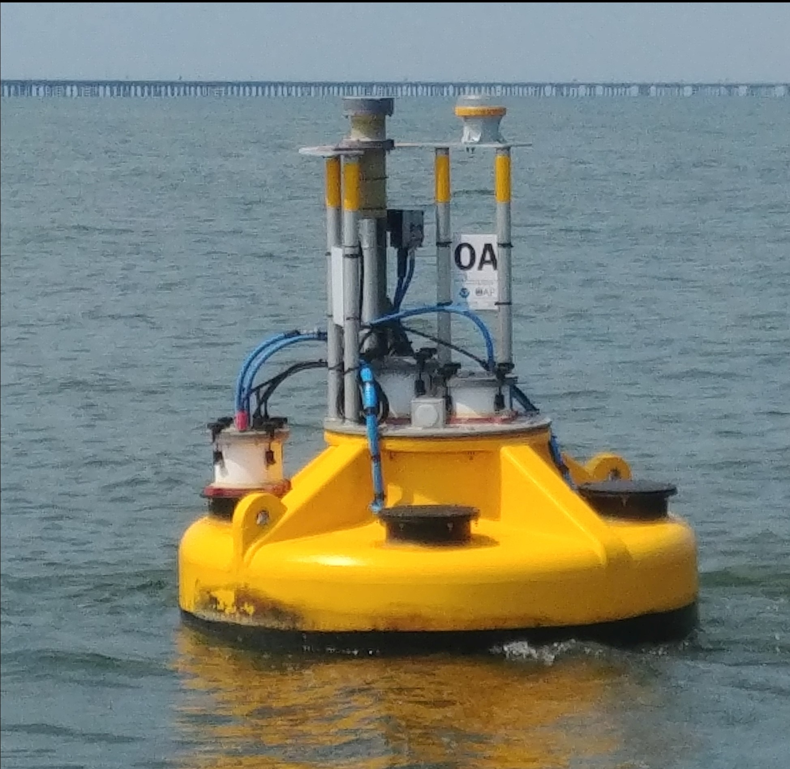
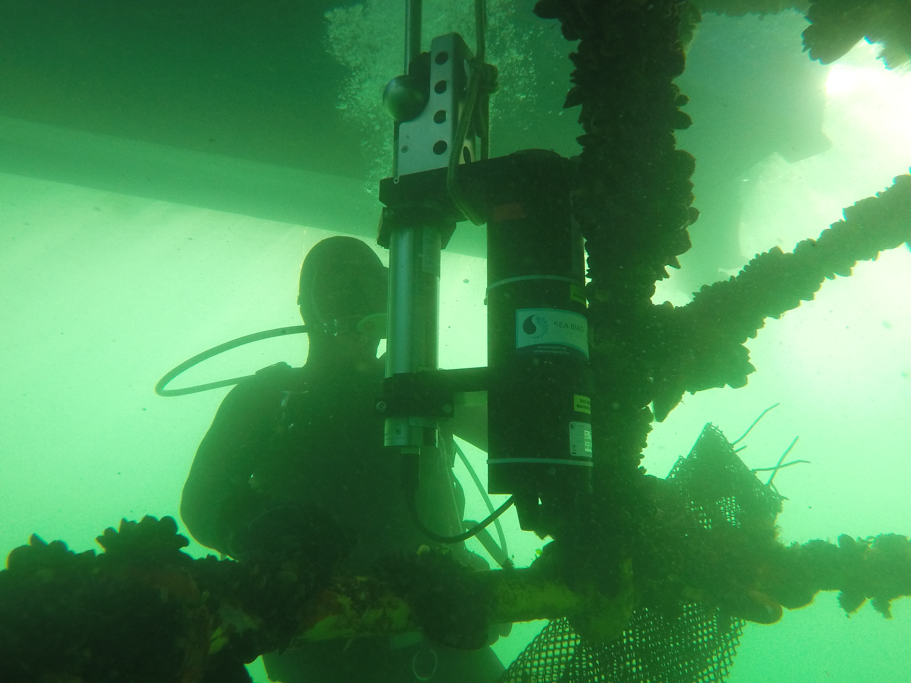
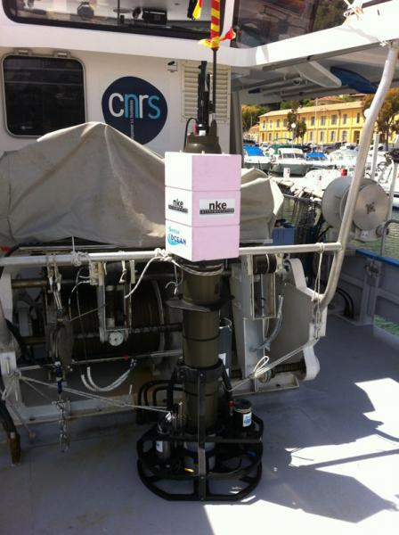
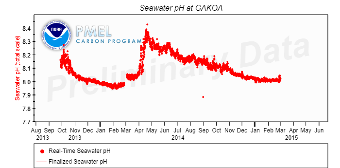
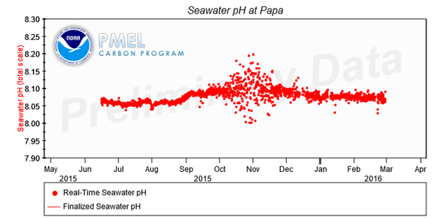

# A Guide to Quality Control and Quality Assurance for pH Observations

## Acknowledgements

This thirteenth QARTOD (Quality Assurance/Quality Control of Real-Time Oceanographic Data) manual builds upon the previous manuals,
which have been created with the assistance of hundreds of subject-matter experts.
We are grateful for their contributions and rewarded by their efforts to implement the QARTOD tests.
We appreciate the guidance and support provided by the members of the QARTOD Board of Advisors.
We thank all of the participants of the pH manual kick-off workshop,
held on February 26,
2018 in conjunction with the Association for the Sciences of Limnology and Oceanography conference in San Juan,
Puerto Rico.

For this pH manual we were fortunate to obtain excellent reviews from Rik Wanninkhof and Leticia Barbero (NOAA/Atlantic Oceanographic and Meteorological Laboratory),
Adrienne Sutton (NOAA/Pacific Marine Environmental Laboratory),
Chris Sabine (University of Hawaii),
Grace Saba (Rutgers University),
Chris Kincade and Dwight Trueblood (NOAA/National Estuarine Research Reserve System),
and Bauke Houtman,
Nicholas Rome,
and Kruti Desai on behalf of the National Science Foundation Ocean Observatories Initiative-thank you all!

We appreciate the support provided by Libby Jewett for the Ocean Acidification Information Exchange forum,
and the conversations with Janice Fulford (U.S. Geological Survey, Hydrographic Instrumentation Facility),
Oscar Schofield (Rutgers University),
Gary Kirkpatrick (Mote Marine Laboratory),
Dan Sullivan (U.S. Geological Survey),
and Andrew Dickson (Scripps Institution of Oceanography).

Finally,
we wish to express our sincere gratitude to Gregory Ikeda and Charles Branham at Sea-Bird Scientific for their enthusiasm,
attention to details,
and excellent contributions.

## Acronyms and Abbreviations

|          |                                                                       |
| -------- | --------------------------------------------------------------------- |
| ACT      | Alliance for Coastal Technologies                                     |
| AOOS     | Alaska Ocean Observing System                                         |
| AUV      | Autonomous Underwater Vehicle                                         |
| CeNCOOS  | Central and Northern California Ocean Observing System                |
| CRC      | Cyclic Redundancy Check                                               |
| CRM      | Certified Reference Material                                          |
| DMAC     | Data Management and Communications                                    |
| EPA      | Environmental Protection Agency                                       |
| GOA      | ON Global Ocean Acidification Observation Network                     |
| GCOOS    | Gulf of Mexico Coastal Ocean Observing System                         |
| GLOS     | Great Lakes Observing System                                          |
| GOOS     | Global Ocean Observing System                                         |
| IOOS     | Integrated Ocean Observing System                                     |
| ISFET    | Ion-selective field effect transistor                                 |
| MAPCO2TM | Moored Autonomous pCO                                                 |
| MARACOOS | Mid-Atlantic Regional Association Coastal Ocean Observing System      |
| NANOOS   | Northwest Association of Networked Ocean Observing Systems            |
| NBS      | U.S. National Bureau of Standards                                     |
| NERACOOS | North Eastern Regional Association of Coastal Ocean Observing Systems |
| NERRS    | National Estuarine Research Reserves System                           |
| NIST     | National Institute of Standards and Technology                        |
| NOAA     | National Oceanic and Atmospheric Administration                       |
| NOS      | National Ocean Service                                                |
| PacIOOS  | Pacific Islands Ocean Observing System                                |
| pCO2     | Partial pressure of carbon dioxide                                    |
| PMEL     | Pacific Marine Environmental Laboratory                               |
| QARTOD   | Quality Control/Quality-Assurance of Real-Time Oceanographic Data     |
| QA       | Quality Assurance                                                     |
| QC       | Quality Control                                                       |
| RCOOS    | Regional Coastal Ocean Observing System                               |
| SAMI     | Submersible Autonomous Moored Instrument                              |
| SCCOOS   | Southern California Coastal Ocean Observing System                    |
| SD       | Standard Deviation                                                    |
| SECOORA  | Southeast Coastal Ocean Observing Regional Association                |
| UNESCO   | United Nations Educational, Scientific, and Cultural Organization     |

## Definitions of Selected Terms

This manual contains several terms whose meanings are critical to those using the manual. These terms are included in the following table to ensure that the meanings are clearly defined.

|                        |                                                                                                                                                                                                                                                                                                         |
| ---------------------- | ------------------------------------------------------------------------------------------------------------------------------------------------------------------------------------------------------------------------------------------------------------------------------------------------------- | --- |
| Codable Instructions   | Codable instructions are specific guidance that can be used by a software programmer to design, construct, and implement a test. These instructions also include examples with sample thresholds.                                                                                                       |
| Data Record            | Data record is one or more messages that form a coherent, logical, and complete observation.                                                                                                                                                                                                            |
| Interoperable          | Interoperable means the ability of two or more systems to exchange and mutually use data, metadata, information, or system parameters using established protocols or standards.                                                                                                                         |
| Message                | Message means a standalone data transmission. A data record can be composed of multiple messages.                                                                                                                                                                                                       |     |
| Operator               | Operators are individuals or entities responsible for collecting and providing data.                                                                                                                                                                                                                    |
| Quality Assurance (QA) | QA means processes that are employed with hardware to support the generation of high-quality data. (section 2.0 and appendix B)                                                                                                                                                                         |
| Quality Control (QC)   | QC means follow-on steps that support the delivery of high-quality data, requiring both automation and human intervention. (section 3.0)                                                                                                                                                                |
| pH                     | pH is a scale, defined as the negative log of the hydrogen ion concentration, in which a lower numerical value translates to a stronger acidity (Newton et. al. 2019)                                                                                                                                   |
| Real Time              | Real time means that: data are delivered without delay for immediate use; time series extends only backwards in time, where the next data point is not available; and sample intervals may range from a few seconds to a few hours or even days, depending upon the sensor configuration (section 1.0). |
| Sensor                 | A sensor is a device that detects or measures a physical property and provides the result without delay.                                                                                                                                                                                                |
|                        | A sensor is an element of a measuring system that is directly affected by a phenomenon, body, or substance carrying a quantity to be measured. (JCGM 2012)                                                                                                                                              |
| Thresholds             | Thresholds are limits that are defined by the operator.                                                                                                                                                                                                                                                 |
| Variable               | A variable is an observation (or measurement) of biogeochemical properties within oceanographic and/or meteorological environments.                                                                                                                                                                     |

## 1.0 Background and Introduction

The U.S. Integrated Ocean Observing System (IOOS) has a vested interest in collecting high-quality data for the 34 core variables (<https://ioos.noaa.gov/about/ioos-by-the-numbers>) measured on a national scale. In response to this interest, U.S. IOOS continues to establish written, authoritative procedures for the quality control (QC) of real-time data through the Quality Assurance/Quality Control of Real-Time Oceanographic Data (QARTOD) Project, addressing each variable as funding permits. This manual is the thirteenth in a series of guidance documents that address the QC of real-time data for each core variable.

Please refer to <https://ioos.noaa.gov/project/qartod/> for the following documents:

1. U.S. Integrated Ocean Observing System, 2017. U.S IOOS QARTOD Project Plan - Accomplishments for 2012-2016 and Update for 2017-2021. 47 pp. <https://doi.org/10.7289/V5JQ0Z>
1. U.S. Integrated Ocean Observing System, 2018. Manual for Real-Time Quality Control of Dissolved Oxygen Observations Version 2.1: A Guide to Quality Control and Quality Assurance for Dissolved Oxygen Observations in Coastal Oceans. 48 pp. <https://doi.org/10.25923/q0m1-d>
1. U.S. Integrated Ocean Observing System, 2015. Manual for Real-Time Quality Control of In-Situ Current Observations Version 2.0: A Guide to Quality Control and Quality Assurance of Acoustic Doppler Current Profiler Observations. 51 pp. <https://doi.org/10.7289/V5WM1BMZ>
1. U.S. Integrated Ocean Observing System, 2019. Manual for Real-Time Quality Control of In-Situ Surface Wave Data Version 2.1: A Guide to Quality Control and Quality Assurance of In-Situ Surface Wave Observations. 70 pp. <https://doi.org/10.25923/7yc5-vs>
1. U.S. Integrated Ocean Observing System, 2016. Manual for Real-Time Quality Control of In-Situ Temperature and Salinity Data Version 2.0: A Guide to Quality Control and Quality Assurance of In-Situ Temperature and Salinity Observations. 56 pp. <https://doi.org/10.7289/V5V40SD>
1. U.S. Integrated Ocean Observing System, 2016. Manual for Real-Time Quality Control of Water Level Data Version 2.0: A Guide to Quality Control and Quality Assurance of Water Level Observations. 4 6 pp. <https://doi.org/10.7289/V5QC01Q>
1. U.S. Integrated Ocean Observing System, 2017. Manual for Real-Time Quality Control of Wind Data Version 1.1: A Guide to Quality Control and Quality Assurance of Coastal and Oceanic Wind Observations. 47 pp. <https://doi.org/10.7289/V5FX77NH>
1. U.S. Integrated Ocean Observing System, 2017. Manual for Real-Time Quality Control of Ocean Optics Data Version 1.1: A Guide to Quality Control and Quality Assurance of Coastal and Oceanic Optics Observations. 49 pp. <https://doi.org/10.25923/v9p8-ft>
1. U.S. Integrated Ocean Observing System, 2018. Manual for Real-Time Quality Control of Dissolved Nutrients Data Version 1.1: A Guide to Quality Control and Quality Assurance of Coastal and Dissolved Nutrients Observations. 56 pp. <https://doi.org/10.7289/V5TT4P7R>
1. U.S. Integrated Ocean Observing System, 2016. Manual for Real-Time Quality Control of High Frequency Radar Surface Current Data Version 1.0: A Guide to Quality Control and Quality Assurance of High Frequency Radar Surface Current Data Observations. 58 pp. <https://doi.org/10.7289/V5T43R>
1. U.S. Integrated Ocean Observing System, 2017. Manual for Real-Time Quality Control of Phytoplankton Data Version 1.0: A Guide to Quality Control and Quality Assurance of Phytoplankton Data Observations. 67 pp. <https://doi.org/10.7289/V56D5R6S>
1. U.S. Integrated Ocean Observing System, 2017. Manual for Real-Time Quality Control of Passive Acoustics Data Version 1.0: A Guide to Quality Control and Quality Assurance of Passive Acoustics Observations. 45 pp. <https://doi.org/10.7289/V5PC30M>
1. U.S. Integrated Ocean Observing System, 2018. Manual for Real-Time Quality Control of Stream Flow Data Version 1.0: A Guide to Quality Control and Quality Assurance of Stream Flow Observations in Rivers and Streams. 45 pp. <https://doi.org/10.25923/gszc-ha>

Please reference this document as:
U.S. Integrated Ocean Observing System, 2019. Manual for Real-Time Quality Control of pH Data Version 1.0: A Guide to Quality Control and Quality Assurance of pH Data Observations. 56 pp <https://doi.org/10.25923/111k-br>

This manual is a living document that reflects the state-of-the-art QC testing procedures for pH observations.
It is written for the experienced operator but also provides examples for those who are just entering the field.

## 2.0 Purpose/Constraints/Applications

The following sections describe the purpose of this manual,
as well as the constraints that operators may encounter when performing QC of pH data and specific applications of those data.

### 2.1 Purpose

The purpose of this manual is to provide guidance to the U.S. IOOS and the community at large for the real-time QC of pH measurements using an agreed-upon,
documented,
and implemented standard process.
This manual is also a deliverable to the U.S. IOOS Regional Associations and the ocean-observing community and represents a contribution to a collection of core variable QC documents.

Most operators provide real-time data on a provisional basis,
alerting users that post-processing is required to validate their data.
However,
even these provisional data should be quality controlled.
Data released in real-time should be subjected to automated QC processes,
which:

1. provide a quality-control indicator,
2. alert the operator when questionable or interesting data are presented,
   and 3) reduce the dissemination of bad data.

These practices for QC of pH data were developed by operators with experience using a variety of sensors and technologies.
In-situ,
real-time detection of pH is typically conducted using colorimetric methods,
potentiometric glass electrodes,
or ion-selective field-effect transistor (ISFET) sensors.
Each method has strengths and weaknesses.

Colorimetric systems using wet chemistry draw water samples into a reagent mixing chamber,
where the chemical reaction is measured and quantified.
This process is controlled by micro-pumps,
injection valves,
and small reactor cells combined with absorption detectors.
Using these miniaturized colorimetric methods leads to sensitive,
in-situ measurements of pH
(Seidel et al., 2008; Martz et al., 2003; Rérolle et al. 2013; Rérolle et al. 2016).
Some of these systems may require frequent maintenance due to the complexity associated with pumps,
chambers,
mixing,
and detection components.
They may require calibration of fluid delivery devices (pumps) and replenishment of reagents and standard solutions.
Some systems can operate over a year without replacing reagents,
depending on sample frequency and other environmental circumstances.

Due to drift and the requirement for frequent calibration,
potentiometric sensors are not suitable for use by the ocean acidification community.
The relative variations in pH they provide can be useful to biologists,
ecologists,
and for water quality studies.
They are most commonly used for freshwater sampling using the methodology described in chapter 6,
section 4 of the _USGS National Field Manual, TWRI Book 9_
(Ritz and Collins 2008) and measurement of seawater pH in discrete bottle samples using the methodology described in chapter 4 SOP 6a of the _Guide to Best Practices for Ocean CO 2 Measurements_ (Dickson et al. 2007).
Potentiometric sensors will also fail in extremely fresh water where ion concentration is inadequate.

Recent developments in ISFET-based pH sensor technology have shown these devices to be much less susceptible to drift
(Ikeda 2018; Branham 2019; Martz et al. 2010; Johnson et al. 2016),
although biofouling can be an issue in surface waters
(Bresnahan et al. 2014; Miller et al. 2018).
While these sensors exhibit high accuracy,
precision,
and long-term stability,
they must undergo a 24-72 hour conditioning period before providing optimal data.
After the sensor becomes conditioned to the environment to which it is deployed,
the factory calibration is sufficient to meet the expected accuracy.
Furthermore,
pH data from these sensors are susceptible to changes in local temperature,
salinity,
and pressure above 50 decibars,
so co-deployment with a conductivity/temperature/depth (CTD) system may be necessary in dynamic environments.
An in-situ calibration offset may be beneficial in certain conditions.

Observations of pH covered by these procedures are collected for a variety of purposes along bays or coasts[^1] in real-time or near-real-time settings.
These tests draw from existing expertise in programs such as the National Estuarine Research Reserve System,
the Global Ocean Acidification Observing Network,
the NOAA Ocean Acidification Buoy Network,
NOAA Ocean Observing and Monitoring Division,
SOCCOM (Southern Ocean Carbon and Climate Observations and Modeling),
and others.

This manual focuses on QC procedures for real-time pH data.
It presents a series of eleven tests that operators can incorporate into practices and procedures for QC of pH measurements.
These tests apply only to the in-situ,
real-time measurement of pH as observed by sensors deployed on fixed or mobile platforms
(including ship-based, discrete samples reported in real-time)
and not to remotely sensed pH measurements
(e.g., satellite observations, a potential capability [Land et al. 2015]).

Table 2-1 shows types of platforms and areas that are included and excluded in this manual.
Those excluded are deemed to require substantially different QC tests,
a different observational community,
substantially greater resources,
or they presently lack a real-time data delivery capability.
Whenever possible,
they will be included in later manual updates.

| **Platforms Included**               | **Platforms Excluded**       |
| ------------------------------------ | ---------------------------- |
| Coastal and offshore buoys           | Satellite (Land et al. 2015) |
| Oil platforms                        | Aircraft                     |
| Surface fixed and mobile platforms   |                              |
| Autonomous surface vessels and ships |                              |
| Profiling floats and gliders         |                              |

: Table 2-1. Types of platforms and areas included and excluded in this manual.

These test procedures are written as a high-level narrative from which a computer programmer can develop code to execute specific tests and set data flags (data quality indicators) within a software program.
Those implementing QARTOD tests have created a code repository (<https://github.com/ioos/qartod>)
where operators may find or post examples of code in use.
Although certain tests are recommended,
thresholds will vary among data providers.
The tests described here are designed to support a range of pH sensors and operator capabilities.
Some well-established programs,
such as the Global Ocean Acidification Observation Network (<http://www.goa-on.org/>),
have implemented rigorous QC processes.
Others,
with different requirements,
may utilize sensors with data streams that cannot support as many QC checks-all have value when used prudently.
Within the ocean acidification community,
three tiers of accuracy are described:
climate,
weather,
and undefined
(Newton et al. 2014; Pimenta and Grear 2018; UNESCO 2018).
It is the responsibility of the users to understand and appropriately utilize data of varying quality,
and operators must provide support by documenting and publishing their QC processes.

High-quality marine observations require sustained QA and QC practices to ensure credibility and value to
operators and data users. QA practices involve processes that are employed with hardware to support the
generation of high-quality data,
such as a sufficiently accurate,
precise,
and reliable sensor with adequate resolution.
Other QA practices include the following:
sensor calibration,
calibration checks,
and/or in-situ verification (including post-deployment calibration);
proper deployment considerations,
such as measures for corrosion control and anti-fouling;
solid data communications;
adequate maintenance intervals;
and creation of a robust quality control process.
Post-deployment calibration (instrument verification after recovery) issues are not part of the scope of this manual.
However,
QC and QA are interrelated,
and both are important to the process;
therefore,
QA considerations are briefly addressed in appendix B.

QC involves follow-on steps that support the delivery of high-quality data and requires both automation and human intervention (known as human-in-the-loop).
QC practices include such things as format,
checksum,
timely arrival of data,
threshold checks (minimum/maximum rate of change),
neighbor checks,
climatology checks,
model comparisons,
signal/noise ratios,
verification of user satisfaction,
and generation of data flags (Bushnell 2005).

The process of ensuring data quality is not always straightforward.
QA/QC procedures may be specific to a sensor technology or even to a particular manufacturer's model, so the establishment of a methodology that is
applicable to every sensor is challenging.

[^1]:
    The coast means coasts of the U.S. Exclusive Economic Zone (EEZ) and territorial sea
    (<https://oceanservice.noaa.gov/facts/eez.html>), Great Lakes, and semi-enclosed bodies of water and tidal wetlands connected to the coastal ocean.

### 2.2 Temperature/Salinity

The pH sensor detects a measure of pH,
but many sensor responses and necessary pH calculations also depend upon the quality of the temperature,
salinity,
and pressure data (Easley and Byrne 2012; Sea-Bird Scientific 2019).
Corrections to the sensor output usually are required to account for the effects of temperature,
salinity,
and pressure.
These corrections might occur internally in many instruments,
and in these cases,
failure of the instrument to collect accurate temperature and/or salinity and/or pressure data necessitates that the pH data be highlighted with a suspect or fail flag and reviewed during the QC process.
Not all sensors make the temperature data available,
and not all sensors measure salinity and/or pressure.

### 2.3 Constraints

Many measurements of the 34 U.S. IOOS core variables of interest utilize similar sensing technologies but
require substantially different QC methods.
However,
QC tests should not be overly generic,
so these variables must be divided and grouped so that specific meaningful tests are appropriate to the variables included in the group.
In this manual,
pH measurements that are sufficiently common in nature to have similar QC checks are identified.

#### 2.3.1 Data Processing Methodology

The type of sensor system used to collect pH data and the system used to process and transmit the measurements determine which QC algorithms are used.
In-situ systems with sufficient onboard processing power within the sensor may substantially process the data to produce derived products,
such as temperature,
salinity,
and pressure corrections to pH observations.
In other cases,
operators may prefer to conduct QC on the "raw" data
(i.e., a sensor voltage output prior to the calculation of pH).
Some sensors may sample at high-rate or burst mode (e.g., 1 Hz).
These samples are used to produce the actual,
real-time value transmitted (e.g., hourly value) or a vertical profile of pH (the case with underwater gliders,
shipboard profilers,
and profiling floats).
Statistical information about the high-rate sample distributions can also be used and transmitted as real-time QC parameters (e.g., sample standard deviations and outliers).
If ample transmission capability is available,
expanded data streams may be transmitted ashore and subsequently quality controlled from there.
To accommodate a range of different operator methodologies,
three levels of QC are proposed:
required,
strongly recommended,
and suggested.

When onboard processing is used to reduce high-frequency sampling,
apply associated corrections,
and generate the resultant observation to be transmitted,
operators should have a full understanding of the algorithms employed.
These processes are often proprietary,
and when not fully revealed by the vendor or manufacturer,
the operator should sufficiently test the system to gain the needed understanding.

#### 2.3.2 Traceability to Accepted Standards

To ensure that pH sensors produce accurate data,
rigorous calibrations and calibration checks must be performed in addition to QC checks.
Most operators rely upon manufacturer calibrations,
but they may also conduct calibration checks before and after deployment.
These calibration checks are critical to ensuring that the manufacturer calibration is still valid.
Manufacturers describe how to conduct these calibration checks in their user manuals,
which are currently considered QA and further addressed in appendix B.
Calibration of pH sensors should be done using accepted standard processes.
For example,
the preferred methods for seawater are outlined in Dickson et al. (2007);
ISFET methods are outlined in Martz et al. (2010),
Johnson et al. (2016) and Bresnahan et al. (2014).

Calibrations and calibration checks must be traceable to certified reference materials.
The National Institute of Standards and Technology (NIST)
(<http://www.nist.gov/index.html>),
a provider of internationally accepted standards,
is a source for these standards
(specifically,
for fresh water,
six pH standard reference materials - see <https://www.nist.gov/programs-projects/ph-metrology>).
The Andrew Dickson Lab offers certified reference material,
including natural seawater pH buffers - see <https://cdiac.ess-dive.lbl.gov/newsletr/fall98/reference.htm>.
Calibration activities must be tailored to match data use and resources.
Calibration cost and effort increase dramatically as accuracy requirements increase.
Fundamental NIST standards such as mass and volume may be required when conducting calibration checks on pH sensors,
and pH-specific standard reference materials are available from many sources
(e.g., Cole-Parmer, Mettler-Toledo, Hach®, Omega).

Calibration and traceability of pH sensors are further complicated because there are four standard pH scales in use,
and conversion between them is not always straightforward (Dickson 1993).
For example,
Dickson (1993) does not recommend using the NBS standard for seawater applications.
The scale employed must be clearly indicated by data providers and properly utilized by those working with the data.

#### 2.3.3 The Effect of Dynamic Environments on Sensor Data

Measurements of pH can be challenging for several reasons:
pH is a non-conservative[^2] variable,
and dynamic coastal regions create rapid horizontal and vertical water mass changes.
Tidal and meteorological events can create substantial steps in the pH time series.
Other variations are induced by such things as seasonal stratification,
upwelling, organic loading, increased biological activity (blooms),
air-sea exchange,
river inputs,
spawning aggregations,
fish kills,
(indeed, all biological activities),
sediment-water exchange,
groundwater seepage,
and springs.
Also,
the hydrogen ion concentrations,
for which pH is a measure,
are very low in natural waters (approximately 10$^{-7}$ to 10$^{-9}$ mol L$^{-1}$).

As with many other real-time QC challenges,
the question is how to deal with extremes associated with a phenomenon (e.g., storm, spill, etc.) in a data time series,
yet identify questionable data values that may have similar characteristics.
One option is to allow a tighter QC requirement for the data,
highlighting the event with a suspect flag and requiring a human review.
This way,
the event is both acknowledged as substantial if real,
and identified as potentially questionable in the absence of causal forces.

The expected pH ranges vary greatly depending upon the environment.
An Alliance for Coastal Technologies (ACT) survey of operators found a low-end range of 4.00-7.80 and an upper-end range of 8.00-11.00 (ACT 2012).

[^2]:
    "Conservative constituents are physical,
    chemical,
    or biological properties of sea water that are not altered by external or internal processes which may either create or destroy the amount or concentration of such constituents or properties in a given volume of water" (Neumann and Pierson 1966).
    Temperature and salinity are conservative properties because there are no sources or sinks of heat and salt in the interior of the ocean.
    Other properties,
    such as oxygen are non-conservative.
    For example,
    oxygen content may change slowly due to oxidation of organic material and respiration by animals.

#### 2.3.4 Sensor Deployment Considerations and Hardware Limitations

Deployment of pH sensors can occur in several ways.
Stationary sensor deployments are on fixed platforms or moorings where there is minimal movement either horizontally or vertically.
They may be lowered from a ship,
deployed aboard autonomous surface or submerged vehicles,
or installed on moored or drifting buoys.
The typical constraints of oceanographic data collection apply-including cost,
power,
data transmission,
bio-fouling,
vandalism,
and electronics in a marine environment.
Examples of deployments are shown in fig. 2-1.

Mobile platforms are available in a variety of configurations and require different real-time pH QC considerations.
Mobile platforms are,
in order of increasing complexity:
fixed vertical profilers,
mobile surface vessels,
and vessels freely operating in three dimensions
(e.g., gliders, floats, powered autonomous underwater vehicles or AUVs).
Figures 2-2 and 2-3 provide examples of mobile platforms.

Data derived from sensors on moving platforms are limited due to response time of the sensor,
i.e.,
the time it takes for a technology to respond to a step change in the environment or to multiple forces.
For example,
a pH sensor might respond to a change in pH,
as well as to changes in temperature,
salinity,
pressure,
and other chemical conditions in the water column.
Data from a glider or profiling CTD system on a moving platform will be affected by dynamic errors that,
in most cases,
have to be corrected in post-processing.
These limitations occur in most sensor technology.

Spatial and temporal resolution require a clear understanding of sensor response time,
sample rate of the instrument
(and in some cases the average period per measurement, if one exists),
and the vehicle speed.
The response time will often limit the realized resolution of an instrument,
and accuracy may be limited relative to the pH gradients through which the vehicle is traveling.
For example,
a sensor with a response time of 60 seconds,
sampling at 1 Hz,
and moving through the water at 25 knots (such as a system installed aboard a volunteer observing ship) will not yield accurate map conditions in regions with high variability.
Generally speaking,
dynamic errors in moving platform data complicate QA/QC actions for real-time data.
Operators must understand the magnitude of these errors before setting QA/QC limits on data.

 

<figcaption>
Figure 2-1. (Top) This Pacific Marine Environmental Laboratory buoy was deployed in April 2018 in the mouth of the Chesapeake Bay,
where acidification may be more rapid due to a reduced buffering capacity in comparison to the open ocean (photo courtesy of M. Bushnell).
(Bottom) A Sea-Bird Scientific Deep SeapHOx V2 deployed on a fixed mooring at Washington State's Carr Inlet by Northwest Environmental Mooring Group (photo courtesy of Sea-Bird Scientific and University of Washington Applied Physics Laboratory.
</figcaption>


<figcaption>
Figure 2-2. An underwater Slocum Webb glider (L) fitted with a prototype Sea-Bird Scientific ISFET-based pH sensor (photo courtesy of Dr. Grace Saba).
Several laboratories have teamed with Liquid Robotics Wave Glider Mobile Surface (R) to deploy pH sensors (photo courtesy of Liquid Robotics).
</figcaption>



<figcaption>
Figure 2-3. This nke Instrumentation PROVOR float hosts a pH optode sensor developed by TU Graz and Pyro Science (photo courtesy of Arnaud David).
</figcaption>

**_Vertical Profilers_**

Fixed vertical pH profiles can be obtained from a variety of systems,
including rigid-mounted profiling systems,
buoy/mooring climbers,
surface-or bottom-tethered systems,
or even routine,
repeated manual station occupations.
In such cases,
the tests described for a fixed sensor (see section 3.3.1) either remain unchanged or are conducted along the vertical 'z' axis,
as well as along a time series of observations.

**_Mobile Surface Vessels_**

Examples of mobile surface vessels include manned vessels of opportunity and autonomously operated vehicles such as the Liquid Robotics Wave Glider and Saildrones fitted with pH sensors.
Samples are obtained at a fixed depth along track.
They may be sampled at fixed temporal or spatial intervals.
Again,
the tests described for a fixed sensor may remain unchanged,
or they are conducted along the vessel track 's' or projections onto 'x' (longitude) and 'y' (latitude) coordinates,
as well as along a time series of observations.

**_3-D Profiler Vessels_**

Gliders,
floats,
and powered AUVs can provide pH observations in a wide variety of space/time configurations.
They can be as simple as along-track 's' observations,
periodic vertical ascent profiles recorded following at-depth drifts (Argo profilers),
or real-time processed down/up profiles (gliders).
In many cases,
a series of profiles may be transmitted together,
and they are all considered as real-time here.
When applying increasingly complex,
real-time QC tests to increasingly complex deployments,
challenges may arise.
However,
most of the eleven tests described in sections 3.2 and 3.3 can be applied with little modification.

**_Instrumentation_**

pH instrumentation may be constructed as a single function device but are usually housed and commingled with additional sensors to form a multiparameter package,
such as the In-Situ Aqua TROLL 600 or Sea-Bird SeapHOx™ V2 multiparameter instruments.
In addition to measuring pressure,
temperature,
and salinity to support meaningful pH observations,
operators often co-locate additional sensors such as turbidity,
chlorophyll-a,
and dissolved oxygen.

Most electrode-based sensors cannot provide pH measurements accurate enough to reach the GOA-ON weather-quality threshold.
For reference,
weather-quality measurements should have a relative uncertainty of approximately 0.02 pH units
(<http://www.goa-on.org/documents/SDG_14.3.1/SDG_14_3_1-indicator_methodology.pdf>).

Table 2-2 provides examples of manufacturers and sensors that are typically used to observe pH,
and fig. 2-4 shows several sensors listed in table 2-2.
Some manufacturers have changed names,
and some sensors are not currently marketed;
however,
data from these devices may still be generated,
and they are included here as valid representatives of the technology.

Figures 2-5 and 2-6 provide examples of pH time series where real-time QC tests would be of value for flagging clearly bad data or data that may require the attention of a knowledgeable individual.
As these QC tests are implemented and additional examples arise,
they will be included when this manual is updated.

As with most sensors,
the effects of bio-fouling must be considered.
Bio-fouling varies seasonally and geographically and can often be the limiting factor in determining the deployment duration.
All pH sensors have surfaces that must remain free of contamination,
or they will drift as growth accumulates.
pH sensors that draw in a water sample for chemical analysis must filter the input sample to avoid clogging,
and the filter itself must remain free of growth.

| Manufacturer/Sensor                            | Measuring Principle         |
| ---------------------------------------------- | --------------------------- |
| Campbell Scientific Instruments / CS526-L      | ISFET                       |
| Eureka / Manta2                                | Potentiometric              |
| Honeywell / Durafet                            | ISFET                       |
| Idronaut / pH sensor                           | Potentiometric              |
| In-Situ / TROLL 9500 pH Sensor                 | Potentiometric              |
| Kongsberg / CONTROS HydroFIA pH                | Spectrophotometric          |
| nke Instrumentation / SPHT                     | Potentiometric              |
| PreSens / NTH-HP5                              | Fiberoptic                  |
| Sea-Bird Scientific / SeaFET V2 and SeapHOx V2 | ISFET                       |
| Sensor Lab SP200-SM                            | Colorometric                |
| SenseOCEAN / oxygen, pH, CO2 device            | Sensor still in development |
| Sunburst / SAMI-pH                             | Spectrophotometric          |
| Yokogawa /FU20                                 | Potentiometric              |
| YSI Xylem / EXO pH Smart Sensor and 6561       | Potentiometric              |

:Table 2-2. Commonly used sensors for pH observations.


<figcaption>Figure 2-4. Some commonly used pH sensors (photos courtesy of vendors).</figcaption>



<figcaption>
Figure 2-5.
This plot shows seawater pH measured by a buoy fitted with a PMEL Moored Autonomous pCO2 (MAPCO2TM) system and using a Sunburst SAMI-pH sensor.
It is deployed in the Gulf of Alaska near Seward.
A negative spike can be seen in September.
</figcaption>



<figcaption>
Figure 2-6.
This pH time series is from a Sunburst SAMI-pH sensor deployed on the Ocean Station Papa mooring.
Spikes of various amplitudes are seen,
demonstrating the need for careful selection of proper test thresholds.
</figcaption>

While outside the scope of the real-time tests described in this manual,
QA is critical to data quality.
Sensors require attention to proper QA measures both before and after the deployment.
Operators must follow the manufacturer's recommendations for factory calibration schedules and proper sensor maintenance.
Often,
operators take field samples during deployment,
recovery,
or service to validate the performance of an in-situ sensor.
This can be a non-optimal sample time for ensuring quality sensor data,
often due to initial stabilization,
sensor/environment disturbance,
or high fouling near the end.
If resources permit,
it is recommended that samples be obtained mid-deployment without disturbing the sensor.

Also important,
but beyond the scope of this document at present,
is the determination and reporting of data uncertainty
(Ellison and Williams 2012; Okazaki et al. 2017).
Knowledge of the accuracy of each observation is required to ensure that data are used appropriately and aids in the computation of error bounds for subsequent products derived by users.
All sensors and measurements contain errors that are determined by hardware quality,
methods of operation,
and data processing techniques.
Operators should routinely provide a quantitative measure of data uncertainty in the associated metadata.
Such calculations can be challenging,
so operators should also document the methods used to compute the uncertainty.
The limits and thresholds implemented by operators for the data QC tests described here are a key component in establishing the observational error bounds.
Operators are strongly encouraged to consider the impact of the QC tests on data uncertainty,
as these two efforts greatly enhance the utility of their data.

Sensor redundancy is key to obtaining measurements and ensuring that uncertainties can be assigned to those measurements.
Comparing two adjacent instruments can assist in evaluation of data quality,
as well as provide two (or more) independent estimates of a variable of interest.
Variation in the estimated values can be useful in uncertainty calculations.

### 2.4 Applications of pH Data

Real-time observations of pH are important for a wide variety of applications,
including:

- Water quality
  - Monitoring for adherence to regulations
  - Monitoring stormwater runoff and wastewater discharge
  - Monitoring fish farm effluent
- Ocean biogeochemistry research, e.g., ocean acidification
- Ocean productivity, e.g., fisheries studies
- Agricultural best practices research

Other applications utilizing post-processed data do not require real-time QC but benefit from it through early detection of pH sensors' issues.
Some examples of observatories that may benefit from standardized real-time QC testing include:

- Florida Atlantic University Harbor Branch Indian River Lagoon Observatory,
  <http://fau.loboviz.com/>
- National Estuarine Research Reserve System,
  <http://cdmo.baruch.sc.edu/get/realTime.cfm>

## 3.0 Quality Control

In order to conduct real-time QC on pH observations,
the first pre-requisite is to understand the science and context within which the measurements are being conducted.
pH measurements are dependent upon many things such as season,
location,
time of day,
and the physical,
chemical,
and biological conditions where the measurements are being taken.
The real-time QC of these observations can be extremely challenging.
Human involvement is therefore important to ensure that solid scientific principles are applied to the process.
Without credible science-based thought,
good data might be discarded,
and bad data distributed.
It is also important to note that advances in pH sensor technology have eliminated many of the problems encountered in older devices.

Again,
this manual focuses specifically on real-time data in coastal environments,
so the operator is likely to encounter aspects of data QC where the flags and tests described in the following sections do not apply because the data are not considered to be real-time.
For example,
in the absence of reference data points such as water samples collected nearby,
drift often cannot be detected or corrected.
Drift correction for pH sensors during post-processing is difficult even with a post-calibration in hand because drift in pH sensors is not always linear.
Drift is sometimes caused by bio-fouling,
usually results in a higher reading from respiring organisms,
and is accompanied by an attenuated response.
Another example might be the ability of some data providers to backfill data gaps.
In both of these examples,
the observations are not considered to be real time for purposes of QC checks.

### 3.1 QC Flags

Data are evaluated using QC tests,
and the results of those tests are indicated using flags in the data files.
Table 3-1 provides the set of flags and associated descriptions proposed by the International Oceanographic Data and Information Exchange (IODE) and adopted by the Intergovernmental Oceanographic Commission (IOC) in 2013.
Operators may incorporate additional flags for inclusion in metadata records.
For example,
a pH observation may fail the gross range test and be flagged as having failed the test.
Additional flags may be incorporated to provide more detailed information to assist with troubleshooting.
If the data failed the gross range check by exceeding the upper limit,
"failed high" may indicate that the values were higher than the expected range,
but such detailed flags primarily support maintenance efforts and are presently beyond U.S. IOOS requirements for QC of real-time data.

Flags set in real-time should retain their original settings.
Further post-processing of the data may yield different conclusions from those suggested in the initial real-time flags.
However,
by retaining the real-time flag settings,
the historical documentation is preserved.
The exception to the rule occurs for test 6 spike check,
where the most recent point must be flagged as "2 Not Evaluated" until the next point arrives,
and the spike check can be performed.

| **Flag**                      | **Description**                                                                                                                                                                      |
| ----------------------------- | ------------------------------------------------------------------------------------------------------------------------------------------------------------------------------------ |
| Pass=1                        | Data have passed critical real-time QC tests and are deemed adequate for use as preliminary data.                                                                                    |
| Not Evaluated=2               | Data have not been QC-tested, or the information on quality is not available.                                                                                                        |
| Suspect or of High Interest=3 | Data are considered to be either suspect or of high interest to data providers and users. They are flagged suspect to draw further attention to them by operators.                   |
| Fail=4                        | Data are considered to have failed one or more critical real-time QC checks. If they are disseminated at all, it should be readily apparent that they are not of acceptable quality. |
| Missing Data=9                | Data are missing; used as a placeholder.                                                                                                                                             |

: Table 3-1. Flags for real-time data (UNESCO 2013)

### 3.2 Test Hierarchy

This section outlines the eleven real-time QC tests that are required or recommended for selected pH sensors.
Tests are listed in order of increasing complexity and (generally) decreasing utility and are divided into three groups.
The tests in group 1 are required for all pH data measurements collected for U.S. IOOS.
Operators must consider each test in group 2 and group 3 to determine if it can be applied in their particular instance -- not all tests can be implemented in all situations.
Table 3-2 shows the test hierarchy.

|             |         |                        |
| ----------- | ------- | ---------------------- |
| **Group 1** | Test 1  | Gap Test               |
| Required    | Test 2  | Syntax Test            |
|             | Test 3  | Location Test          |
|             | Test 4  | Gross Range Test       |
| **Group 2** | Test 5  | Climatological Test    |
| Strongly    | Test 6  | Spike Test             |
| Recommended | Test 7  | Rate of Change Test    |
|             | Test 8  | Flat Line Test         |
| **Group 3** | Test 9  | Multi-Variate Test     |
| Suggested   | Test 10 | Attenuated Signal Test |
|             | Test 11 | Neighbor Test          |

: Table 3-2. Real-time QC Tests in order of implementation

Some effort will be needed to select the best thresholds,
which are determined at the local level and may require multiple iterations of trial and error before final selections are made.
This manual does not provide overly generic guidance for selecting thresholds because doing so may not yield a good starting point at the local level.
Although more tests imply a more robust QC effort,
valid reasons may exist for not invoking a particular test in some instances.
Where a test from group 2 or group 3 cannot be implemented, the operator should document the reason it does not apply.
Such flexibility is needed to support the U.S. IOOS effort,
since the number of tests conducted and the justification for not applying some tests are useful for evaluating an operator's skill levels.

### 3.3 QC Tests

A variety of tests can be performed on the data to indicate data quality.
Testing the integrity of the data transmission itself using a gap test and syntax test is a first step.
If the data transmission is not sound,
further testing is irrelevant.
Additional checks evaluate the pH values themselves through various comparisons to the data stream and to the expected conditions in the given environment.
The tests listed in the following section presume a time ordered series of observations and denote the most recent observation as pH$_n$,
preceded by a value at pH$_{n-1}$,
and so on backwards in time.
They were developed from input by authors and reviewers of this manual,
as well as from QARTOD workshops (QARTOD 2003-2009).
The focus is primarily on the real-time QC of observation pH$_n$,
pH$_{n-1}$, and pH$_{n-2}$.
There are several instances when tests are closely related,
e.g.,
the climatology test is similar to the gross range test,
the multi-variate test can be similar to the rate of change test,
etc.
As such,
there are opportunities for clever and efficient coding,
which are left to those creating the software.

#### 3.3.1 Applications of QC Tests to Stationary pH Sensors

These eleven tests require operators to select a variety of thresholds.
These thresholds should not be determined arbitrarily but can be based on historical knowledge or statistics derived from more recently acquired data.
Operators must document the reasons and methods used to determine the thresholds.
Examples are provided in the following test tables;
however,
operators are in the best position to determine the appropriate thresholds for their operations.
Some tests rely on multiple data points most recently received to determine the quality of the current data point.
When this series of data points reveals that the entire group fails,
the current data point is flagged,
but the previous flags are not changed.
This action supports the view that historical flags are not altered.
The first example is in test 8,
the flat line test,
where this scenario will become clearer.
For additional information regarding flags,
see U.S. IOOS (2017) posted on the U.S. IOOS QARTOD website.

**Test 1) Gap Test (Required)**

Check for arrival of data.

Test determines that the most recent data point has been received within the expected time window (`TIM_INC`) and has the correct time stamp (`TIM_STMP`).

Note: For those systems that do not update at regular intervals,
a large value for `TIM_STMP` can be assigned.
The gap check is not a panacea for all timing errors.
Data could arrive earlier than expected.
This test does not address all clock drift/jump issues.

| Flags     | Condition                          | Codable Instructions       |
| --------- | ---------------------------------- | -------------------------- |
| Fail=4    | Data have not arrived as expected. | `NOW - TIM_STMP > TIM_INC` |
| Suspect=3 | N/A                                | N/A                        |
| Pass=1    | Applies for test pass condition.   | N/A                        |

Test Exception: None.

Test specifications to be established locally by operator.

Example: `TIM_INC = 1 hour`

**Test 2) Syntax Test (Required)**

Check to ensure that the message is structured properly.

Received data record (full message) contains the proper structure without any indicators of flawed transmission such as parity errors.
Possible tests are a) the expected number of characters (`NCHAR`) for fixed length messages equals the number of characters received (`REC_CHAR`),
or b) passes a standard parity bit check,
CRC check,
etc.
Many such syntax tests exist,
and the user should select the best criteria for one or more syntax tests.

Note: Capabilities for dealing with flawed messages vary among operators;
some may have the ability to parse messages to extract data within the flawed message sentence before the flaw.
Syntax check is performed only at the message level and not at the sub-message level.

| Flags     | Condition                                                | Codable Instructions |
| --------- | -------------------------------------------------------- | -------------------- |
| Fail=4    | Data record cannot be parsed.                            | `REC_CHAR ≠ NCHAR`   |
| Suspect=3 | Data record can be parsed.                               | `REC_CHAR ≠ NCHAR`   |
| Pass=1    | Expected data record received; absence of parity errors. | N/A                  |

Test Exception: None.

Test specifications to be established locally by operator.

Example: `NCHAR = 128`

**Test 3) Location Test (Required)**

Check for reasonable geographic location.

Test checks that the reported present physical location (latitude/longitude) is within operator-determined limits.
The location test(s) can vary from a simple invalid location to a more complex check for displacement (DISP) exceeding a distance limit (RANGEMAX) based upon a previous location and platform speed.
Operators may also check for erroneous locations based upon other criteria,
such as reported positions over land,
as appropriate.

| Flags     | Condition                        | Codable Instructions           |
| --------- | -------------------------------- | ------------------------------ | --- | ------- | ---- | ---------------- |
| Fail=4    | Invalid location.                | `If                            | LAT | > 90 or | LONG | > 180, flag = 4` |
| Suspect=3 | Unlikely platform displacement.  | `If DISP > RANGEMAX, flag = 3` |
| Pass=1    | Applies for test pass condition. | N/A                            |

Test Exception: Test does not apply to fixed deployments when no location is transmitted.

Test specifications to be established locally by the operator.

Example: Displacement DISP calculated between sequential position reports,
`RANGEMAX = 20 km`

**Test 4) Gross Range Test (Required)**

Data point exceeds sensor or operator selected min/max.

All sensors have a limited output range,
and this can form the most rudimentary gross range check.
No values less than a minimum value or greater than the maximum value the sensor can output (`pH_SENSOR_MIN`,
`pH_SENSOR_MAX`) are acceptable.
Additionally,
the operator can select a smaller span (`pH_USER_MIN`,
`pH_USER_MAX`) based upon local knowledge or a desire to draw attention to extreme values.

| Flags     | Condition                                        | Codable Instructions       |
| --------- | ------------------------------------------------ | -------------------------- |
| Fail=4    | Reported value is outside of sensor span.        | `pH_n < pH_SENSOR_MIN`, or |
|           |                                                  | `pH_n > pH_SENSOR_MAX`     |
| Suspect=3 | Reported value is outside of user-selected span. | `pHn < pH_USER_MIN`, or    |
|           |                                                  | `pHn > pH_USER_MAX`        |
| Pass=1    | Applies for test pass condition.                 | N/A                        |

Test Exception: None.

Test specifications to be established locally by operator.

Examples:

    pH_SENSOR_MAX = 14
    pH_SENSOR_MIN = 0
    pH_USER_MAX = 7
    pH_USER_MIN = 9

**Test 5) Climatology Test (Strongly Recommended)**

Test that data point falls within seasonal expectations.

This test is a variation on the gross range check,
where the gross range (`pH_Season_MAX` and `pH_Season_MIN`) are adjusted monthly,
seasonally,
or at some other operator-selected time period (`TIM_TST`).
Expertise of the local user is required to determine reasonable seasonal averages.
Longer time series permit more refined identification of appropriate thresholds.

| Flags     | Condition                                 | Codable Instructions     |
| --------- | ----------------------------------------- | ------------------------ |
| Fail=4    | Because of the dynamic nature of pH,      | N/A                      |
|           | no fail flag is identified for this test. |                          |
| Suspect=3 | Reported value is outside of user-        | `pHn < pH_Season_MIN` or |
|           | identified climatology window.            | `pHn > pH_Season_MAX`    |
| Pass=1    | Applies for test pass condition.          | N/A                      |

Test Exception: None.

Test specifications to be established locally by operator:
A seasonal matrix of pHmax and pHmin values at all `TIM_TST` intervals.

Examples: `pH_WINTER_MIN = 7.9`, `pH_WINTER_MAX = 8.1`

**Test 6) Spike Test (Strongly Recommended)**

Data point $n-1$ exceeds a selected threshold relative to adjacent data points.

This check is for single value spikes,
specifically the pH value at point $n-1$ (pH$_{n-1}$).
Spikes consisting of more than one data point are notoriously difficult to capture,
but their onset may be flagged by the rate of change test.
The spike test consists of two operator-selected thresholds,
`THRSHLD_LOW` and `THRSHLD_HIGH`.
Adjacent data points (pH$_{n-2}$ and pH$_n$) are averaged to form a spike reference (`SPK_REF`).
The absolute value of the spike is tested to capture positive and negative going spikes.
Large spikes are easier to identify as outliers and flag as failures.
Smaller spikes may be real and are only flagged suspect.

| Flags     | Condition                        | Codable Instructions |
| --------- | -------------------------------- | -------------------- | ---------------- | --------------- |
| Fail=4    | High spike threshold exceeded.   | `                    | pH_n-1 - SPK_REF | > THRSHLD_HIGH` |
| Suspect=3 | Low spike threshold exceeded.    | `                    | pH_n-1 - SPK_REF | > THRSHLD_LOW`  |
|           |                                  | `                    | pH_n-1 - SPK_REF | < THRSHLD_HIGH` |
| Pass=1    | Applies for test pass condition. | N/A                  |

Test Exception: None.

Test specifications to be established locally by operator.

Examples: `THRSHLD_LOW = 0.1`, `THRSHLD_HIGH = 0.2`

**Test 7 ) Rate of Change Test (Strongly Recommended)**

Excessive rise/fall test.

This test inspects the time series for a time rate of change that exceeds a threshold value identified by the operator.
pH values can change dramatically over short periods,
hindering the value of this test.
A balance must be found between a threshold set too low,
which triggers too many false alarms,
and one set too high,
making the test ineffective.
Determining the excessive rate of change is left to the local operator.
The following are two different examples provided by QARTOD VI participants used to select the thresholds.
Implementation of this test can be challenging.
Upon failure,
it is unknown which point is bad.
Further,
upon failing a data point,
it remains to be determined how the next iteration can be handled.

- **Example 1:** The rate of change between pH$_{n-1}$ and pH$_{n}$ must be less than three standard deviations (3 $*$ SD).
  The SD of the pH time series is computed over the previous 25-hour period (user-selected value) to accommodate cyclical diurnal and tidal fluctuations.
  Both the number of SDs (`N_DEV`) and the period over which the SDs are calculated (`TIM_DEV`) are determined by the local operator.
- **Example 2:** The rate of change between pH$_{n-1}$ and pH$_{n}$ must be less than 0.1 + 2SD.

| Flags     | Condition                                 | Codable Instructions |
| --------- | ----------------------------------------- | -------------------- | ------------- | ------------ |
| Fail=4    | Because of the dynamic nature of pH,      | N/A                  |
|           | no fail flag is identified for this test. |                      |
| Suspect=3 | The rate of change exceeds the            | `                    | pH_n - pH_n-1 | > N_DEV\*SD` |
|           | selected threshold.                       |                      |
| Pass=1    | Applies for test pass condition.          | N/A                  |

Test Exception: None

Test specifications to be established locally by operator.

Example: `N_DEV = 3`, `TIM_DEV = 25`

**Test 8) Flat Line Test (Strongly Recommended)**

Invariate pH value.

When some sensors and/or data collection platforms fail,
the result can be a continuously repeated observation of the same value.
This test compares the present observation (pH$_n$) to a number (`REP_CNT_FAIL` or `REP_CNT_SUSPECT`) of previous observations.
pH$_n$ is flagged if it has the same value as previous observations within a tolerance value `EPS` to allow for numerical round-off error.
Note that historical flags are not changed.

| Flags     | Condition                                          | Codable Instructions                             |
| --------- | -------------------------------------------------- | ------------------------------------------------ |
| Fail=4    | When the five most recent observations             | `pH n ≠ 0` AND                                   |
|           | are equal, pH n is flagged fail.                   | `For i=1, REP_CNT_FAIL pH_n - pH_{n-I} < EPS`    |
| Suspect=3 | It is possible but unlikely that the               | `For i=1, REP_CNT_SUSPECT pH_n - pH_{n-I} < EPS` |
|           | present observation and the two                    |                                                  |
|           | previous observations would be                     |                                                  |
|           | equal. When the three most recent                  |                                                  |
|           | observations are equal, pH$_n$ is flagged suspect. |                                                  |
| Pass=1    | Applies for test pass condition.                   | N/A                                              |

Test Exception: None

Test specifications to be established locally by operator.

Examples: `REP_CNT_FAIL = 5`, `REP_CNT_SUSPECT = 3`

**Test 9) Multi-Variate Test (Suggested)**

Comparison to other variables.
This is an advanced family of tests, starting with the simpler test described here and anticipating growth
toward full co-variance testing in the future. To our knowledge, no one is conducting tests such as these in
real-time. As these tests are developed and implemented, they should indeed be documented and
standardized in later versions of this living pH manual.
In this simple example, it is a pair of rate of change tests as described in test 7. The pH rate of change test is
conducted with a more restrictive threshold (N_pH_DEV). If this test fails, a second rate of change test
operating on a second variable (dissolved oxygen would be the most probable, N_DO_DEV) is conducted.
The absolute value of the rate of change may need to be tested, since the relationship between pH and
variable two is indeterminate. If the rate of change test on the second variable fails to exceed a threshold
(e.g., an anomalous step is found in pH and is lacking in salinity), then the pH n value is flagged.
Flags Condition Codable Instructions
Fail=4 Because of the dynamic nature of pH,
no fail flag is identified for this test.

N/A

Suspect=3 pH n fails the pH rate of change and
the second variable does not exceed
the rate of change.

|pH n - pH n- 1 |>N_pH_DEV*SD_pH
AND
|DO n - DO n- 1 |<N_DO_DEV*SD_DO
Pass=1 N/A N/A
Test Exception: None.
Test specifications to be established locally by operator.
Examples: N_pH_DEV = 2, N_DO_DEV = 2, TIM_DEV = 25 hours

**NOTE:** In a more complex case, more than one secondary rate of change test can be conducted.
Temperature, salinity, turbidity, chlorophyll, total dissolved inorganic carbon and pCO2 are all possible
secondary candidates, and any number of them could be checked for anomalous rate of change values. In this
case, a knowledgeable operator may elect to pass a high rate of change pH observation when any one of the
secondary variables also exhibits a high rate of change. Such tests border on modeling, should be carefully
considered, and may be beyond the scope of this effort.

Those reviewing this pH manual recognized the high value in full co-variance testing but also noted the
challenges. Such testing is still a research project not yet ready for operational implementation.

**Test 10) Attenuated Signal Test (Suggested)**

A test for inadequate variation of the time series.

```

A pH sensor failure can provide a data series that is nearly but not exactly a flat line (for example, if the
sensor head was to become wrapped in debris). This test inspects for a standard deviation (SD) value or a
range variation (MAX-MIN) value that fails to exceed threshold values (MIN_VAR_WARN, MIN_VAR_FAIL)
over a selected time period (TST_TIM).
**Flags Condition Codable Instructions**
Fail=4 Variation fails to meet the minimum
threshold MIN_VAR_FAIL.

```

During TST_TIM, SD <MIN_VAR_FAIL, or
During TST_TIM, MAX-MIN <MIN_VAR_FAIL
Suspect=3 Variation fails to meet the minimum
threshold MIN_VAR_WARN.

```

```

During TST_TIM, SD <MIN_VAR_WARN, or
During TST_TIM, MAX-MIN <MIN_VAR_WARN
Pass=1 Applies for test pass condition. N/A

```

**Test Exception:** None.

**Test specifications to be established locally by operator.
Examples:** TST_TIM = 12 hours
MIN_VAR_WARN = 0.1, MIN_VAR_FAIL = 0.2

```

Test 1 1 ) Neighbor Test (Suggested)
Comparison to nearby pH sensors.
The check has the potential to be the most useful test when a nearby second sensor is determined to have a
similar response.
In a perfect world, redundant pH sensors utilizing different technology would be co-located and alternately
serviced at different intervals. This close neighbor would provide the ultimate QC check, but cost prohibits
such a deployment in most cases.
In the real world, there are very few instances where a second pH sensor is sufficiently proximate to provide
a useful QC check. Just a few hundred meters in the horizontal and less than 10 meters vertical separation
can yield greatly different results. Nevertheless, the test should not be overlooked where it may have
application.
This test is the same as 9) multi-variate test - comparison to other variables where the second variable is
the second pH sensor. The selected thresholds depend entirely upon the relationship between the two
sensors as determined by the local knowledge of the operator.
In the instructions and examples below, data from one site (pH1) are compared to a second site (pH2). The
standard deviation for each site (SD1, SD2) is calculated over the period (TIM_DEV) and multiplied as
appropriate (N_pH1_DEV for site pH1) to calculate the rate of change threshold. Note that an operator
could also choose to use the same threshold for each site since they are presumed to be similar.
Flags Condition Codable Instructions
Fail=4 Because of the dynamic nature of
pH, no fail flag is identified for this
test.

```

```

N/A

```

```

Suspect=3 pH n fails the pH rate of change and
the second pH sensor does not
exceed the rate of change.

```

|pH (^1) _n_ - pH (^1) _n- 1_ |>N*pH1_DEV\*SD1
AND
|pH (^2) \_n* - pH (^2) _n- 1_ |<N_pH2_DEV\*SD2
Pass=1 N/A N/A
**Test Exception:** None.
**Test specifications to be established locally by operator.
Examples:** N_pH1_DEV = 2, N_pH2_DEV = 2, TIM_DEV = 25 hours

#### 3.3.2 Applications of QC Tests to pH Sensor Deployments

The specific application of the QC tests can be dependent on the way the sensor is deployed. Table 3- 3
provides a summary of each QC test described earlier in section 3. 3 and indicates any changes necessary for
the test to be applied to different deployment scenarios. Note that the "s" axis indicates "along path" for
mobile platforms.

**Table 3-3** Application of Required QC Tests for Sensor Deployments. **Note:** The 's' axis means "along path."

###### Test Condition Platform Codable

###### Instructions

```

1. Gap Test (Required)
   Test determines that the most recent data point has been
   received within the expected time window (TIM_INC) and
   has the correct time stamp (TIM_STMP).
   Note: For those systems that don't update at regular
   intervals, a large value for TIM_STMP can be assigned. The
   gap check is not a panacea for all timing errors. Data could
   arrive earlier than expected. This test does not address all
   clock drift/jump issues.

```

```

Check for
arrival of data.

```

```

Stationary No change
Fixed Vertical
Mobile
3 - D

```

```

2. Syntax Test (Required)
   Received data record contains the proper structure
   without any indicators of flawed transmission such as
   parity errors. Possible tests are a) the expected number
   of characters (NCHAR) for fixed length messages equals
   the number of characters received (REC_CHAR), or b)
   passes a standard parity bit check, CRC check, etc. Many
   such syntax tests exist, and the user should select the
   best criteria for one or more syntax tests.

```

```

Expected data
record
received,
absence of
parity errors.

```

```

Stationary No change
Fixed Vertical
Mobile
3 - D

```

```

3. Location Test (Required)
   Test checks that the reported present physical location
   (latitude/longitude) is within operator-determined limits.
   The location test(s) can vary from a simple invalid location
   to a more complex check for displacement (DISP)
   exceeding a distance limit (RANGEMAX) based upon a
   previous location and platform speed. Operators may also
   check for erroneous locations based upon other criteria,
   such as reported positions over land, as appropriate.

```

```

Check for
reasonable
geographic
location.

```

```

Stationary No change
Fixed Vertical
Mobile
3 - D

```

```

4. Gross Range Test (Required)
   All sensors have a limited output range, and this can form
   the most rudimentary gross range check. No values less
   than a minimum value or greater than the maximum value
   the sensor can output (pH_SENSOR_MIN,
   pH_SENSOR_MAX) are acceptable. Additionally, the
   operator can select a smaller span (pH_USER_MIN,
   pH_USER_MAX) based upon local knowledge or a desire to
   draw attention to extreme values.

```

```

Data point
exceeds
sensor or
operator
selected
min/max.

```

```

Stationary No change
Fixed Vertical
Mobile
3 - D

```

**Table 3- 4.** Application of Strongly Recommended QC Tests for Sensor Deployments

##### Test Condition Platform Codable

##### Instructions

```

5 ) Climatology Test (Strongly Recommended)
This test is a variation on the gross range check,
where the gross range (pH_Season_MAX and
pH_Season_MIN) are adjusted monthly,
seasonally, or at some other operator-selected
time period (TIM_TST). Expertise of the local user
is required to determine reasonable seasonal
averages. Longer time series permit more refined
identification of appropriate thresholds.

```

```

Test that data
point falls
within seasonal
expectations.

```

```

Stationary No change^
Fixed Vertical Test conducted
along z axis
Mobile Test conducted
along s, x, or y axis
3 - D Test conducted
along s, x, y, or z
axis 6) Spike Test (Strongly Recommended)
This check is for single value spikes, specifically the
pH value at point n-1 (pHn-1)). Spikes consisting of
more than one data point are notoriously difficult
to capture, but their onset may be flagged by the
rate of change test. The spike test consists of two
operator-selected thresholds above or below
adjacent data points, THRSHLD_LOW and
THRSHLD_HIGH. Adjacent data points (pHn- 2 and
pHn) are averaged to form a spike reference
(SPK_REF). The absolute value of the spike is
tested to capture positive and negative going
spikes. Large spikes are easier to identify as
outliers and flag as failures. Smaller spikes may be
real and are only flagged suspect.

```

```

Data point n- 1
exceeds a
selected
threshold
relative to
adjacent data
points.

```

```

Stationary No change
Fixed Vertical
Test is conducted
along z axis
Mobile
No change, or test is
conducted along s,
x, or y axis
3 - D No change, or test is
conducted along s,
x, y, or z axis

```

##### Test Condition Platform Codable

##### Instructions

**7) Rate of Change Test (Strongly Recommended)**
This test inspects the time series for a time rate of
change that exceeds a threshold value identified
by the operator. pH values can change
dramatically over short periods, hindering the
value of this test. A balance must be found
between a threshold set too low, which triggers
too many false alarms, and one set too high,
making the test ineffective. Determining the
excessive rate of change is left to the local
operator. The following are two different
examples provided by QARTOD VI participants
used to select the thresholds. Implementation of
this test can be challenging. Upon failure, it is
unknown which of the points is bad. Further, upon
failing a data point, it remains to be determined
how the next iteration can be handled.

- **Example 1:** The rate of change between
  pH _n- 1_ and pH _n_ must be less than three
  standard deviations (3\*SD). The SD of the
  pH time series is computed over the
  previous 25-hour period (user-selected
  value) to accommodate cyclical diurnal
  and tidal fluctuations. Both the number of
  SDs (N_DEV) and the period over which
  the SDs (TIM_DEV) are calculated are
  determined by the local operator.
- **Example 2:** The rate of change between
  pH _n- 1_ and pH _n_ must be less than 0.2 +2SD.

```

Excessive
rise/fall test.

```

```

Stationary No change
Fixed Vertical Test is conducted
along z axis
Mobile No change, or test is
conducted along s,
x, or y axis
3 - D No change, or test is
conducted along s,
x, y, or z axis

```

**8) Flat Line Test (Strongly Recommended)**
When some sensors and/or data collection
platforms fail, the result can be a continuously
repeated observation of exactly the same value.
This test compares the present observation
(pHn) to a number (REP_CNT_FAIL or
REP_CNT_SUSPECT) of previous observations. pHn
is flagged if it has the same value as previous
observations within a tolerance value EPS to allow
for numerical round-off error. Note that historical
flags are not changed.

```

Invariant pH
value.

```

```

Stationary No change
Vertical Test is conducted
along z axis
Mobile No change, or test is
conducted along s,
x, or y axis
3 - D No change, or test is
conducted along s,
x, y, or z axis

```

**Table 3- 5.** Application Suggested QC Tests for Sensor Deployments

##### Test Condition Platform Codable

##### Instructions

```

9. Multi-Variate Test (Suggested)
   This is an advanced family of tests, starting with
   the simpler test described here and anticipating
   growth towards full co-variance testing in the
   future.
   In the simplest case, it is a pair of rate of change
   tests as described in test 7. The pH rate of change
   test is conducted with a more restrictive threshold
   (N_pH_DEV). If this test fails, a second rate of
   change test operating on a second variable
   (dissolved oxygen would be the most probable) is
   conducted. The absolute valued rate of change
   should be tested since the relationship between
   pH and variable two is indeterminate. If the rate
   of change test on the second variable fails to
   exceed a threshold (e.g., an anomalous step is
   found in pH and is lacking in salinity), then the pH
   value n 0 is flagged.

```

```

Comparison to
other variables.

```

```

Stationary No change
Fixed Vertical Test is conducted
along z axis
Mobile Test is conducted
along s, x, or y axis
3 - D Test is conducted
along s, x, y, or z axis

```

```

10. Attenuated Signal Test (Suggested)
    A pH sensor failure can provide a data series that
    is nearly but not exactly a flat line (for example, if
    the sensor head was to become wrapped in
    debris). This test inspects for a standard deviation
    (SD) value or a range variation (MAX-MIN) value
    that fails to exceed a threshold value (MIN_VAR)
    over a selected time period (TST_TIM).

```

```

Inadequate
variation test.

```

```

Stationary No change
Fixed Vertical Test is conducted
along z axis
Mobile No change, or test is
conducted along s, x,
or y axis
3 - D No change, or test is
conducted along s, x,
y, or z axis 11) Neighbor Test (Suggested)
The check has the potential to be the most
useful test when a nearby second sensor is
determined to have a similar response.
This test is the same as test 9) multi-variate check

```

_- comparison to other variables_ where the second
variable is the second pH sensor. The selected
thresholds depend entirely upon the relationship
between the two sensors as determined by the
local knowledge of the operator.

```

Comparison to
nearby pH
sensors.

```

```

Stationary No change
Fixed Vertical Test is conducted
along z axis
Mobile No change
3 - D No change

```

#### 4.0 Summary

The QC tests in this pH manual have been compiled using the guidance provided by QARTOD workshops
(QARTOD 2003-2009) and from operators with extensive experience. Wherever possible, redundant tests
have been merged. These tests are designed to support a range of pH sensors and operator capabilities. Some
well-established programs with the highest standards have implemented very rigorous QC processes. Others,
with different requirements, may utilize sensors with data streams that cannot support as many QC checks-
all have value when used prudently. It is the responsibility of the users to understand and appropriately utilize
data of varying quality, and operators must provide support by documenting and publishing their QC
processes. A balance must be struck between the time-sensitive needs of real-time observing systems and the
degree of rigor that has been applied to non-real-time systems by operators with decades of QC experience.

The eleven data QC tests described in this manual apply to pH observations from a variety of sensor types
and platforms that may be used. Several existing programs, such as the Global Ocean Acidification
Observation Network, may have already developed QC tests that are similar to the U.S. IOOS QARTOD
tests in this manual. The QARTOD pH committee's objective is to ensure these QARTOD QC test
requirements and recommendations align with those of existing programs to the maximum extent possible
(without being overly prescriptive) by providing meaningful guidance and thresholds that everyone can
accomplish within a national framework. The individual tests are described and include codable instructions,
output conditions, example thresholds, and exceptions (if any).

Selection of the proper thresholds is critical to a successful QC effort. Thresholds can be based on historical
knowledge or statistics derived from more recently acquired data and should not be determined arbitrarily.
This manual provides some guidance for selecting thresholds based on input from various operators, but also
notes that operators need the subject-matter expertise in selecting the proper thresholds to maximize the
value of their QC effort. Because long-term data for pH are relatively scarce, it is expected that refinement of
thresholds and exceptions will occur over time globally as well as becoming more specific to regional
databases.

Future QARTOD manuals will address standard QC test procedures and best practices for all types of
common as well as uncommon platforms and sensors for U.S. IOOS core variables as appropriate. Some test
procedures may even take place within the sensor package. Significant components of metadata will reside in
the sensor and be transmitted either on demand or automatically along with the data stream. Users may also
reference metadata through Uniform Resource Locators to simplify the identification of which QC steps have
been applied to data. However, QARTOD QC test procedures in this manual address only real-time, in-situ
observations made by sensors on fixed or mobile platforms. The tests do not include post-processing, which
is not conducted in real-time but may be useful for ecosystem-based management, or delayed-mode, which is
required for climate studies.

Training and education are of paramount importance to ensure that both QA and QC practices are in place.
The sensor manufacturers can play a huge role in this area. The manufacturers have spent enormous efforts
helping customers use these sensors successfully. Most manufacturers provide instructions for best practices,

##### Knowledgeable human involvement is required to properly understand the physical, chemical,

##### and biological conditions within which the pH observations are being taken.

and those practices should be used as a first-order QA for all measurements. The manufacturer-supplied
user's manual includes these instructions, and carefully following them is critical to knowing how to use the
instruments, understanding their limitations and accuracy, knowing how to interpret output, and then having
a meaningful way to validate performance. Validation of sensor performance can be done by taking periodic
water samples, using a known calibrated and maintained reference instrument, or performing laboratory tests
to a given accuracy.

Each QC manual is a dynamic document and is posted on the QARTOD website
(<https://ioos.noaa.gov/project/qartod/>) upon completion. This practice allows for updating each U.S. IOOS
core variable QC manual as technology development occurs, accommodating not only new sensors but also
the upgrades envisioned for the existing sensors.

This website permits easy access to all QARTOD material and updates as they are identified. It identifies
code libraries, procedures for testing data, and links to social media-enabling the growing ocean observing
community to stay engaged across the enterprise regionally, nationally, and internationally.

This QARTOD project may be one of the best working examples of private-public partnerships, which is a
fundamental tenet of U.S. IOOS. As this pH manual has exemplified, the sensor manufacturers must be fully
involved in the creation of most, if not all, QC manuals.

It is through this kind of uniform QC process that integration can occur across the national ocean enterprise,
capitalizing the _I_ in U.S. IOOS. Implementing these procedures will accelerate the research-to-operations
process to support a real-time, operational, integrated ocean observing system of defined data quality.

#### 5.0 References

Alliance for Coastal Technologies (ACT) (2012). Customer Needs and Use Assessment Survey, Use of,
Satisfaction with, and Requirements for In Situ pH Sensors, Ref. No. [UMCES] CBL 2012-053.

Branham, C., Murphy D., Johnson K., and Jannasch H. (2016). Optimization of a robust and reliable ISFET
sensor for measuring pH in the deep ocean. [Presentation at OCEANS 2016 MTS/IEEE Monterey].
DOI: <https://doi.org/10.1109/OCEANS.2016.7761357>

Bresnahan Jr., P.J., T. R. Martza, Y. Takeshita, K.S. Johnson, and M. La Shomba (2014). Best practices for
autonomous measurement of seawater pH with the Honeywell Durafet. Methods in Oceanography, 9,
pp.44-60. DOI: <http://dx.doi.org/10.25607/OBP-> 18

Bushnell, M. (2005). Quality Control, Quality Assurance, and Quality Flags [Presentation at QARTOD III, 2-
4 November 2005]. NOAA/NOS/CO-OPS, 18 slides. DOI: <http://dx.doi.org/10.25607/OBP-> 390

Dickson, A.G. ( 1993 ) The measurement of sea water pH. Mar. Chem. 44: 131-142. <https://doi.org/10.1016/0304-4203(93)90198-W>

Dickson, A.G., C.L. Sabine, and J.R. Christian, (Eds.) (2007). Guide to Best Practices for Ocean CO2
Measurements. PICES Special Publication 3, 191 pp.

Easley, R.A. and R.H. Byrne (201 2 ). Spectrophotometric calibration of pH electrodes in seawater using
purified m-cresol purple [published correction appears in Environ Sci Technol. 2015 May 5;49(9):5841].
Environ Sci Technol. 2012;46(9):5018-5024. doi:10.1021/es300491s

Ellison, S.L.R. and A. Williams (2012). Eurachem/CITAC guide: Quantifying Uncertainty in Analytical
Measurement, Third ed.

Ikeda, G., (2018). Verifying ISFET Sensors: Test Bath, Field Experiments to Check Accuracy of pH
Measurements. Sea Technology Magazine, October 2018, pp 10-13.

Johnson, K. S., H.W. Jannasch, L.J. Coletti, V.A. Elrod, T.R. Martz, Y. Takeshita, R.J. Carlson, J.G. Connery,
(2016). Deep-Sea DuraFET: A pressure tolerant pH sensor designed for global sensor networks. Anal.
Chem. 88(6), 3249-3256.

Joint Committee for Guides in Metrology (JCGM), ( 2012 ). International Vocabulary of Metrology: Basic and
General Concepts and Associated Terms. 3rd Edition.

Land, Peter E. ,J.D. Shutler, H. Findlay, F. Girard-Ardhuin, R. Sabia, N. Reul, J. Piolle, ... P. Bhadury (2015).
"Salinity from space unlocks satellite-based assessment of ocean acidification." Environmental science &
technology. Retrieved from: <http://pubs.acs.org/doi/abs/10.1021/es504849s>.

Martz, T.R., J.J. Carr, C.R. French, and M.D. DeGrandpre (2003). A submersible autonomous sensor for
spectrophotometric pH measurements of natural waters. Anal. Chem., 75,1844-1850.

Martz, T. R., J.G. Connery, and K.S. Johnson (2010). Testing the Honeywell Durafet® for seawater pH
applications. Limnol. Oceanogr. Methods 8, 172-184.

Miller, C. A., K. Pocock, W. Evans, and A.L. Kelley (2018). An evaluation of the performance of Sea-Bird
Scientific's SeaFET™ autonomous pH sensor: considerations for the broader oceanographic community,
Ocean Sci., 14, 751-768, <https://doi.org/10.5194/os-14-751-2018>.

Neumann, Gerhard and W.J. Pierson (1966). Principles of Physical Oceanography, Prentice Hall, p. 154.

Newton, J. A., R.A. Feely, E.B. Jewett, P. Williamson, and J. Mathis. ( 2014 ) Global Ocean Acidification
Observing Network: Requirements and Governance Plan, First Edition. Accessed March 28, 2019 at
<http://www.pmel.noaa.gov/co2/GOA-ON/GOA-ON_Plan_v1.0_April2014.doc>.

Okazaki, R. R., A.J. Sutton, R.A. Feely, A.G. Dickson, S.R. Alin, C.L. Sabine, P.M. Bunje and J.I. Virmani
(2017). Evaluation of marine pH sensors under controlled and natural conditions for the Wendy Schmidt
Ocean Health XPRIZE. Limnology and Oceanography: Methods, 15, pp.586-600.
DOI:10.1002/lom3.10189.

Paris. Intergovernmental Oceanographic Commission of UNESCO ( 2013 ). Ocean Data Standards, Vol.3:
Recommendation for a Quality Flag Scheme for the Exchange of Oceanographic and Marine
Meteorological Data. (IOC Manuals and Guides, 54, Vol. 3.) 12 pp. (English) (IOC/2013/MG/54-3).
<https://www.nodc.noaa.gov/oads/support/MG54_3.pdf>

Paris. Intergovernmental Oceanographic Commission of UNESCO ( 2018 ). IOC/EC-LI/2 Annex 6 rev.
Update on the IOC Custodianship Role in Relation to SDG 14 Indicators. 21 pp. (English).
<http://www.ioc-unesco.org/components/com_oe/oe.php?task=download&id=42566&version=1.0&lang=1&format=1>

Pimenta, A.R. and J.S. Grear (2018). Guidelines for Measuring Changes in Seawater pH and Associated
Carbonate Chemistry in Coastal Environments of the Eastern United States. Narragansett, RI, U.S.
Environment Protection Agency, 59pp. (EPA/600/R-17/483) DOI:/10.25607/OBP- 425.

QARTOD I-V Reports ( 2003 - 2009 ): Accessed June 9, 2019 at <https://ioos.noaa.gov/ioos-in-action/qartod-meetings/>.

Rérolle, Victoire M.C., Cedric F.A Floquet, Andy J.K. Harris, Matt C. Mowlem, Richard G. J. Bellerby, and
Eric P. Achterberga ( 2013 ). Development of a colorimetric microfluidic pH sensor for autonomous
seawater measurements Analytica Chimica Acta, Volume 786, 5 July 2013, Pages 124-131.
<https://doi.org/10.1016/j.aca.2013.05.008>

Rérolle, Victoire, Diana Ruiz-Pino, Mehrad Rafizadeh, Socratis Loucaides, Stathys Papadimitriou, et al.
(2016). Measuring pH in the Arctic Ocean: Colorimetric method or SeaFET? Methods in Oceanography,
Elsevier, 2016, 17, pp.32-49.
<https://www.researchgate.net/publication/304106232_Measuring_pH_in_the_Arctic_Ocean_Colorimetric_method_or_SeaFET>

Ritz, G.F. and J.A. Collins ( 2008 ), Field measurements: U.S. Geological Survey Techniques of Water-
Resources Investigations, book 9, chap. A6, sec. 6.4, accessed March 28, 2019 at
<http://pubs.water.usgs.gov/twri9A6/>

Sea-Bird Scientific Application Note 99 (2019). Calculating pH from ISFET pH Sensors.
<https://www.seabird.com/asset-get.download.jsa?id=56653842251>

Seidel, M.P., DeGrandpre, M.D. and A.G. Dickson. (2008). A sensor for in situ indicator-based
measurements of seawater pH, Mar. Chem., 109, 18-28.

U.S. Integrated Ocean Observing System ( 2017 ). Manual for the Use of Real-Time Oceanographic Data
Quality Control Flags Version 1.1. 41 pp. <https://doi.org/10.7289/V5B56GZJ>

Williams, N.L., Juranek, L.W., Johnson, K.S., Feely, R.A., Riser, S.C., Talley, L.D., Russell, J.L., Sarmiento,
J.L., Wanninkhof, R. (2016). Empirical algorithms to estimate water column pH in the Southern Ocean.
Geophysical Research Letters 43, 3415-3422.

#### Additional References to Related Documents:

Scheme on QC flags, which is a general document that discusses how to write the results of tests but does not
discuss the actual tests. <http://www.oceandatastandards.org/>

The ocean data standards resource pool can be found at: <http://www.oceandatastandards.org/resourcepool-mainmenu-7>.

<http://www.oceandatastandards.org> is the higher-level page (see menu to the right for subpages).

Argo Quality Control Manual can be found at:
<http://www.argodatamgt.org/content/download/341/2650/file/argo-quality-control-manual-V2.7.pdf>.

National Data Buoy Center (NDBC) Technical Document 09-02, Handbook of Automated Data Quality
Control Checks and Procedures, August 2009. National Data Buoy Center, Stennis Space Center,
Mississippi 39529-6000.

National Oceanographic Partnership Program (NOPP) January 2006. The First U.S. Integrated Ocean
Observing System (IOOS)Development Plan - A report of the national Ocean Research Leadership
Council and the Interagency Committee on Ocean Science and Resource Management Integration. The
National Office for Integrated and Sustained Ocean Observations. Ocean US Publication No. 9.

Wagner, R.J., R.W. Boulger, Jr., C.J. Oblinger, and B.A. Smith, ( 2006 ). Guidelines and standard procedures
for continuous water-quality monitors-Station operation, record computation, and data reporting: U.S.
Geological Survey Techniques and Methods 1-D3, 51 p. <http://pubs.water.usgs.gov/tm1d3>

#### Supporting Documents Found on the QARTOD Website:

<https://ioos.noaa.gov/ioos-in-action/pH/>

Global Ocean Acidification Observing Network: Requirements and Governance Plan, 2014

Argo Quality Control Manual, V 2.7 3 January 2012

National Water Quality Monitoring Council Water Quality Data Elements: A User Guide

Requirements for Global Implementation of the Strategic Plan for Coastal GOOS - Panel for Integrated
Coastal Observation (PICO-I)

Voluntary Estuary Monitoring Manual, A Methods Manual, Second Edition, EPA- 842 - B- 06 - 003. Chapter 11:
pH and Alkalinity

A- 1

#### Appendix A pH Manual Contributors and Reviewers

#### pH Manual Contributors and Reviewers, Version 1. 0

##### Name Organization

```

Leticia Barbero
Mark Bushnell
Charles Branham
Kruti Desai
Janice Fulford
Bauke Houtman
Greg Ikeda
Chris Kincade
Nicholas Rome
Grace Saba
Chris Sabine
Dan Sullivan
Adrienne Sutton
Dwight Trueblood
Rik Wanninkhof

```

```

Atlantic Oceanographic and Meteorological Laboratory
U.S. IOOS
Sea-Bird Scientific
National Science Foundation/Ocean Observatories Initiative
USGS Hydrographic Instrumentation Facility
National Science Foundation/Ocean Observatories Initiative
Sea-Bird Scientific
National Estuarine Research Reserve System
National Science Foundation/Ocean Observatories Initiative
Rutgers University
University of Hawaii
U.S. Geological Survey
Pacific Marine Environmental Laboratory
National Estuarine Research Reserve System
Atlantic Oceanographic and Meteorological Laboratory

```

#### QARTOD Board of Advisors, Version 1. 0

##### Name Organization

```

Kathleen Bailey, Project Manager
Julie Bosch
Eugene Burger
Jennifer Dorton
Robert Heitsenrether
Jeff King
Shannon McArthur
Mario Tamburri

```

```

Julie Thomas, BOA Chair

```

```

Christoph Waldmann

```

```

U.S. IOOS
NOAA/National Centers for Environmental Information
NOAA/Pacific Marine Environmental Laboratory
SECOORA
NOS/Center for Operational Oceanographic Products and Services
U.S. Army Corps of Engineers
NOAA/National Data Buoy Center
University of Maryland Center for Environmental Science / Chesapeake
Biological Laboratory
SCCOOS/Scripps Institution of Oceanography/Coastal Data Information
Program (retired)
University of Bremen/MARUM

```

#### U.S. IOOS Regional Associations, Version 1. 0

##### Name Organization

```

Josie Quintrell
Clarissa Anderson
Debra Hernandez
Melissa Iwamoto
Barbara Kirkpatrick
Gerhard Kuska
Molly McCammon
Julio Morell
Ru Morrison
Jan Newton
Kelli Paige
Henry Ruhl

```

```

IOOS Association
SCCOOS
SECOORA
PacIOOS
GCOOS
MARACOOS
AOOS
CariCOOS
NERACOOS
NANOOS
GLOS
CeNCOOS

```

```

A - 2

```

#### DMAC Community Version 1.0

**Regional Associations**

```

AOOS
Carol Janzen

```

```

GCOOS
Bob Currier
CARICOOS
Miguel Canals
Roy Watlington

```

```

SECOORA
Jennifer Dorton
Abbey Wakely
Filipe Pires Alvarenga Fernandes
Research Organizations
Gulf of Maine Research Institute
Eric Bridger

```

```

Scripps Institution of Oceanography
Vicky Rowley
Monterey Bay Aquarium Research Institute
Fred Bahr

```

```

Smithsonian Environmental Research Center
Matthew Ogburn
Federal and State Agencies
Bureau of Ocean Energy Management
Brian Zelenke
Jonathan Blythe

```

```

Environmental Protection Agency
Dwane Young

```

```

Great Lakes Commission
Guan Wang
National Oceanic and Atmospheric Administration
Bill Woodward
Kenneth Casey
Mark VanWaes
Alexander Birger
Bob Simons
Byron Kilbourne
Dave Easter
Derrick Snowden
Frank Lodato
Gabrielle Canonico

```

```

Jason Gedamke
Jessica Morgan
Kevin O'Brien
Lynn Dewitt
Mark Bushnell
Micah Wengren
Rita Adak
Thomas Ryan
Tiffany Vance
Tim Boyer
Tony Lavoi
U.S. Army Corps of Engineers
Jeff Lillycrop

```

```

U.S. Geological Survey
Abigail Benson
James Kreft
Rich Signell
Sky Bristol

```

A- 3

```

Academic Institutions
University of Maine Bob Fleming
University of Maryland Mario Tamburri
Dalhousie University Brad Covey
Lenore Bajona
Richard Davis
University of Puerto Rico Jorge Capella
Juan Orlando Gonzalez Lopez
University of Hawaii James T. Potemra
University of Washington Emilio Mayorga
Texas A & M University Felimon Gayanilo
Rutgers University John Kerfoot
Michael Vardaro
University of Tasmania Peter Walsh
Private Industry
LimnoTech Kathy Koch
Tad Slawecki
RPS Group Kelly Knee
Melanie Gearon
Axiom Kyle Wilcox
Rob Bochenek
Shane StClair
Ocean Tracking Network Jonathan Pye
Sea-Bird Scientific Charles Branham
Gregory Ikeda

```

B- 1

#### Appendix B Quality Assurance

A major pre-requisite for establishing data quality for pH observations is having strong QA practices that
address all actions related to the sensor during pre-deployment, deployment, and post-deployment. The
consensus that emerged from past QARTOD meetings was that good quality data requires good QA, and
good QA requires good scientists, engineers, and technicians applying consistent practices. Generally, QA
practices relate to observing systems' sensors (the hardware) and include things like appropriate sensor
selection, calibration, sensor handling and service, and evaluation of sensor performance.

##### B.1 Sensor Calibration Considerations

Observations must be traceable to one or more accepted standards such as NIST through a calibration
performed by the manufacturer and/or the operator. If the calibration is conducted by the manufacturer, the
operator must also conduct some form of an acceptable calibration check.

An often-overlooked calibration or calibration check can be performed by choosing a consensus standard.
For example, deriving the same answer (within acceptable levels of data precision or data uncertainty) from
four different sensors of four different manufacturers, preferably utilizing several different technologies,
constitutes an acceptable check. Because of the trend toward corporate conglomeration, those wishing to
employ a consensus standard should ensure that the different manufacturers are truly independent.

Wet chemical sensors also have defined reagent stability and storage considerations that should be accounted
for. For example, if reagents are beyond a "best-by date" the data are likely suspect. If reagents drift, that drift
must be known or monitored.

##### B.2 Sensor Comparison

An effective QA effort continually strives to ensure that end data products are of high value and to prove
they are free of error. Operators should seek out partnering opportunities to inter-compare systems by co-
locating differing sensors, thereby demonstrating high quality by both to the extent that there is agreement
and providing a robust measure of observation data uncertainty by the level of disagreement. If possible,
operators should retain an alternate sensor or technology from a second manufacturer for similar in-house
checks. For resource-constrained operators, however, it may not be possible to spend the time and funds
needed to procure and maintain two systems. For those who do so and get two different results, the use of
alternate sensors or technologies provide several important messages: a) a measure of corporate capabilities;
b) a reason to investigate, understand the different results, and take corrective action; and c) increased
understanding that, when variables are measured with different technologies, different answers can be correct;
they must be understood in order to properly report results. For those who succeed in obtaining similar
results, the additional sensors provide a highly robust demonstration of capability. Such efforts form the basis
of a strong QA/QC effort. Further, sensor comparison provides the operator with an expanded supply
source, permitting less reliance upon a single manufacturer and providing competition that is often required
by procurement offices.

Users often take samples during deployment, recovery, or service. These times are not optimal for ensuring
quality sensor data-often due to initial stabilization, sensor/environment disturbance, or high fouling near

```

B- 2

```

the end of the deployment. At least one sample should be obtained mid-deployment without disturbing the
sensor.

##### B.3 Bio-fouling and Corrosion Prevention Strategies

Bio-fouling is a frequent cause of pH sensor degradation and failure, so the following strategies may be useful
for ameliorating the problem:

- Use anti-fouling paint with the highest copper content available (up to 75%) when possible (but not
  on aluminum).
- Tributyltin oxide (TBTO) anti-foulant systems, often used in conjunction with a pumped system, are
  highly effective (e.g., Sea-Bird SBE 43)
- To help with post-deployment clean-up (but not as an anti-foulant), wrap the body of the sensor with
  clear packing tape for a small probe or plastic wrap for a large instrument, followed by PVC pipe
  wrap tape. (This keeps the PVC tape from leaving a residue on the sensor.) Wrap the sensor body
  with copper tape (again, beware of aluminum).
- Coat with zinc oxide (Desitin ointment).
- Use brass door/window screen around opening to sensor. The combination of copper and zinc is a
  great anti-foulant and is significantly cheaper than copper screen.
- Remember that growth is sensor, depth, location, and season dependent.
- Maintain wipers on sensors per manufacturers' recommendation.
- Flush out with chlorine gas pumped through the system. This technique requires a lot of battery power.
- Plan for routine changing or cleaning of sensor as necessary.
- Check with calibration facility on which anti-foulants will be handled (allowed) by the calibrators.
- Use copper plates as shutters, which keep the sensor open for limited time. This is ideal over wipers
  in oceanic environments with encrusting organisms like barnacles. Wipers do not work well in
  southern Florida during the summer. Sediment and particles that become embedded in the wipers
  can scratch the lens on optical sensors.
- Store the sensor in the dark when not in use.
- Avoid or isolate dissimilar metals.
- Maintain sacrificial anodes and ensure they are properly installed (good electrical contact).
- Maximize the use of non-metallic components.
- Use UV-stabilized components that are not subject to sunlight degradation.
- Mount sensors vertically to minimize sediment buildup - employ filters for sensors with flow-
  through tubes.
- Where applicable, maintain sensor surfaces by gentle cleaning (e.g., using a baby toothbrush).
- Store the device above the surface between measurements.
- Make use of a pumped system where the sensor is kept above water and the sample is pumped
  through a flow chamber just before a reading is required.
- Use petroleum-based lubricants as biocides (using care in the vicinity of optics and other sensitive
  components).
- Carefully maintain and clean filters.
- Obtain mid-deployment validation field samples.

B- 3

##### B.4 Common QA Considerations

The following lists suggest ways to ensure QA by using specific procedures and techniques:

- Perform pre-deployment calibrations on every sensor.
- Perform post-deployment calibrations on every sensor, plus in-situ comparison before recovery.
- Calibrate ready-to-use spares periodically.
- Monitor with redundant sensors whenever possible.
- Collect in-situ water samples to compare with the sensor.
- Take photos of sensor fouling for records.
- Record all actions related to sensors - calibration, cleaning, deployment, etc.
- Compare the first day or less of readings from newly deployed sensor to last sensor deployed. Large
  shifts in median values can indicate a problem with one of the sensors. A post calibration of a
  previously deployed sensor may help to determine if it is the source of the discontinuity in readings.
- Monitor battery voltage and watch for unexpected fluctuations.

**When evaluating which instrument to use, consider these factors:**

- Selection of a reliable and supportive manufacturer and appropriate model
- Measurable data concentration range (including detection limit)
  o Lowest and highest possible readings
- Operating range (i.e., some instruments won't operate at certain temperatures)
  o Could be depth or pressure range
  o Salinity correction
- Resolution/precision required
- Sampling frequency - how fast the sensor can take measurements
- Reporting frequency - how often the sensor reports the data
- Response time of the sensor - sensor lag - time response
- Power source limitations
- Clock stability and timing issues
- Internal fault detection and error reporting capabilities

**When evaluating which specifications must be met:**

- State the expected accuracy.
- Determine how the sensor compared to the design specifications.
- Determine if sensor met those specifications.
- Determine whether the result is good enough (fit for purpose: data are adequate for nominal use as
  preliminary data).

**General comments regarding QA procedures:**

- A diagram (<http://www.ldeo.columbia.edu/~dale/dataflow/>), contributed by Dale Chayes (LDEO)
  provides a visual representation of proper QA procedures.
- Require serial numbers and model ID from the supplier.
- Develop useful checklists and update them as needed.
- Do not assume the calibration is perfect (could be a calibration problem rather than a sensor
  problem).
- Keep good records of all related sensor calibrations and checks (e.g., conductivity and temperature).
- Use NIST-traceable standards when conducting calibrations or calibration checks.

```

B- 4

```

- Keep good maintenance records. Favor sensors that maintain an internal file of past calibration
  constants, which is very useful since it can be downloaded instead of transcribed manually, thus
  introducing human error.
- Plot calibration constants or deviations from a standard over time to determine if the sensor has a
  drift in one direction or another. A sudden change can indicate a problem with the sensor or the last
  calibration.
- Don't presume that anomalous values are always problems with a sensor. Compare measurements
  with other sensors to help determine if the reading is real; then examine the possibility of problems
  with a sensor.
- Follow the manufacturer's recommendations and best practices established by knowledgeable users
  to ensure proper sampling techniques. For example, in a non-pumped sensor in a turbulent
  environment, bubbles can adhere to the surface of a sensor resulting in anomalous readings. Cycle
  the wipers or shutter before the reading to brush off the bubbles from the face of the instrument.
  For a pumped system in a turbulent environment, a degassing "Y" may limit bubbles adhering to the
  face of the sensor.

##### B.5 QA Levels for Best Practices

A wide variety of techniques are used by operators to assure that sensors are properly calibrated and
operating within specifications. While all operators must conduct some form of validation, there is no need to
force operators to adhere to one single method. A balance exists between available resources, level of
proficiency of the operator, and accuracy. The various techniques span a range of validation levels and form a
natural hierarchy that can be used to establish levels of certification for operators (table A-1). The lists in the
following sections suggest ways to ensure QA by using specific procedures and techniques.

Table A-1. Best practices indicator for QA

##### QA Best

##### Practices

##### Indicator

##### Description

```

Good Process Sensors are swapped and/or serviced at sufficiently regular intervals so as to
avoid data steps (unexpected offsets) upon swap/service. Pre- and post-
deployment calibration checks are conducted on each sensor.
Better Process The good processes are employed, plus pre- and post-deployment calibration
checks are conducted using alternative sensors to confirm performance.

```

**Best Process** (^) The better processes are employed, following a well-documented protocol,
or alternative sensors are used to validate in-situ deployments. Or, pre-
and post-calibrations are conducted by the manufacturer.

B- 5

##### B.6 Additional Sources of QA Information

Sensor operators have access to many other sources of QA practices and information about a variety of
instruments. For example, the Alliance for Coastal Technologies (ACT) serves as an unbiased, third party
testbed for evaluating sensors and platforms for use in coastal and ocean environments. ACT conducts
instrument performance demonstrations and verifications so that effective existing technologies can be
recognized, and promising new technologies can become available to support coastal science, resource
management, and ocean observing systems (ACT 2012). The NOAA Ocean Systems Test and Evaluation
Program (OSTEP) also conducts independent tests and evaluations on emerging technology as well as new
sensor models. Both ACT and OSTEP publish findings that can provide information about QA, calibration,
and other aspects of sensor functionality. The following list provides links to additional resources on QA
practices.

- Manufacturer specifications and supporting Web pages/documents
- QARTOD - <https://ioos.noaa.gov/project/qartod/>
- ACT - <http://www.act-us.info/>
- USGS - <http://water.usgs.gov/owq/quality.html>
- USGS - <http://pubs.usgs.gov/tm/2006/tm1D3/>
- USGS - <http://or.water.usgs.gov/pubs/WRIR01-4273/wri014273.pdf>
- WOCE - <https://www.nodc.noaa.gov/woce/>
- NWQMC - <http://acwi.gov/monitoring/>

##### B.7 Sample Checklists

The following samples provide hints for development of deployment checklists taken from QARTOD IV:

```

General QA Checklist:
 Read the manual.
 Establish, use, and submit (with a reference and version #) a documented sensor preparation

```

###### procedure (protocol). Should include cleaning sensor according to the manufacturer's procedures.

######  Calibrate sensor against an accepted standard and document (with a reference and version #).

```

 Compare the sensor with an identical, calibrated sensor measuring the same thing in the same area (in
a calibration lab).
 View calibration specifications with a critical eye (don't presume the calibration is infallible). Execute
detailed review of calibrated data.
 Check the sensor history for past calibrations, including a plot over time of deviations from the
standard for each (this will help identify trends such a progressively poorer performance). Check the
sensor history for past repairs, maintenance, and calibration.
 Consider storing and shipping information before deploying.
o Heat, cold, vibration, etc.
 Record operator/user experiences with this sensor.
 Search the literature for information on your particular sensor(s) to see what experiences other
researchers may have had with the sensor(s).
 Establish and use a formal pre-deployment checklist.
 Ensure that technicians are well-trained. Use a tracking system to identify those technicians who are
highly trained and then pair them with inexperienced technicians for training purposes.

```

```

B- 6

```

**Deployment Checklist**

```

 Scrape bio-fouling off platform.
 Verify sensor serial numbers.
 Perform visual inspection; take photos if possible (verify position of sensors, connectors, fouling,
and cable problems).
 Verify instrument function at deployment site just prior to site departure. Monitor sensors for issues
(freezing, fouling, bubbles).
 Use established processes to confirm that the sensor is properly functioning, before departing the
deployment site.
 Specify date/time for all recorded events. Use GMT or UTC.
 Check software to ensure that the sensor configuration and calibration coefficients are correct. Also
check sampling rates and other timed events, like wiping and time averaging.
 Visually inspect data stream to ensure reasonable values.
 Compare up and down casts and/or dual sensors (if available).
 Note weather conditions and members of field crew.

```

**Post-deployment Checklist**

```

 Take pictures of recovered sensor prior to cleaning.
 Check to make sure all clocks agree or, if they do not agree, record all times and compare with NIST.
 Post-calibrate sensor before and after cleaning, if possible. Perform in-situ side by side check using
another sensor, if possible
 Use standard procedures to provide feedback about possible data problems and/or sensor
diagnostics.
 Clean and store the sensor properly or redeploy.
 Visually inspect physical state of instrument.
 Verify sensor performance by:
o Checking nearby stations;
o Making historical data comparisons (e.g., long-term time-series plots, which are particularly
useful for identifying long-term bio-fouling or calibration drift.)

```

```
